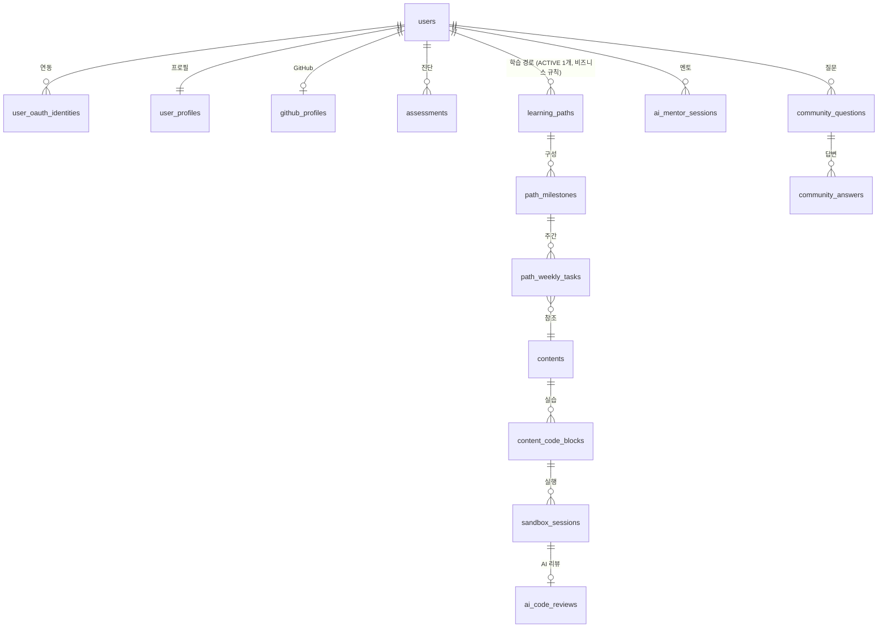

# 02. ERD 문서

> **버전**: v1.0
> **DB 엔진**: MySQL 8.x (OLTP) · pgvector (임베딩) · Redis (세션/캐시) · Elasticsearch (BM25)

총 9개 도메인 — 사용자·인증, GitHub 프로필, 온보딩·진단, 학습 경로, 콘텐츠, Sandbox, AI 리뷰, 커뮤니티·멘토, 진척.

> AR 도메인은 본 MVP 범위에서 제외됨. 참고 설계: [22_AR_아키텍처_체험_참고설계.md](./22_AR_아키텍처_체험_참고설계.md)

---

## 1. 사용자·인증 도메인

```text
users ─┬─ user_oauth_identities
       ├─ user_profiles
       └─ user_learning_prefs
```

| 테이블 | 주요 컬럼 |
|--------|-----------|
| `users` | id(PK), email(UK), nickname, role(LEARNER/ADMIN), status, **onboarding_status**(PENDING/IN_PROGRESS/DONE), created_at |
| `user_oauth_identities` | user_id(FK), provider(GITHUB/GOOGLE/KAKAO), provider_user_id, access_token_encrypted, refresh_token_encrypted, scope, linked_at |
| `user_profiles` | user_id(FK), avatar, bio, **learning_goal**(JOB/CAREER_CHANGE/UPSKILL/SIDE_PROJECT), **target_track**(BACKEND_SPRING/FRONTEND_REACT/MOBILE_FLUTTER/DEVOPS/FULLSTACK), experience_years |
| `user_learning_prefs` | user_id(FK), weekly_hours, preferred_time_slot(JSON), reminder_enabled, locale |

**설계 포인트**:
- `onboarding_status` 플래그로 보호 경로 진입 시 온보딩 강제 노출.
- OAuth 토큰은 `AES-256-GCM` 암호화 저장 (환경 변수 KMS 키).

---

## 2. GitHub 프로필 도메인

```text
github_profiles ─┬─ github_repositories
                 └─ github_language_stats
```

| 테이블 | 주요 컬럼 |
|--------|-----------|
| `github_profiles` | user_id(FK, PK), login, public_repos_count, followers, total_commits_last_year, fetched_at, fetch_status(PENDING/COMPLETED/FAILED) |
| `github_repositories` | id, user_id(FK), repo_full_name, primary_language, stars, last_pushed_at, topic_tags(JSON) |
| `github_language_stats` | user_id(FK), language, bytes, proportion |

**수집 정책**: 가입 시 1회 + 월 1회 자동 리프레시. 비공개 리포는 수집 안 함.

---

## 3. 온보딩·진단 도메인

| 테이블 | 주요 컬럼 |
|--------|-----------|
| `assessments` | id(PK), user_id(FK), track, status(IN_PROGRESS/COMPLETED/ABANDONED), started_at, completed_at, **current_difficulty**(FLOAT 0.0~1.0), bloom_distribution(JSON) |
| `assessment_items` | id(PK), question_bank_id(FK), assessment_id(FK), order_num, presented_at, answered_at, answer(JSON), is_correct, time_spent_sec |
| `question_bank` | id(PK), track, question_type(MCQ/CODE_READING/SHORT_ANSWER), content(TEXT), options(JSON), answer_key(JSON), **bloom_level**(REMEMBER/UNDERSTAND/APPLY/ANALYZE/EVALUATE/CREATE), **difficulty**(FLOAT), concept_tags(JSON) |
| `assessment_results` | assessment_id(FK, PK), diagnosed_level(JUNIOR/MID/SENIOR), concept_scores(JSON), strength_concepts(JSON), weakness_concepts(JSON), confidence_weight(FLOAT) |

**적응형 알고리즘**: 정답 시 난이도 +0.1, 오답 시 -0.05. Bloom 분포로 진단 깊이 보정.

---

## 4. 학습 경로 도메인

```text
learning_paths ── path_milestones ── path_weekly_tasks
```

| 테이블 | 주요 컬럼 |
|--------|-----------|
| `learning_paths` | id(PK), user_id(FK), generated_at, track, total_weeks(default 12), claude_prompt_version, source_embedding_version, status(ACTIVE/ARCHIVED), ai_rationale(TEXT) — **1:N 관계** (사용자당 여러 경로 보유 가능, `status=ACTIVE`는 앱 레이어에서 1개로 제한) |
| `path_milestones` | id, path_id(FK), week_num, title, goal_description, target_skills(JSON), estimated_hours, why_this_order(TEXT) |
| `path_weekly_tasks` | id, milestone_id(FK), order_num, content_id(FK), task_type(READ/PRACTICE/AR/QUIZ), required(BOOL), completed_at |

**생성 플로우**: Assessment + GitHubProfile + LearningGoal → Claude API → JSON roadmap → pgvector로 콘텐츠 매칭 → `path_weekly_tasks` 생성.

---

## 5. 콘텐츠 도메인

| 테이블 | 주요 컬럼 |
|--------|-----------|
| `contents` | id(PK), slug(UK), title, track, content_md(TEXT), estimated_minutes, difficulty(FLOAT), bloom_level(ENUM), concept_tags(JSON), status(DRAFT/PUBLISHED), author_id, published_at |
| `content_code_blocks` | id(PK), content_id(FK), order_num, language, starter_code(TEXT), test_cases(JSON), is_sandbox_runnable(BOOL) |
| `content_embeddings` | id(PK), content_id(FK), chunk_index, chunk_text(TEXT), embedding VECTOR(1536), chunk_hash(SHA-256), metadata(JSONB), status(ACTIVE/INACTIVE) |

**인덱스**:
- HNSW on `embedding` WHERE status = 'ACTIVE'
- `(track, status, difficulty)` — 학습 경로 생성 시 후보 필터

---

## 6. Sandbox 도메인

| 테이블 | 주요 컬럼 |
|--------|-----------|
| `sandbox_sessions` | id(PK), user_id(FK), content_id(FK), code_block_id(FK), container_id(VARCHAR), status(ALLOCATING/RUNNING/COMPLETED/FAILED/KILLED), started_at, finished_at, submitted_code(TEXT), stdout(TEXT), stderr(TEXT), exit_code, cpu_ms_used, memory_mb_peak |
| `sandbox_test_results` | sandbox_session_id(FK), test_name, passed(BOOL), expected(TEXT), actual(TEXT), duration_ms |
| `sandbox_quotas` | user_id(FK, PK), daily_run_count, daily_run_limit, monthly_run_count, last_reset_at |

**리소스 제약**: CPU 1 vCPU · Memory 512MB · 실행 시간 30초 · 네트워크 차단 (루프백만) · gVisor 격리.

---

## 7. AI 리뷰·멘토 도메인

| 테이블 | 주요 컬럼 |
|--------|-----------|
| `ai_code_reviews` | id(PK), sandbox_session_id(FK), model_used, prompt_version, review_summary(TEXT), strengths(JSON), improvements(JSON), security_issues(JSON), confidence(FLOAT), latency_ms, cost_usd, reviewed_at |
| `ai_mentor_sessions` | id(PK), user_id(FK), context_snapshot(JSON), title, created_at |
| `ai_mentor_messages` | id, session_id(FK), role(USER/ASSISTANT/SYSTEM), content(TEXT), token_used, references(JSON), feedback(GOOD/BAD/null), created_at |

**컨텍스트 스냅샷**: 진행 중 콘텐츠, 최근 5개 과제 결과, 최근 실패 테스트 — 프롬프트에 자동 주입.

---

## 8. 커뮤니티 도메인

> 5개 게시판 (Q&A / 자유 / 스터디 모집 / 프로젝트 공유 / 수료자 라운지) + 스택오버플로 평판 시스템 + 학습 맥락 자동 첨부. 상세 설계: [20_커뮤니티_기능_설계서.md](./20_커뮤니티_기능_설계서.md)

### 8.1 게시글·답변·댓글

| 테이블 | 주요 컬럼 |
|--------|-----------|
| `community_posts` | id(PK), author_id(FK), **board_type**(QNA/FREE/STUDY/PROJECT/ALUMNI), title, body_md(TEXT), body_html(TEXT), status(DRAFT/PUBLISHED/HIDDEN/DELETED), view_count, upvote_count, downvote_count, created_at |
| `community_questions` | post_id(FK, PK, Q&A 확장), is_solved, accepted_answer_id(FK nullable), bounty_amount, bounty_expires_at, **learning_context**(JSONB — 차별화) |
| `community_answers` | id(PK), question_id(FK), author_id(FK), body_md, body_html, is_ai_generated(BOOL), is_accepted(BOOL), upvote_count, created_at |
| `community_comments` | id, parent_type(POST/ANSWER), parent_id, author_id(FK), body(TEXT), created_at |

### 8.2 투표·북마크·팔로우

| 테이블 | 주요 컬럼 |
|--------|-----------|
| `community_votes` | user_id(FK), target_type(POST/ANSWER), target_id, value(+1/-1), created_at — UNIQUE(user_id, target_type, target_id) |
| `community_bookmarks` | user_id(FK), target_type, target_id, folder_id(FK nullable), created_at |
| `community_follows` | follower_id(FK), target_type(USER/TAG), target_id, created_at |

### 8.3 태그·평판·배지

| 테이블 | 주요 컬럼 |
|--------|-----------|
| `community_tags` | id(PK), name(UK), description, wiki_md, post_count, watcher_count |
| `community_post_tags` | post_id(FK), tag_id(FK) — UNIQUE 페어 |
| `user_tag_reputation` | user_id(FK), tag_id(FK), reputation(INT) — UNIQUE 페어 |
| `user_reputation_events` | id, user_id(FK), action(ANSWER_UPVOTED/ACCEPTED/DOWNVOTED/BOUNTY_PAID 등), points(INT), source_id, created_at |
| `badges` | id(PK), code(UK), name, tier(BRONZE/SILVER/GOLD), criteria(JSONB) |
| `user_badges` | user_id(FK), badge_id(FK), awarded_at — UNIQUE 페어 |

**평판 남용 방지**
- `user_reputation_events` 집계로 같은 `source_id` 중복 점수 차단
- 일일 합산 +40 상한 (하루 가산 한도)
- 7일 신규 계정은 투표 제한 (`users.created_at` 기준 트리거)

### 8.4 신고·모더레이션

| 테이블 | 주요 컬럼 |
|--------|-----------|
| `community_reports` | id, reporter_id(FK), target_type, target_id, category(SPAM/HATE/AD/DUPLICATE/NSFW/OTHER), reason, status(OPEN/REVIEWING/RESOLVED/DISMISSED), reviewed_by(FK nullable), created_at |
| `moderation_queue` | id, target_type, target_id, ai_severity(LOW/MEDIUM/HIGH/CRITICAL), ai_reason(JSON), trust_votes(INT), created_at |
| `user_sanctions` | user_id(FK), sanction_type(WARN/WRITE_SUSPEND_7D/WRITE_SUSPEND_30D/ACCOUNT_SUSPEND/BAN), reason, starts_at, ends_at, issued_by |

### 8.5 학습 맥락 스냅샷 (차별화 핵심)

```sql
CREATE TABLE learning_context_snapshots (
  id            BIGSERIAL PRIMARY KEY,
  user_id       BIGINT NOT NULL REFERENCES users(id),
  snapshot_at   TIMESTAMPTZ NOT NULL DEFAULT now(),
  -- 스냅샷 내용
  current_content_id  BIGINT REFERENCES contents(id),
  current_path_id     BIGINT REFERENCES learning_paths(id),
  current_step_num    INT,
  progress            NUMERIC(4,2),
  active_tags         JSONB,  -- [{tag: "jpa", reputation: 120}]
  recent_errors       JSONB,  -- [{timestamp, source, message}]
  -- 사용처
  linked_question_id  BIGINT REFERENCES community_questions(post_id),
  visibility          VARCHAR(20) DEFAULT 'ANSWERERS_ONLY' -- ANSWERERS_ONLY/PUBLIC
);
```

질문 작성 시 사용자 Opt-in 토글에 따라 자동 수집 → 답변자 UI에 렌더링.

### 8.6 AI 시드 답변

| 테이블 | 주요 컬럼 |
|--------|-----------|
| `community_ai_answers` | question_id(FK, PK), model_used, prompt_version, content(TEXT), references(JSONB), generated_at, usefulness_rating_sum, rating_count |

Q&A 작성 즉시 Claude 호출 → `is_ai_generated=TRUE` 상태로 `community_answers`에도 삽입 + `community_ai_answers` 메타 저장.

**에스컬레이션 추적 (CEO 리뷰 보강 6)**:
```sql
ALTER TABLE community_ai_answers ADD COLUMN
  escalation_status VARCHAR(20) DEFAULT 'NONE'
  -- NONE / ESCALATED_TO_COMMUNITY / BOUNTY_PLACED / RESOLVED_BY_HUMAN;
```

### 8.7 스터디·프로젝트 확장 (Phase 2)

| 테이블 | 주요 컬럼 |
|--------|-----------|
| `study_groups` | post_id(FK, PK), subject, max_members, period_start, period_end, mode(ONLINE/OFFLINE/HYBRID), region, required_level, status(RECRUITING/ACTIVE/COMPLETED) |
| `study_applications` | group_id(FK), user_id(FK), status(PENDING/APPROVED/REJECTED), applied_at |
| `project_showcases` | post_id(FK, PK), github_url, demo_url, stack_tags(JSON), project_type(TOY/SIDE/STARTUP), seeks_feedback(BOOL), seeks_contributors(BOOL), star_count |

### 8.8 커뮤니티 인덱스 (Eng 리뷰 보강)

| 테이블 | 인덱스 | 용도 |
|--------|--------|------|
| `community_posts` | `(board_type, status, created_at DESC)` | 게시판별 최신글 조회 |
| `community_posts` | `(author_id, created_at DESC)` | 프로필 활동 내역 |
| `community_questions` | `(is_solved, created_at DESC)` | 미답변 큐 조회 |
| `community_votes` | `(target_type, target_id)` | 투표 집계 |
| `community_votes` | `(user_id, target_type, target_id)` UNIQUE | 중복 투표 방지 |
| `user_reputation_events` | `(user_id, created_at DESC)` | 평판 이력 조회 |
| `user_reputation_events` | `(user_id, source_id)` | 중복 점수 방지 |
| `learning_context_snapshots` | `(linked_question_id)` | 질문별 맥락 조회 |
| `moderation_queue` | `(ai_severity, created_at)` | 모더레이션 큐 정렬 |

### 8.9 이벤트 (Outbox)

| 이벤트 | Producer | Consumer |
|--------|----------|----------|
| `CommunityPostCreatedEvent` | Post Service | AI Moderation Worker + Search Indexer |
| `CommunityQuestionPostedEvent` | QnA Service | AI Seed Answer Worker |
| `CommunityAnswerAcceptedEvent` | QnA Service | Reputation Worker + Badge Worker |
| `CommunityVoteCastEvent` | Vote Service | Reputation Worker |
| `CommunityReputationChangedEvent` | Reputation Worker | Notification + Badge Worker |
| `CommunityBadgeAwardedEvent` | Badge Worker | Notification |
| `CommunityReportCreatedEvent` | Report Service | AI Moderation → Trust User Queue |
| `LearningContextSnapshotRequestedEvent` | Community | Learning Snapshot Worker |

---

## 9. 진척 도메인

| 테이블 | 주요 컬럼 |
|--------|-----------|
| `progress_events` | id, user_id(FK), event_type(CONTENT_COMPLETED/TASK_SUBMITTED/QUIZ_PASSED), ref_id, xp_awarded, occurred_at (monthly partition) |
| `user_streaks` | user_id(FK, PK), current_streak_days, longest_streak_days, last_active_date, freeze_tokens |
| ~~`user_badges`~~ | **커뮤니티 도메인(§8)의 `user_badges` 테이블로 통합** — `user_id(FK), badge_id(FK→badges), awarded_at`. 진척 도메인에서는 FK 참조만 사용 |
| `user_usage` | user_id(FK), period_start, mentor_questions_used, sandbox_runs_used |

> FinOps 한도 관리용 `user_usage` 테이블. 기본 계정 한도(월 멘토 20, Sandbox 100/월 등)는 환경 변수로 조정.

---

## 10. 관리자 도메인

| 테이블 | 주요 컬럼 |
|--------|-----------|
| `announcements` | id(PK), title, body_md(TEXT), display_type(BANNER/POPUP/IN_APP), target_audience(ALL/LEARNER/TRACK/WEEK), target_filter(JSON nullable), publish_at, expire_at, is_active(BOOL), created_by(FK), created_at |
| `admin_audit_logs` | id, admin_user_id(FK), action(SANCTION/RESTORE/KILL_SWITCH/PROMPT_ROLLBACK/CONTENT_DELETE 등), target_type, target_id, details(JSON), ip_address, created_at |
| `golden_test_runs` | id(PK), prompt_version, total_cases, passed, failed, accuracy(DECIMAL), triggered_by(FK), started_at, completed_at |
| `sandbox_abuse_logs` | id, user_id(FK), session_id(FK), abuse_type(NETWORK_ATTEMPT/FS_ACCESS/TIMEOUT_REPEAT/RATE_LIMIT), details(JSON), ip_address, auto_banned(BOOL), created_at |

> `user_sanctions` 테이블은 커뮤니티 도메인(§8.4)에 정의됨. 관리자 제재도 동일 테이블 사용.

---

## 11. 이벤트/운영 도메인

| 테이블 | 주요 컬럼 |
|--------|-----------|
| `outbox_events` | id, aggregate_type, aggregate_id, event_type, **dedup_key**(UNIQUE), destination_topic, payload(JSON), status(PENDING→PUBLISHED→CONSUMED), retry_count, max_retries(default 5) |
| `audit_logs` | user_id, action, entity_type, entity_id, before_value(JSON), after_value(JSON), ip_address, created_at |
| `ai_cost_logs` | user_id, service(PATH_GEN/CODE_REVIEW/MENTOR/SEED_ANSWER/EMBEDDING), model, input_tokens, output_tokens, cost_usd, cache_hit(BOOL), request_id |

**주요 이벤트 (Outbox)**:
| 이벤트 | Producer | Consumer |
|--------|----------|----------|
| `UserRegisteredEvent` | Auth | Welcome Email / Analytics / GitHub Fetch Worker |
| `GithubProfileFetchedEvent` | GitHub Worker | Path Engine (재생성 트리거) |
| `AssessmentCompletedEvent` | Assessment | Path Engine |
| `LearningPathGeneratedEvent` | Path Engine | Notification (1st Aha 노출) |
| `ContentCompletedEvent` | Learning | Progress / Peer Matching |
| ~~`ARSessionEndedEvent`~~ | ~~AR~~ | ~~Progress~~ — **(v2.0 — 현재 비활성)** |
| `SandboxRunSubmittedEvent` | Sandbox | AI Review Worker |
| `AiReviewCompletedEvent` | AI Review Worker | Notification |
| `StreakBreakingSoonEvent` | Scheduler | Notification (리텐션) |

---

## 12. 물리 인덱스 전략 요약

| 테이블 | 인덱스 | 목적 |
|--------|--------|------|
| `users` | `(email)`, `(onboarding_status)` | 로그인 / 미완료 온보딩 재진입 |
| `user_oauth_identities` | `(provider, provider_user_id)` UNIQUE | OAuth 로그인 조회 |
| `contents` | `(track, status, difficulty)` | 경로 생성 |
| `content_embeddings` | HNSW(embedding) WHERE ACTIVE | 경로 매칭 벡터 검색 |
| `path_weekly_tasks` | `(milestone_id, order_num)` | 주간 과제 순서 |
| `sandbox_sessions` | `(user_id, started_at DESC)` | 사용자 실습 이력 |
| `progress_events` | PARTITION monthly(occurred_at), `(user_id, occurred_at)` | 대용량 append |
| `outbox_events` | `dedup_key` UNIQUE | 멱등성 |
| `admin_audit_logs` | `(admin_user_id, created_at DESC)` | 관리자 활동 이력 |
| `sandbox_abuse_logs` | `(user_id, created_at DESC)` | 악용 사용자 조회 |
| `announcements` | `(is_active, publish_at)` | 활성 공지 조회 |
| `community_reports` | `(status, ai_severity)` | 미처리 신고 우선순위 |

---

## 13. 전체 ER 다이어그램 (요약)



---

## 14. 제약 · 보안 요약

- **OAuth 토큰 암호화**: AES-256-GCM, KMS 관리
- **Soft Delete**: `users`, `contents` — `status = DELETED`
- **Append-only**: `progress_events`, `audit_logs`, `ai_cost_logs`
- **GDPR 삭제 요청**: 14일 내 처리. 집계 테이블은 익명화 후 보존.

---

## 15. 관련 문서

- [03_프로젝트_아키텍처_정의서.md](./03_프로젝트_아키텍처_정의서.md)
- [04_API_명세서.md](./04_API_명세서.md)
- [07_요구사항_정의서.md](./07_요구사항_정의서.md)
