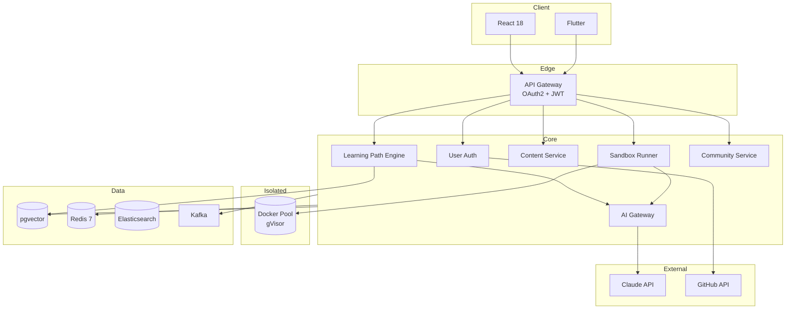

# 03. 프로젝트 아키텍처 정의서

> **버전**: v1.0
> **스타일**: 폴리레포 마이크로서비스(distributed modular monolith) — 독립 배포 서비스 + 중앙집중 스키마(단일 PostgreSQL) + AI Gateway
> **핵심 패턴**: Transactional Outbox, Hybrid Search, OAuth2, Isolated Sandbox (gVisor)

---

## 1. 전체 아키텍처

```text
┌────────────────────────────────────────────────────────────────┐
│                       Client Layer                             │
│   React 18 (Web)  │  Flutter 3.x (Mobile)                       │
└───────────────┬──────────────────┬─────────────────────────────┘
                └──────┬───────────┘
                       │
                ┌──────▼──────┐
                │ API Gateway │  Spring Cloud Gateway + JWT
                │ + OAuth2    │  OTel Sampling 10~30%
                └──────┬──────┘
                       │
  ┌────────┬───────────┼──────────┬──────────┐
  │        │           │          │          │
┌─▼─────┐ ┌▼─────┐ ┌───▼─────┐ ┌──▼──────┐ ┌─▼─────┐
│ User  │ │Learn │ │ AI      │ │Sandbox  │ │Commu- │
│ Auth  │ │ Path │ │ Gateway │ │Runner   │ │nity   │
└───┬───┘ └──┬───┘ └──┬──────┘ └────┬────┘ └───┬───┘
    │        │        │              │          │
    │        │        ▼              ▼          │
    │        │    Claude API     Docker Pool    │
    │        │    + pgvector     + gVisor       │
    │        │                                  │
    ▼        ▼                                  ▼
 PostgreSQL (SSOT)  Redis (세션/큐)
 pgvector (콘텐츠·GitHub 임베딩)
 Elasticsearch (BM25)
 Kafka (Event Bus via Outbox)
```

### 1.1 Mermaid 시스템 구성도



### 1.2 아키텍처 핵심 결정

1. **폴리레포 서비스 + 중앙집중 스키마**: 1인 창업자 단독 개발이나, CI·패키징·배포 독립성을 위해 도메인별 레포로 분리한다. 데이터 결합은 중앙 `devpath-shared` 스키마(단일 PostgreSQL, Flyway)로 유지하는 distributed modular monolith. Sandbox는 보안상 무조건 격리된 별도 서비스.
2. **AI Gateway 단일 진입점**: Claude API 호출, 비용 추적, Semantic Cache, Kill-switch를 한 곳에서.
3. **OAuth2 우선 설계**: GitHub 토큰이 Learning Path 품질의 핵심 입력.
4. **Outbox Pattern**: 결제/리텐션 알림/진척도 갱신 같은 부작용을 멱등 이벤트로.

---

## 2. 모듈 구성

```text
DevPathAi/ (폴리레포 — 독립 배포 서비스 + 중앙 라이브러리·스키마)
├── devpath-shared/         # 공유 이벤트 스키마 + 공통 라이브러리 + 중앙 Flyway 스키마(SSOT) + 로컬 compose
├── devpath-gateway/        # API Gateway (Spring Cloud Gateway, OAuth2 + JWT 엣지)
├── devpath-platform-svc/   # user/auth · github 수집 · notification
├── devpath-learning-svc/   # onboarding · learning(경로 엔진) · content · mentor
├── devpath-community-svc/  # post · reputation · badge · moderation · learning-context · ai-seed
├── devpath-ai-svc/         # ai-gateway(Claude 오케스트레이터) · review-worker · finops
├── devpath-sandbox-svc/    # Docker + gVisor 격리 실행
├── devpath-frontend/       # web(React) + admin(React) + mobile(Flutter)
└── devpath-gitops/         # Kubernetes 매니페스트 + ArgoCD + Flyway 마이그레이션 Job
```

> 각 서비스는 자기 도메인 코드를 소유한다. DB 스키마는 `devpath-shared`가 중앙에서 소유(단일 PostgreSQL, Flyway)하고 서비스는 `ddl-auto: validate`로 매핑만 검증한다 — 데이터 결합은 유지하되 배포·CI는 독립(distributed modular monolith). `devpath-shared`는 GitHub Packages(Maven)로 배포되어 각 서비스가 의존한다.

---

## 3. 핵심 서비스 상세

### 3.1 Learning Path Engine

```text
Input:
  AssessmentResult (concept_scores, Bloom 분포, confidence_weight)
  LearningGoal (JOB/CAREER_CHANGE/UPSKILL/SIDE_PROJECT)
  GitHubProfile (주요 언어, 커밋 활동, 저장소 토픽)

Step 1. Claude Prompt:
  "다음 사용자에게 {target_track} 트랙 12주 로드맵 생성:
   - 현재 수준: {diagnosed_level}
   - 강점: [...], 약점: [...]
   - GitHub 활동: [...]
   - 목표: {goal}
   응답은 JSON: milestones[].{week, title, target_skills, why_this_order}"

Step 2. pgvector 매칭:
   각 milestone의 target_skills → 임베딩 → content_embeddings HNSW 검색
   → 후보 콘텐츠 20개 → difficulty·bloom_level 필터 → 최종 3~5개/주

Step 3. DB 저장:
   learning_paths + path_milestones + path_weekly_tasks (한 트랜잭션)
   Outbox: LearningPathGeneratedEvent
```

**SLO**: 생성 p95 < 8초. 재생성(사용자 요청) 동일.

### 3.2 AI Gateway 내부 구조

```text
┌─────────────────────────────────────────────────────────────┐
│  AI Gateway                                                 │
│  ├── 4분류 모델 라우팅                                        │
│  │    (Path Gen → Sonnet, Code Review → Sonnet,             │
│  │     Mentor short → Haiku, Embedding → OpenAI)            │
│  ├── Semantic Cache (Redis, TTL 7일)                        │
│  ├── FinOps Kill-switch (3계층: 사용자/플랜/전사)            │
│  ├── Circuit Breaker (Resilience4j)                         │
│  └── Trace ID 전파 (OTel)                                    │
└─────────────────────────────────────────────────────────────┘
```

### 3.3 Sandbox Runner (격리)

```text
제출 플로우:
  1. 코드 제출 → sandbox_sessions INSERT (status=ALLOCATING)
  2. Runner가 pre-warmed 컨테이너 풀에서 할당 (언어별: java21-jdk, node20, python3.12)
  3. 코드 + 테스트 케이스 주입 → 실행
  4. 리소스 제한: CPU 1 vCPU, MEM 512MB, 30초, 네트워크 루프백만
  5. stdout/stderr/exit_code 캡처
  6. 테스트 러너(JUnit/Jest/pytest)로 결과 파싱
  7. status=COMPLETED → Outbox: SandboxRunSubmittedEvent → AI Review Worker

보안:
  - gVisor (runsc) 커널 격리
  - seccomp 프로파일
  - readonly rootfs (tmpfs /workspace 쓰기 허용)
  - 아웃바운드 네트워크 차단 (nftables)
  - 주기적 컨테이너 교체 (1회 실행 후 파기)
```

> **AR 씬 서비스**: v1.0 범위에서 제외됨. 참고 설계는 [22_AR_아키텍처_체험_참고설계.md](./22_AR_아키텍처_체험_참고설계.md) 참고.

---

## 4. OAuth2 & 인증 흐름

```text
1. [Web] "GitHub로 시작" → /oauth2/authorization/github
2. GitHub 동의 → /login/oauth2/code/github (callback)
3. Spring Security OAuth2Client:
   - Access Token + Refresh Token 발급
   - 사용자 이메일/프로필 가져오기
4. UserService.handleOAuthLogin():
   - 기존 user_oauth_identities 조회
   - 있으면: 로그인, 없으면: User 생성 + Identity 저장
   - GitHub인 경우 비동기로 GithubProfileFetchWorker 큐잉
5. JWT 발급 (access 30min + refresh 14day)
6. 프론트: 토큰 저장 → /onboarding (status=PENDING이면)
```

**토큰 저장**: access는 메모리, refresh는 httpOnly Secure Cookie.

---

## 5. Transactional Outbox Pattern

```text
@Transactional:
  1. 비즈니스 데이터 저장 (PostgreSQL)
  2. outbox_events INSERT (같은 트랜잭션)

Relay:
  Phase 1: Polling + ShedLock (30s)
  Phase 2: Debezium CDC

Consumer 멱등성 (Holy Trinity):
  - dedup_key UNIQUE
  - Version OCC (Read Model)
  - DLQ: Relay 5회 실패 → DEAD_LETTER, Consumer 3회 → DLQ 토픽
```

### 5.1 주요 이벤트 흐름

| 이벤트 | 트리거 | 주 Consumer |
|--------|--------|-------------|
| `UserRegisteredEvent` | OAuth2 완료 | Welcome Email + GitHub Fetch |
| `GithubProfileFetchedEvent` | 워커 완료 | Path Engine 재생성 조건부 |
| `AssessmentCompletedEvent` | 진단 제출 | Path Engine (즉시) |
| `LearningPathGeneratedEvent` | Path 생성 완료 | Frontend SSE 푸시 (1st Aha 노출) |
| `SandboxRunSubmittedEvent` | 제출 성공 | AI Review Worker |
| `AiReviewCompletedEvent` | 리뷰 완료 | Notification → 프론트 |
| `StreakBreakingSoonEvent` | 스케줄러 | Push/Email Notification |
| `CommunityPostCreatedEvent` | Community | AI Moderation + Search Indexer |
| `CommunityQuestionPostedEvent` | Community Q&A | **AI Seed Answer Worker** |
| `CommunityAnswerAcceptedEvent` | Community Q&A | Reputation + Badge Worker |
| `CommunityVoteCastEvent` | Community Vote | Reputation Worker |
| `CommunityReputationChangedEvent` | Reputation Worker | Notification + Badge Worker |
| `CommunityBadgeAwardedEvent` | Badge Worker | Notification |
| `CommunityReportCreatedEvent` | Community Report | AI Moderation → Trust User Queue |

---

## 6. Distributed Tracing (OTel)

```text
Sampling: dev 100% / staging 50% / prod 10~30% (에러 100%)

v1.0 주요 Span Attributes:
  devpath.user_id
  devpath.track
  devpath.path_id
  devpath.content_id
  devpath.sandbox.session_id
  devpath.ai.service (PATH_GEN / CODE_REVIEW / MENTOR)
  devpath.ai.model
  devpath.ai.cache_hit

예시 Trace (개인화 경로 생성):
  API Gateway (2ms)
  → Learning Path Engine (orchestrator)
    → GitHub Profile lookup (50ms)
    → Assessment result (30ms)
    → AI Gateway → Claude API (4500ms, 주된 지연)
    → pgvector 매칭 (120ms, 12주 × 10ms 병렬)
    → DB 저장 + Outbox (80ms)
  Total: ~4800ms
```

---

## 7. 데이터 스토어 전략

| 저장소 | 역할 | 근거 |
|--------|------|------|
| **PostgreSQL 17** | Source of Truth | 트랜잭션 + pgvector 생태계 우위 |
| **pgvector** | 콘텐츠·GitHub 임베딩 | HNSW 성능 + Postgres 호환 |
| **Redis 7.x** | 세션, Semantic Cache, Sandbox Queue | TTL + 큐 네이티브 |
| **Elasticsearch 8.x** | BM25 Hybrid Search | 콘텐츠 검색 품질 |
| **Kafka** | 이벤트 버스 | Outbox + DLQ 생태계 |
| **S3/CDN** | 사용자 업로드 파일·썸네일 | 글로벌 엣지 배포 |

---

## 8. 보안 아키텍처 (6 Layer)

```text
Layer 1 — Network: Cloudflare WAF + Rate Limit
Layer 2 — API Gateway: OAuth2 + JWT 검증 + CORS
Layer 3 — Authentication: Spring Security 7 (OAuth2 + JWT + Refresh)
Layer 4 — Authorization: Role + Resource Ownership + Plan check
Layer 5 — Sandbox Isolation: gVisor + seccomp + 네트워크 차단
Layer 6 — Audit: AOP 기반 before/after 감사 로그
```

### 8.1 OAuth 토큰 보호

- 저장: AES-256-GCM 암호화, KMS에서 키 회전
- 전송: TLS 1.3
- 스코프: 최소 권한 (`read:user`, `public_repo`만)
- 토큰 revoke: 계정 삭제 시 즉시

### 8.2 Sandbox 위협 모델

| 위협 | 대응 |
|------|------|
| 암호화폐 채굴 | CPU 1 vCPU + 30초 제한, 사용자 월 한도 |
| 리모트 서버 공격 | 아웃바운드 네트워크 차단 |
| 컨테이너 이스케이프 | gVisor(runsc) + seccomp |
| DoS (무한 루프) | 실행 시간 30초, 메모리 512MB, PID 50개 |
| 악성 의존성 | 사전 빌드된 베이스 이미지만 사용, pip/npm 설치 금지 |

---

## 9. 기술 결정 기록 (ADR 요약)

| # | 결정 | 이유 |
|---|------|------|
| 001 | Spring Boot 4 + Java 21 (**GA 미확정 시 Spring Boot 3.4.x로 폴백**) | Virtual Threads로 Sandbox/AI I/O 병렬. `build.gradle`에 버전 핀 명시. Spring Boot 4 GA 확인 후 최종 결정 (DevOps 담당) |
| 002 | PostgreSQL (SSOT) + pgvector 분리 | 단일 엔진 운영 단순 + 임베딩 부하 격리 |
| 003 | Transactional Outbox | Exactly-once + 멱등 Consumer |
| 004 | **Docker + gVisor** Sandbox | 커널 격리 + 운영 성숙도 |
| 006 | **Monaco Editor** 웹 에디터 | VSCode 동일 UX, 사용자 친숙 |
| 007 | Claude API (Sonnet 주력) | 코드 리뷰 품질 + 컨텍스트 창 |
| 008 | OAuth2 GitHub 우선 | Path Engine 입력 품질 결정 |
| 009 | 폴리레포 채택 (2026-06-13 번복) | CI·패키징·배포 독립성 + 중앙 `devpath-shared` 스키마로 데이터 결합 유지 (distributed modular monolith) |
| 010 | **glTF 표준 3D 에셋** | 웹/Flutter/Unity 미래 전환 유연 — **(v2.0 — 현재 비활성, AR 재활성화 시 적용)** |
| 011 | **커뮤니티는 학습과 동등한 축** | 2 Aha + Sandbox 옆에 커뮤니티를 MVP 핵심으로 편입 (콜드 스타트 AI 시드 + Founding Contributors) |
| 012 | **스택오버플로 평판 모델 채택** | 평판 점수 + 태그별 평판 + Bronze 배지 + 권한 언락 (사용자 락인 + 자정 시스템 기반) |
| 013 | **학습 맥락 자동 첨부** | 질문 작성 시 현재 콘텐츠·진도·에러 Opt-in 첨부 → 답변자 UI 렌더 (차별화 핵심) |

---

## 10. 성능 SLO

| 영역 | 지표 | 목표 |
|------|------|------|
| API | p95 응답 (AI 제외) | < 500ms |
| API | p95 응답 (AI 포함) | < 2.5s |
| Learning Path 생성 | p95 | < 8s |
| AI 코드 리뷰 | p95 | < 6s |
| Sandbox 할당 → 실행 시작 | p95 | < 2s |
| Sandbox 실행 완료 | p99 | < 30s (hard limit) |
| 5xx 에러율 | - | < 0.1% |

---

## 11. 관련 문서

- [02_ERD_문서.md](./02_ERD_문서.md) — 데이터 모델
- [04_API_명세서.md](./04_API_명세서.md) — REST API
- [10_환경_설정_템플릿.md](./10_환경_설정_템플릿.md) — Docker Compose
- [16_운영_메뉴얼.md](./16_운영_메뉴얼.md) — 모니터링·FinOps
