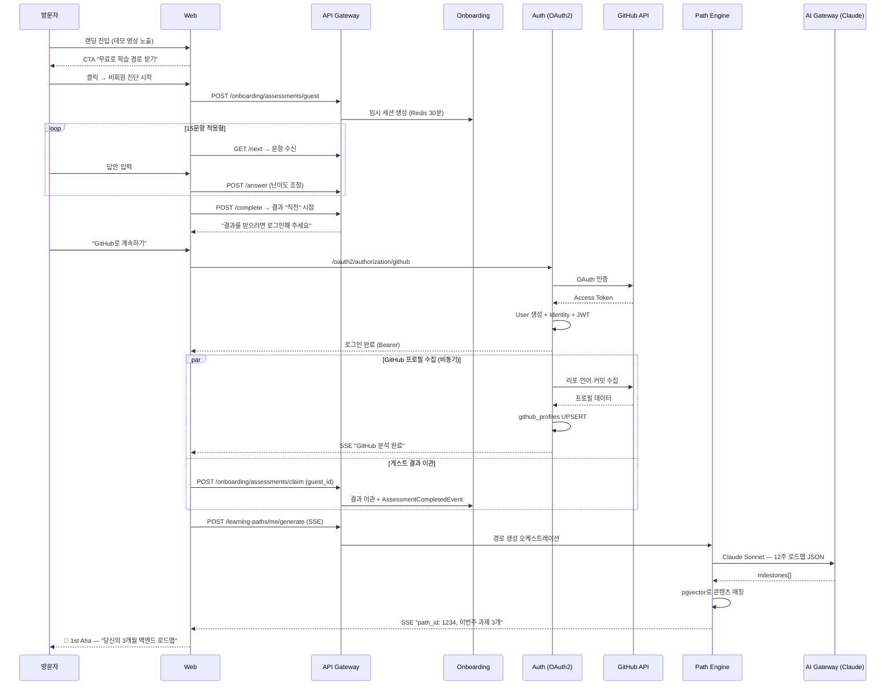
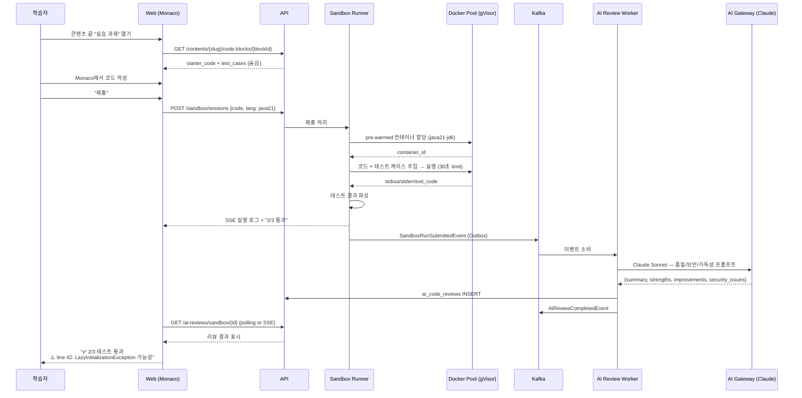
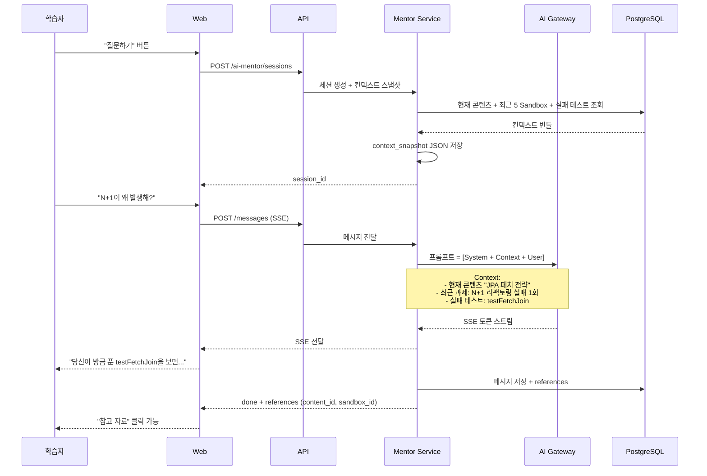
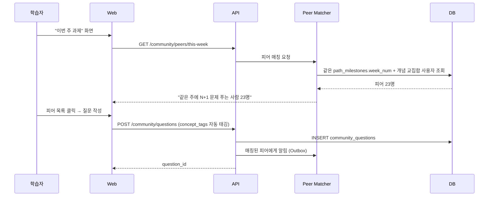
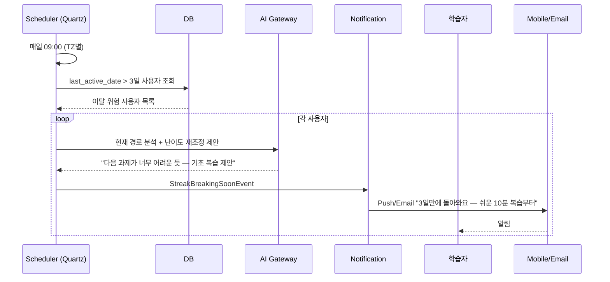
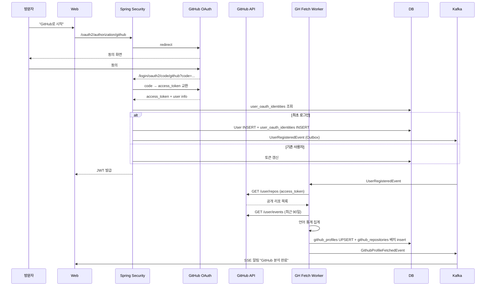

# 05. 화면 흐름 시퀀스 다이어그램

> **표기**: Mermaid sequenceDiagram
> **범위**: 핵심 End-to-End 시나리오 — 진입 → 2 Aha → 습관화 → 전환

---

## 1. 비회원 진단 체험 → 가입 → 1st Aha

> **관련 화면**: SCR-W-LAND-001 (랜딩), SCR-W-ONB-002 (비회원 진단), SCR-W-AUTH-001 (로그인), SCR-W-PATH-001 (학습 경로)



---

## 2. Sandbox 실습 → AI 코드 리뷰 (2nd Aha)

> **관련 화면**: SCR-W-SBX-001 (Sandbox), SCR-W-REV-001 (리뷰 결과)



---

## 3. AI 멘토 채팅 (컨텍스트 인식)

> **관련 화면**: SCR-W-MEN-001 (멘토 패널)



---

## 4. 커뮤니티 피어 매칭

> **관련 화면**: SCR-W-COM-001 (Q&A), SCR-W-PATH-002 (이번 주 과제)



---

## 5. 리텐션 트리거 (3일 미접속)



---

## 6. OAuth2 + GitHub 프로필 수집 (상세)



---

## 커뮤니티 시퀀스 다이어그램 (CEO 리뷰 보강)

### 시퀀스 A: Q&A 작성 → AI 시드 → 에스컬레이션

```text
사용자          Frontend         API Gateway       CommunityService      Kafka(Outbox)      LCS Worker       AI Seed Worker     Claude API
  │                │                 │                    │                    │                 │                  │                │
  ├─ 질문 작성 ──→│                 │                    │                    │                 │                  │                │
  │  + 맥락 토글ON │                 │                    │                    │                 │                  │                │
  │                ├─ POST /qna ──→│                    │                    │                 │                  │                │
  │                │                 ├─ createQuestion()─→│                    │                 │                  │                │
  │                │                 │                    ├─ INSERT question ──│                 │                  │                │
  │                │                 │                    ├─ Event: QuestionPosted ─→│           │                  │                │
  │                │                 │                    ├─ Event: LCSRequested ───→│           │                  │                │
  │                │                 │                    │                    │     ├─ 스냅샷 생성│                  │                │
  │                │                 │                    │                    │     │  (1-3초)   │                  │                │
  │                │                 │                    │                    │     ├─linked_question_id 연결       │                │
  │                │                 │                    │                    │                 ├─ 시드 생성 ──────→│                │
  │                │                 │                    │                    │                 │   (병렬: 품질     │                │
  │                │                 │                    │                    │                 │    스코어링 +     │                │
  │                │                 │                    │                    │                 │    모더레이션)    │                │
  │                │                 │                    │                    │                 │  ←── AI 응답 ─────│                │
  │  ←─ AI 시드 표시(접혀있음) ──────│                    │                    │                 │                  │                │
  │                │                 │                    │                    │                 │                  │                │
  ├─ "도움됐어요" →│                 │                    │                    │                 │                  │                │
  │                │  → 종료 (검색DB 인덱싱)              │                    │                 │                  │                │
  │   OR           │                 │                    │                    │                 │                  │                │
  ├─ "부족해요" ──→│                 │                    │                    │                 │                  │                │
  │                ├─ POST /escalate→│                    │                    │                 │                  │                │
  │                │                 ├─ escalateQuestion()│                    │                 │                  │                │
  │                │                 │                    ├─ escalation_status = ESCALATED       │                  │                │
  │                │                 │                    ├─ Event: AiAnswerEscalated ──→│       │                  │                │
  │                │                 │                    │                    │   (미답변 큐 등록 + 답변자 알림)    │                │
  │  ←─ 에스컬레이션 확인 ───────────│                    │                    │                 │                  │                │
  │                │                 │                    │                    │                 │                  │                │
  │  [24h 미답변]  │                 │                    │                    │                 │                  │                │
  │                │                 │                    ├─ 자동 승격: 태그 매칭 답변자 푸시 + 보상 +50%           │                │
  │  [72h 미답변]  │                 │                    │                    │                 │                  │                │
  │                │                 │                    ├─ AI 답변 재생성(상세 버전) + 운영자 알림               │                │
```

### 시퀀스 B: 평판 변동 + 권한 언락

```text
답변자           Frontend         VoteService       ReputationWorker      PostgreSQL              BadgeWorker      NotificationSvc
  │                │                 │                    │                  │                   │                │
  │  [답변 upvote] │                 │                    │                  │                   │                │
  │                ├─ POST /vote ──→│                    │                  │                   │                │
  │                │                 ├─ 중복 투표 검증 ──→│                  │                   │                │
  │                │                 ├─ INSERT vote ─────→│                  │                   │                │
  │                │                 ├─ Event: AnswerUpvoted ──→│            │                   │                │
  │                │                 │                    ├─ 일일 40점 상한 검증               │                │
  │                │                 │                    ├─ INSERT reputation_event ──→│        │                │
  │                │                 │                    ├─ 총 평판 갱신 ────────────→│        │                │
  │                │                 │                    ├─ 태그별 평판 갱신 ─────────→│        │                │
  │                │                 │                    │                  │                   │                │
  │                │                 │                    ├─ 권한 임계값 도달 시:                │                │
  │                │                 │                    │  Event: TrustLevelChanged ──────────→│                │
  │                │                 │                    │                  │                   ├─ 배지 조건 검사│
  │                │                 │                    │                  │                   ├─ INSERT badge─→│
  │                │                 │                    │                  │                   ├─ 알림 ────────→│
  │  ←─ "평판 +10, 새 권한 해금!" ──│                    │                  │                   │                │
```

### 시퀀스 C: 3단계 모더레이션

```text
작성자           Frontend         ModerationSvc     AI Moderation        RuleFilter        관리자큐          신뢰사용자
  │                │                 │                    │                  │                 │                │
  ├─ 글 작성 ────→│                 │                    │                  │                 │                │
  │                ├─ POST ────────→│                    │                  │                 │                │
  │                │                 ├─ AI 판정 요청 ───→│                  │                 │                │
  │                │                 │                    ├─ Claude Haiku ──→│                 │                │
  │                │                 │                    │  + 규칙 기반      │                 │                │
  │                │                 │                    │                  │                 │                │
  │                │                 │  [AI 성공]         │                  │                 │                │
  │                │                 │  ←─ 심각도 반환 ──│                  │                 │                │
  │                │                 │                    │                  │                 │                │
  │                │                 │  [AI 타임아웃]     │                  │                 │                │
  │                │                 │  ├─ 규칙 기반 fallback ─────────────→│                 │                │
  │                │                 │  │                  │                 ←─ 규칙 판정 ────│                │
  │                │                 │                    │                  │                 │                │
  │                │                 │  [심각도별 처리]   │                  │                 │                │
  │                │                 │  CRITICAL: 즉시 비공개 + 관리자 확인 후 계정 정지      │                │
  │                │                 │  HIGH: 비공개 ─────────────────────────────────────────→│                │
  │                │                 │  MED: 게시 보류 + 작성자 알림                          │                │
  │                │                 │  LOW: 경고 플래그                                      │                │
  │                │                 │                    │                  │                 │                │
  │                │                 │  [신고 접수]       │                  │                 │                │
  │                │                 │  ├─ INSERT moderation_queue ─────────────────────────→│                │
  │                │                 │  │                  │                 │                ├─ 투표 (3표)    │
  │                │                 │  │  [3표 합의]     │                 │                │  → 자동 처리   │
  │                │                 │  │  [2:1 분쟁]     │                 ├─ 관리자 큐 ────│                │
```

---

## 7. 관련 문서

- [04_API_명세서.md](./04_API_명세서.md) — 엔드포인트 상세
- [06_화면_기능_정의서.md](./06_화면_기능_정의서.md) — 화면별 기능
- [08_스토리_보드.md](./08_스토리_보드.md) — 사용자 시나리오
