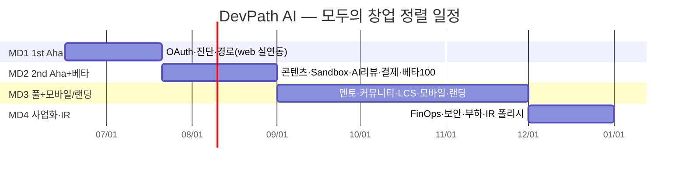

# 17. 스케줄

> **총 기간(재정의)**: 모두의 창업 라운드 정렬(2026-06 ~ 12). 갱신일 **2026-06-16**.
> **기준축**: 모두의 창업 + 사업계획서 8주 MVP 데모 우선(접근 A — 라운드 정렬 + 수직 슬라이스 + Tier 컷라인).
> **마일스톤**: **MD1**(1st Aha 실연동) · **MD2**(2nd Aha + 베타100 = 8주 MVP 종착) · **MD3**(풀 골든패스 + 모바일/랜딩) · **MD4**(사업화·완성도·IR).
> **설계 출처**: [docs/superpowers/specs/2026-06-16-schedule-rework-design](./docs/superpowers/specs/2026-06-16-schedule-rework-design.md) · 정렬 근거 [29_예비창업패키지_사업계획서](./29_예비창업패키지_사업계획서.md) · [35_모두의_창업_프로그램_참고](./35_모두의_창업_프로그램_참고.md).
> **수행 인력**: 1인(창업자) + Claude Code. 풀 범위는 Tier 컷라인으로 우선순위화한다.

---

## 0. 완료 기준선 (DONE)

> 커밋·CI·핸드오프로 검증된 완료분. 이후 일정의 출발점.

**인프라 (완료)**
- [x] W1 인프라: MySQL→**PostgreSQL**(SSOT 5432 + pgvector 5433), shared **GitHub Packages(Maven)**, 중앙 **Flyway** 스키마(공통 규약 `set_updated_at`·users 골격·법적 분리보관 `dormant_user_archives`, 정보통신망법 §29)
- [x] CI/CD: 9개 서비스 postgres service container CI + 이미지 빌드·push + gitops 배포 job + GitHub App 자동 SHA 갱신(node24 actions)

**프론트엔드 (목 API 프로토타입 완료 — 실서버 연동은 후속)**
- [x] React→Flutter 전환, melos 모노레포(dp_core·dp_design + apps/web·admin·mobile)
- [x] 목 API 기반 **web 골든패스 전체**(P4a~f: 셸·인증 / 온보딩·경로 SSE / 콘텐츠·Sandbox·Monaco / AI리뷰·KILL_SWITCH·Quota / 멘토 SSE / 대시보드·커뮤니티)
- [x] **admin 대표 3화면**(P5: 운영 대시보드·사용자 관리·신고 처리)
- [ ] ⚠️ web/admin은 목 API 중심 · 모바일(P6)·랜딩(P7) 미착수 → 이후 일정 본체

**백엔드 도메인 (MD1 일부 진행)**
- [x] 9개 서비스 W1 수준(PG 드라이버·shared 의존·DB 연결 테스트)
- [x] shared: users/auth/outbox/notifications + 진단(question_bank·assessments·items·results) Flyway
- [x] platform-svc: refresh/logout, `/users/me`, `UserRegisteredEvent`, `AssessmentCompletedEvent` 소비
- [x] learning-svc: 회원/비회원 진단, answer/complete/result, claim, `AssessmentCompletedEvent`
- [x] ai-svc: 로컬 Ollama gateway(`/ai/embed`, `/ai/path/generate`, 768차원 임베딩 계약)
- [ ] 학습경로 영속화·콘텐츠·Sandbox·AI 리뷰·멘토·커뮤니티 도메인 API 미구현

**문서**
- [x] 01~38 작성

### 0.1 현재 구현 현황 스냅샷 (2026-06-19)

| 영역 | 현재 상태 | 다음 정합성 과제 |
|---|---|---|
| 인증/사용자 | 부분 구현 | OAuth provider별 E2E, gateway edge 흐름 확인 |
| 진단 | 부분 구현 | 프론트 목 API → 실API 전환, 통합 테스트 |
| AI Gateway | dev Ollama gateway 구현 | learning-svc 경로 영속화/SSE와 연결 |
| 학습경로·콘텐츠 | 목표 상태 | `learning_paths`, `contents`, `content_embeddings VECTOR(768)` 스키마 추가 |
| Sandbox·AI 리뷰 | 목표 상태 | sandbox-svc runner와 ai review worker 구현 |
| 커뮤니티·LCS | 목표 상태 | community API와 `learning_context_snapshots` 구현 |

---

## 1. 전체 로드맵 (캘린더 앵커)

```text
DONE ───────────── ~6.16  W1 인프라 + 프론트 목 프로토(web·admin)
MD1 ── 6.16~7.20 ─▶ 1st Aha 실연동 (OAuth→진단→경로 Claude SSE, web)      [1R 멘토링 ~7.22]
MD2 ── 7.21~8.31 ─▶ 2nd Aha + 베타100 (콘텐츠→Sandbox→AI리뷰, 결제)        [2R MVP·지역 IR]  ← 8주 MVP 종착
MD3 ── 9월~11월  ─▶ 풀 골든패스(멘토·커뮤니티·LCS) + 모바일(P6) + 랜딩(P7)   [2R후반·3R 사업화]
MD4 ── 12월      ─▶ 사업화·완성도(FinOps·보안·부하) + 왕중왕 IR 데모 폴리시     [파이널·왕중왕전]
```

| 단계 | 기간(목표) | 모두의 창업 정렬 | 핵심 산출물 |
|---|---|---|---|
| DONE | ~6.16 | (선행) | W1 인프라 + 프론트 목 프로토 |
| **MD1** | 6.16 ~ 7.20 | 1R 멘토링(~7.22) | OAuth → 진단 → 학습경로(Claude SSE) 끝단간 실API(web) |
| **MD2** | 7.21 ~ 8.31 | 2R MVP(8~9월)·지역 IR | 콘텐츠 → Sandbox → AI 코드리뷰 실연동 + 결제 + 베타 100명 |
| **MD3** | 9월 ~ 11월 | 2R 후반·3R 사업화 | 멘토·커뮤니티 Q&A·LCS 실연동 + 모바일(P6) + 랜딩(P7) + 평판 |
| **MD4** | 12월 | 파이널·왕중왕전 | FinOps·보안/Chaos·부하/QA·안정화 + 왕중왕 IR 데모 완성도 |

### 1.1 간트 차트 (요약)



---

## 2. 단계별 상세

### MD1 — 1st Aha 실연동 (6.16 ~ 7.20) · 1R

> 목표: 비회원 진단 → 로그인(OAuth) → 개인화 학습경로(Claude SSE)가 **web에서 끝단간 실API로 동작**. 사업계획서 고도화(1R 멘토링) 병행.

**슬라이스 #1 — OAuth/인증 (게이트)**
- [ ] platform-svc: Spring Security 7 + OAuth2 Client (GitHub → Google → 카카오 순) — 부분 구현
- [ ] JWT + Refresh Cookie, `users`·`user_oauth_identities`·`user_profiles` 스키마(shared Flyway, W1 users 골격 확장) — 부분 구현
- [x] `UserRegisteredEvent` Outbox
- [ ] gateway: OAuth2 엣지 + JWT 검증 라우팅 — 부분 구현
- [ ] 프론트: web `AuthController` 목→실API 전환 + 통합테스트
- [ ] **횡단 즉시 착수**: 카카오/Google OAuth 앱 심사 신청, Anthropic 프로덕션 한도 신청

**슬라이스 #2 — 진단**
- [x] learning-svc: `question_bank` + Bloom 태깅 스키마, 적응형 진단 알고리즘(난이도 ±)
- [x] 비회원 진단 세션(Redis 30분) + 결과 → 회원 이관
- [ ] 프론트: 온보딩 진단 실API 전환

**슬라이스 #3 — 학습경로 (1st Aha)**
- [ ] ai-svc: AI Gateway 경로 생성 — dev Ollama(`/ai/embed`, `/ai/path/generate`) 부분 구현, 운영 provider/SSE/Event 후속
- [ ] learning-svc: 콘텐츠 임베딩(nomic-embed-text 768, 운영 provider 교체 가능) + HNSW 인덱스 + milestone.target_skills 매칭 + `path_milestones`·`path_weekly_tasks`
- [ ] 프론트: `PathController` SSE 목→실API 전환 + 온보딩→PATH 골든 스모크(정상 + 중단→resume)
- [ ] **MD1 완료 기준**: 가입(OAuth)→진단→경로 p50 < 8분(staging), web 끝단간 실동작

### MD2 — 2nd Aha + 베타100 (7.21 ~ 8.31) · 2R MVP·지역 IR · =8주 MVP 종착

> 목표: 콘텐츠 → Sandbox → AI 코드리뷰가 실동작 + 결제 + 베타 100명.

**슬라이스 #4 — 콘텐츠**
- [ ] learning-svc: content 뷰어 API(Markdown) + 진척 자동 추적(스크롤·체류) + 다음 콘텐츠 추천
- [ ] 프론트: `ContentPage` 실API 전환

**슬라이스 #5 — Sandbox**
- [ ] sandbox-svc: Docker 컨테이너 풀(Java21/Node20/Python3.12) + gVisor(runsc) + 리소스 제한(CPU/MEM/30s/네트워크 차단) + `sandbox_sessions` + 실행 로그 SSE + `SandboxRunSubmittedEvent`
- [ ] 프론트: `RunController` 실API 전환(Monaco는 이미 web)

**슬라이스 #6 — AI 코드리뷰 (2nd Aha)**
- [ ] ai-svc: **[법적 필수] 프롬프트 인젝션 방어**(입력 필터링 + system prompt 방어 + 탈옥 방지) — AI 기능 활성화 전 필수
- [ ] Claude 코드 리뷰 프롬프트 + 골든 50 케이스 + `ai_code_reviews` 비동기 + 👍👎 피드백
- [ ] 프론트: `ReviewPanel` 실API 전환
- [ ] **결제**: 토스페이먼츠 연동(월 14,900원 구독 진입)
- [ ] **MD2 완료 기준**: 과제 제출→AI 리뷰 수신 실동작, 유료 전환 가능, **베타 100명** 초대·운영(사업계획서·멘토 검증 요구치), 2R 지역 공개 IR 데모

### MD3 — 풀 골든패스 + 모바일/랜딩 (9월 ~ 11월) · 2R 후반·3R 사업화

> 목표: 멘토·커뮤니티·LCS 실연동으로 골든패스 완성 + 모바일/랜딩 출시 + 평판 기초.

**슬라이스 #7 — AI 멘토**
- [ ] ai-svc: `ai_mentor_sessions` + `context_snapshot`(현재 콘텐츠 + 최근 5 Sandbox 자동 주입) + SSE 스트리밍 + 참고자료 링크
- [ ] 프론트: `MentorController` SSE 실API 전환

**슬라이스 #8 — 커뮤니티 Q&A**
- [ ] community-svc: Q&A CRUD(목록/상세/작성/답변/채택) + 태그 자동완성 + ES 검색 인덱스 + **AI 시드 답변 Worker**(질문 즉시 Claude→`community_ai_answers`) + 유사 질문 탐지(pgvector 0.80)
- [ ] 프론트: 커뮤니티 실API 전환(질문 작성 FAB·답변 스레드·투표 활성)
- [ ] 자유게시판 + 프로젝트 공유 게시판(커뮤니티 확장)

**슬라이스 #9 — LCS (차별화 moat)**
- [ ] `learning_context_snapshots` 자동 수집(질문 작성 시 Opt-in 토글) + Kafka 학습활동 스트림 + Redis 스냅샷(TTL 7일) + Post 서비스 브릿지
- [ ] 에러 로그 민감정보 **3단계 Sanitize 파이프라인**(API 키·이메일·토큰 마스킹)
- [ ] 답변자 UI 맥락 패널(학습 경로·현재 콘텐츠·최근 에러) + 맥락 항목 개별 on/off·미리보기·공개범위

**슬라이스 #10 — 모바일 (P6)**
- [ ] apps/mobile 실API 전환(공유 dp_core 재사용) + StatefulShellRoute + drift 캐시(오프라인 읽기) + 재연결 동기화 + FCM 푸시 + OAuth 콜백 딥링크(`devpath://callback`) + secure_storage TokenStore
- [ ] 홈 대시보드(스트릭·진척률·다음 과제) + 모바일 학습 뷰어 + 퀵 캡처

**슬라이스 #11 — 랜딩 (P7)**
- [ ] landing(Jaspr SSG, standalone) 마케팅 페이지 + 전용 CI job + `<html lang="ko">` 주입

**평판 기초**
- [ ] 평판 엔진(upvote/downvote/채택) + 태그별 평판(`user_tag_reputation`) + 레벨별 권한(15/125/500/1000) + Bronze 배지 9종 + 일일 +40 상한·sockpuppet 탐지
- [ ] 스트릭(TZ)·주간 리포트 배치·3일 미접속 AI 제안·선호 시간대 푸시
- [ ] **MD3 완료 기준**: 풀 골든패스(멘토·커뮤니티·LCS) web 실동작 + 모바일 앱 작동 + 랜딩 배포 + 3R 권역 IR 준비

### MD4 — 사업화·완성도·IR (12월) · 파이널·왕중왕전

> 목표: 비용·보안·부하 완성도 + 왕중왕 IR 데모 폴리시.

- [ ] FinOps: `ai_cost_logs` + Grafana 대시보드 + Semantic Cache(Redis TTL 7일) + 3계층 Kill-switch + 사용량 한도 가드 + 2 Aha 퍼널 대시보드
- [ ] 보안/Chaos: Sandbox pentest(격리 탈출 자동 테스트) + OAuth 키 rotation 리허설 + Chaos(Claude·CDN·Sandbox 풀 고갈) + OWASP ZAP + AI 자동 모더레이션 4단계(Haiku) + 신고·제재 체계
- [ ] 부하/QA: k6 시나리오 + 모바일 실기기 회귀(Android·iOS 각 3종) + SonarQube Quality Gate + 회귀 체크리스트
- [ ] 안정화·릴리즈: staging→prod Canary(10→50→100%) + 릴리즈 노트 + [13_테스트_보고서](./13_테스트_보고서.md)
- [ ] **MD4 완료 기준**: 회귀·부하·Chaos 통과, 왕중왕 IR 데모 완성도

---

## 3. Tier 컷라인 (솔로 → 우아한 degrade)

| Tier | 범위 | 의미 |
|---|---|---|
| **Tier-1 (데모 필수)** | 슬라이스 #1~6 web 실연동 = MD1+MD2 (1st+2nd Aha) | 빠지면 데모 실패. 무조건 사수 |
| **Tier-2 (여유 시)** | #7 멘토 · #8 커뮤니티 · #9 LCS · #10 모바일 · #11 랜딩 (MD3) | 라운드 진행에 맞춰 완성. 지연 시 라운드로 이연 |
| **Tier-3 (데모 후)** | #12 평판 고도화 · FinOps 완성 · Chaos · 부하 · AR(22 참고) (MD4) | 데모 이후 완성도 |

> 일정 압박 시 **Tier 순서로만** 컷한다. Tier-1은 어떤 경우에도 사수(데모·베타·IR의 최소 성립 조건).

---

## 4. 수직 슬라이스 의존성 (빌드 순서)

```text
#1 OAuth/인증 (게이트, 모든 인증 데이터 호출 선행)
   └─▶ #2 진단 ──▶ #3 학습경로(1st Aha) ──▶ #4 콘텐츠 ──▶ #5 Sandbox ──▶ #6 AI리뷰(2nd Aha)
                                                                          ├─▶ #7 멘토
                                                                          ├─▶ #8 커뮤니티 ──▶ #9 LCS
                                                                          ├─▶ #10 모바일(백엔드 재사용)
                                                                          └─▶ #11 랜딩(독립)
   #12 사업화/완성도는 #1~11 가동 후
```

- 각 슬라이스 = 백엔드 API + 기존 Flutter 목 화면 실API 전환 + 통합테스트(끝단간). 매주 데모 가능 증분.
- 프론트 구현 시 플랜 API 가정을 **dp_core/dp_design 실제 시그니처로 사전검증**(P4~P5 반복 교훈), TDD, 브랜치 전략(develop 경유) 준수.

---

## 5. 외부 의존성 타임라인 (라운드 기준 갱신)

| 의존성 | 신청 시점 | 예상 소요 | 필요 시점 | 비고 |
|---|---|---|---|---|
| GitHub OAuth | MD1 즉시 | 즉시 | MD1 #1 | 가장 먼저 연동 |
| 카카오 OAuth 심사 | MD1 즉시(6월) | 3~7일 | MD1 #1 | 비즈앱 전환 시 +2주 |
| Google OAuth 동의 화면 | MD1 즉시(6월) | 2~6주 | MD1 #1 | 100명 이하 테스트 모드 우선 |
| Anthropic 프로덕션 한도 | MD1 즉시(6월) | 1~2주 | MD1 #3 | usage plan 제출, 한도 전 개발 키 |
| Apple 개발자 계정 | MD2(8월) | 1~3일(개인)/최대 4주(조직) | MD3 모바일 | 조직은 DUNS 필요 |
| Apple App Store 심사 | MD3(10월) | 1~7일 | MD3 모바일 | 첫 제출 리젝 고려 |
| Google Play 심사 | MD3(10월) | 1~3일 | MD3 모바일 | 비교적 빠름 |

## 6. 콘텐츠 제작 일정 (유지)

| 산출물 | 시작 | 완료 | 비고 |
|---|---|---|---|
| 진단 문항 500개(Bloom) | MD1 | MD1 | LLM 초안 + 검수, 적응형 난이도 캘리브레이션 |
| 학습 콘텐츠 Markdown 30편 | MD1 | MD2 | 최소 착수 분량 |
| 학습 콘텐츠 100편 전체 | MD1 | MD3 | 주 5편, 부족 시 LLM 초안 비중↑ |
| 실습 과제 코드 블록 50개 | MD2 | MD2 | 콘텐츠 연동, 테스트 케이스 포함 |
| AI 코드 리뷰 골든 50개 | MD2 | MD2 | 11_테스트_전략서 §16 |
| 커뮤니티 시드(Q&A 30·자유 10) | MD3 | MD3 | Founding Contributors |

---

## 7. 마일스톤 요약

| 마일스톤 | 시점 | 완료 기준(끝단간 동작) |
|---|---|---|
| **MD1** 1st Aha | ~7.20 | OAuth 로그인 → 진단 → 학습경로(Claude) p50 < 8분, web 실동작 |
| **MD2** 2nd Aha + 베타 | ~8.31 | 콘텐츠→Sandbox→AI리뷰 실동작 + 결제 + 베타 100명 (=8주 MVP) |
| **MD3** 풀 골든패스 + 멀티플랫폼 | ~11월 | 멘토·커뮤니티·LCS 실동작 + 모바일 앱 + 랜딩 배포 |
| **MD4** v1.0 완성도 | 12월 | 회귀·부하·Chaos 통과 + 왕중왕 IR 데모 |

---

## 8. 리스크 & 완충

| 리스크 | 영향 | 완충 |
|---|---|---|
| 솔로+CC 용량으로 풀 범위 불가 | 데모 실패 | Tier-1만으로 데모 성립하도록 컷라인 고정, Tier-2/3 라운드 이연 |
| OAuth provider 심사 지연 | MD1 #1 게이트 블로킹 | MD1 즉시 신청, GitHub 우선, Google 테스트 모드 |
| Anthropic 한도 지연 | #3·#6 블로킹 | MD1 즉시 제출, 한도 전 개발 키 |
| 목↔실 계약 불일치(통합 리스크) | 슬라이스 지연 | 수직 슬라이스 매주 끝단간 검증, dp_core 계약 사전검증 |
| 모두의 창업 라운드 탈락 | 후속 자금·일정 | Tier-1 데모는 라운드 무관 자립, 라운드는 가속 수단 |
| 활동자금 집행 제약(온라인결제·자산성물품 불가) | 인프라 비용 | 클라우드·API는 별도 재원, 활동자금은 외주/문헌/세미나([35]) |
| Spring Boot 4 GA 미출시 | MD1 | 3.4.x 폴백(ADR 001) |
| 콘텐츠 부족(100편 미달) | MD2~3 | LLM 보조 초안 + 내부 집필 병행 |

### 8.1 라운드 완충
- 라운드 경계(7.22 1R 종료, 8월 2R 평가, 10~11월 3R)마다 잔여·안정화 흡수 버퍼를 둔다. Tier-2/3는 라운드 진척에 맞춰 유동 배치.

---

## 9. 모두의 창업 정렬 메모

| 라운드 | 시기 | 산출물 | 본 일정 단계 |
|---|---|---|---|
| 1R | 6~7월 | 사업계획서 초안(3장) + 활동 보고 | MD1 (1st Aha + 사업계획서 고도화) |
| 2R | 8~9월 | MVP 제작·지역 IR | MD2 (2nd Aha + 베타100) |
| 3R | 10~11월 | 사업화·권역 IR | MD3 (풀 골든패스 + 모바일/랜딩) |
| 파이널 | 12월 | 왕중왕 IR | MD4 (완성도·IR 폴리시) |

- 자격 타이밍: 예창패(사업자 미등록) vs 모두의 창업 2R(사업자등록 요구) 충돌 관리 — 상세 [29]·[35].

---

## 10. 변경 관리 & 셀프 리듬 (1인)

- 스코프 변경은 Tier 우선순위로만. 일정 조정은 라운드 경계에서 재평가.
- 셀프 체크 리듬: 슬라이스 완료 = 끝단간 통합테스트 통과 + develop PR 머지. 주간 자가 회고(진척 vs 마일스톤).

---

## 11. 관련 문서

- [설계 스펙](./docs/superpowers/specs/2026-06-16-schedule-rework-design.md)
- [01_프로젝트_계획서](./01_프로젝트_계획서.md) · [07_요구사항_정의서](./07_요구사항_정의서.md) · [11_테스트_전략서](./11_테스트_전략서.md) · [14_배포_가이드](./14_배포_가이드.md)
- [29_예비창업패키지_사업계획서](./29_예비창업패키지_사업계획서.md) · [35_모두의_창업_프로그램_참고](./35_모두의_창업_프로그램_참고.md)
