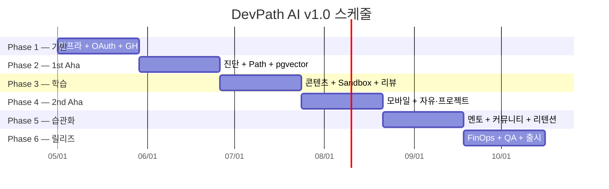

# 17. 스케줄

> **총 기간**: 24주
> **마일스톤**: M1(가입 플로우), **M2(1st Aha)**, M3(학습 실행), **M4(2nd Aha)**, M5(습관화), M6(v1.0 릴리즈)

---

## 1. 전체 로드맵

```text
Phase 1 ─── Week 1-4  ──▶ M1 가입 플로우
Phase 2 ─── Week 5-8  ──▶ M2 🎉 1st Aha (개인화 경로)
Phase 3 ─── Week 9-12 ──▶ M3 학습 실행
Phase 3 ─── Week 9-12  ──▶ M3 🎉 2nd Aha (실무급 AI 리뷰)
Phase 4 ─── Week 13-16 ──▶ M4 모바일·커뮤니티 확장
Phase 5 ─── Week 17-20 ──▶ M5 습관화
Phase 6 ─── Week 21-24 ──▶ M6 v1.0 릴리즈
```

---

## 2. Phase 1 — 기반 + 가입 플로우 (Week 1-4)

### Week 1: 인프라 부트스트랩
- [ ] 폴리레포(9개) 구성 + GitHub Packages shared 라이브러리 ([W1 인프라 재정의 설계](https://github.com/DevPathAi/devpath-shared/blob/main/docs/superpowers/specs/2026-06-13-w1-infra-redefinition-design.md))
- [ ] Docker Compose 로컬 환경
- [ ] CI/CD 파이프라인 (GitHub Actions)
- [ ] Flyway 초기 스키마
- [ ] **[법적 필수]** 3년 미이용 사용자 분리보관 테이블 설계 + 배치 스케줄러 스키마 (정보통신망법 제29조)

### Week 2: OAuth2 인증
- [ ] Spring Security 7 + OAuth2 Client
- [ ] GitHub / Google / 카카오 Provider
- [ ] JWT + Refresh Cookie
- [ ] users / user_oauth_identities / user_profiles 스키마
- [ ] `UserRegisteredEvent` Outbox

### Week 3: GitHub 프로필 수집
- [ ] GitHub API 클라이언트 (사용자 토큰)
- [ ] GithubProfileFetchWorker (비동기)
- [ ] github_profiles / repositories / language_stats
- [ ] Rate Limit 처리 + 토큰 암호화 (AES-256-GCM)

### Week 4: 랜딩 페이지 + 관리자 기초 + **커뮤니티 스키마 선반영**
- [ ] 랜딩 페이지 (히어로 데모 영상)
- [ ] Admin 콘텐츠 CRUD
- [ ] **커뮤니티 스키마 Flyway**: community_posts / questions / answers / comments / votes / tags / user_tag_reputation / badges / reports / learning_context_snapshots
- [ ] M1 완료: "가입 후 GitHub 프로필 분석 완료" 내부 시연

---

## 3. Phase 2 — 🎉 1st Aha (Week 5-8)

### Week 5: 진단 테스트
- [ ] question_bank + Bloom 태깅 스키마
- [ ] 적응형 진단 알고리즘 (난이도 ±)
- [ ] 비회원 진단 세션 (Redis 30분)
- [ ] 객관식 + 코드 읽기 UI
- [ ] 결과 → 회원 이관 플로우

### Week 6: Learning Path Engine (Claude)
- [ ] Claude API 클라이언트 (Sonnet 4.6)
- [ ] Path 생성 프롬프트 v1 + 버전 관리
- [ ] JSON strict 응답 파싱
- [ ] `LearningPathGeneratedEvent`

### Week 7: pgvector 매칭
- [ ] 콘텐츠 임베딩 파이프라인 (text-embedding-3-small)
- [ ] HNSW 인덱스
- [ ] milestone.target_skills → 콘텐츠 매칭 로직
- [ ] path_milestones + path_weekly_tasks 생성

### Week 8: 1st Aha UX + Q&A 게시판 기본
- [ ] SSE 진행 스트리밍 (4단계)
- [ ] 학습 경로 시각화 화면
- [ ] "왜 이 순서인가" rationale 렌더
- [ ] 단일 CTA 검증
- [ ] **Q&A CRUD API + 목록/상세/작성/답변/채택** (평판 시스템 없이)
- [ ] **태그 자동완성 + 검색 인덱스 (Elasticsearch posts 인덱스)**
- [ ] **M2 완료 기준**: 가입 → 1st Aha p50 < 8분 (staging), 내부에서 Q&A 작성·답변 가능

---

## 4. Phase 3 — 학습 실행 (Week 9-12)

### Week 9: 콘텐츠 뷰어
- [ ] Markdown + Syntax Highlighting
- [ ] 코드 블록 인라인 실행 팝오버
- [ ] 진척 자동 추적 (스크롤 + 체류)
- [ ] 다음 콘텐츠 추천

### Week 10: Sandbox Runner 기반
- [ ] Docker 컨테이너 풀 (Java21/Node20/Python3.12)
- [ ] gVisor (runsc) 런타임
- [ ] 리소스 제한 (CPU/MEM/30s/네트워크 차단)
- [ ] sandbox_sessions + 실행 로그 SSE

### Week 11: Monaco 에디터 + 제출
- [ ] Web 에디터 통합
- [ ] 테스트 러너 결과 파싱
- [ ] `SandboxRunSubmittedEvent`
- [ ] 힌트 3단계 (선택)

### Week 12: AI 코드 리뷰 Worker + **AI 시드 답변**
- [ ] **[법적 필수]** 프롬프트 인젝션 방어 구현 (입력 필터링 + system prompt 방어 + 탈옥 방지) — AI 기능 활성화 전 필수
- [ ] Claude 코드 리뷰 프롬프트 + 골든 50 케이스
- [ ] ai_code_reviews 스키마 + 비동기 처리
- [ ] 👍👎 피드백
- [ ] **AI Seed Answer Worker** — 질문 작성 즉시 Claude 호출, `community_ai_answers` 저장
- [ ] **유사 질문 탐지 (pgvector, 임계 0.80)**
- [ ] **M3 완료**: 과제 제출 → AI 리뷰 수신, Q&A 질문 시 AI 초안 3~5초 내 노출

---

## 5. Phase 4 — 모바일 앱 기본 + 커뮤니티 확장 (Week 13-16)

### Week 13: 모바일 앱 기본 (Flutter)
- [ ] Flutter 앱 스캐폴드 (OAuth2 로그인 + JWT)
- [ ] 홈 대시보드 (스트릭 · 이번 주 진척률 · 다음 과제)
- [ ] 딥링크 + FCM 푸시 기반 인프라

### Week 14: 모바일 학습 뷰어
- [ ] 콘텐츠 뷰어 (Markdown 렌더 + 코드 블록)
- [ ] 진척도 동기화
- [ ] 오프라인 읽기 캐시 (drift)

### Week 15: 자유게시판 + 프로젝트 공유
- [ ] 자유게시판 CRUD + 카테고리 6종 + 댓글·좋아요
- [ ] 프로젝트 공유 게시판 + GitHub URL + 스타
- [ ] 커뮤니티 검색 (Elasticsearch)

### Week 16: 사용자 프로필 + UX 안정화
- [ ] 사용자 프로필 화면 (평판 / 태그별 평판 뼈대 / 배지 슬롯)
- [ ] 모바일 퀵 캡처 (노트/아이디어 저장)
- [ ] UX 회귀 라운드 + 성능 튜닝
- [ ] **M4 완료**: 모바일 앱 + 커뮤니티 3개 게시판 작동

---

## 6. Phase 5 — 습관화 (Week 17-20)

### Week 17: AI 멘토 (컨텍스트 인식) + **학습 맥락 연결 커뮤니티**
- [ ] ai_mentor_sessions + context_snapshot
- [ ] 현재 콘텐츠 + 최근 5 Sandbox 자동 주입
- [ ] SSE 스트리밍
- [ ] 참고 자료 (content/sandbox 링크)
- [ ] **`learning_context_snapshots` 자동 수집** (질문 작성 시 Opt-in 토글)
- [ ] **답변자 UI 맥락 패널** (학습 경로·현재 콘텐츠·최근 에러)
- [ ] **맥락 항목 개별 on/off + 미리보기 + 공개 범위 선택**

### Week 18: 평판 시스템 + 피어 매칭 + **Bronze 배지**
- [ ] **평판 엔진**: upvote/downvote/채택 이벤트 기반 집계
- [ ] **태그별 평판 별도 집계** (`user_tag_reputation`)
- [ ] **평판 레벨별 권한 언락** (15/125/500/1000)
- [ ] **Bronze 배지 9종 자동 수여 + 알림**
- [ ] **일일 +40 상한 + 7일 신규 투표 제한 + sockpuppet 탐지**
- [ ] 같은 주차 + 개념 교집합 피어 매칭

### Week 19: 진척·리텐션 루프
- [ ] 스트릭 계산 (TZ 지원)
- [ ] user_badges + 자동 수여
- [ ] 대시보드 UI (홈)
- [ ] 주간 리포트 배치 (일요일 19:00)
- [ ] 3일 미접속 AI 제안 배치

### Week 20: 알림 + 정체 탐지
- [ ] 사용자 선호 시간대 푸시 스케줄러
- [ ] FCM 모바일 푸시 + 이메일
- [ ] 정체 탐지 AI (Claude) 난이도 재조정 제안
- [ ] **M5 완료**: D7 리텐션 ≥ 25% (staging 기준)

---

## 7. Phase 6 — FinOps + QA + 릴리즈 (Week 21-24)

### Week 21: FinOps
- [ ] ai_cost_logs 수집 + Grafana 대시보드
- [ ] Semantic Cache (Redis TTL 7일)
- [ ] 3계층 Kill-switch
- [ ] 사용량 한도 가드 (멘토/Sandbox)
- [ ] 2 Aha 퍼널 대시보드

### Week 22: 보안 + Chaos + **AI 모더레이션 + 신고**
- [ ] Sandbox pentest (격리 탈출 시도 자동 테스트)
- [ ] OAuth 토큰 암호화 키 rotation 리허설
- [ ] Chaos: Claude 다운 / CDN 다운 / Sandbox 풀 고갈
- [ ] OWASP ZAP 스캔
- [ ] **AI 자동 모더레이션 4단계 심각도 (Haiku + 규칙 기반 사전 필터)**
- [ ] **사용자 신고 + 6 카테고리 + Admin 큐**
- [ ] **사용자 제재 체계 (경고/7일/30일/영구) + 이의제기**

### Week 23: 부하 테스트 + QA
- [ ] k6 시나리오 전체
- [ ] 모바일 실기기 회귀 (Android·iOS 각 3종)
- [ ] SonarQube Quality Gate

### Week 24: 통합 QA + 배포 + **Founding Contributors 활성화**
- [ ] 회귀 테스트 체크리스트 전부 통과
- [ ] [13_테스트_보고서.md](./13_테스트_보고서.md) 작성
- [ ] 문서 세트 최종 업데이트
- [ ] staging → prod Canary (10% → 50% → 100%)
- [ ] 릴리즈 노트 공지
- [ ] **Founding Contributors 50명 프로필 활성화 + 평판 500 부여 + 영구 배지**
- [ ] **미답변 질문 자동 승격 (24h) + "지금 답하면 좋은 질문" 홈 카드**
- [ ] **M6 완료**: v1.0 정식 릴리즈, 커뮤니티 질문당 평균 답변 1.5개(내부 측정)

---

## 8. 마일스톤 요약

| 마일스톤 | 시점 | 완료 기준 |
|----------|------|-----------|
| M1 가입 플로우 | Week 4 | GitHub OAuth + 프로필 수집 |
| **M2 1st Aha** | Week 8 | 가입 → 경로 p50 < 8분 |
| M3 학습 실행 | Week 12 | Sandbox + AI 리뷰 작동 |
| **M4 모바일·커뮤니티** | Week 16 | Flutter 앱 + 자유/프로젝트 게시판 + 프로필 |
| M5 습관화 | Week 20 | D7 리텐션 ≥ 25% (staging) |
| M6 v1.0 | Week 24 | 회귀 + 부하 + Chaos 전부 통과 |

---

## 9. 간트 차트 (요약)



---

## 10. 종속성

| 선행 | 후행 | 이유 |
|------|------|------|
| Week 2 OAuth | Week 3 GitHub Worker | 토큰 필요 |
| Week 3 GitHub | Week 6 Path Engine | 프로필 입력 |
| Week 5 진단 | Week 6 Path | 진단 결과 입력 |
| Week 7 pgvector | Week 9 콘텐츠 | 임베딩 인프라 |
| Week 10 Sandbox | Week 12 AI 리뷰 | 제출 이벤트 |
| Week 13-14 모바일 앱 | Week 15 커뮤니티 | 모바일 UI 컴포넌트 |
| Week 17 멘토 | Week 20 정체 탐지 | 컨텍스트 시스템 |

---

## 11. 리스크 & 완충

| 리스크 | 영향 | 완충 |
|--------|------|------|
| 모바일 플랫폼 리젝션 | M4 | iOS 리뷰 가이드라인 사전 체크 + 웹 우선 공개 |
| Claude 프롬프트 품질 | M2, M3 | 골든 케이스 + A/B |
| Sandbox 격리 이슈 | M3 | gVisor 검증 2주 여유 |
| OAuth provider 승인 | M1 | 3개 provider 동시 신청 |
| 2 Aha 도달률 미달 | M2, M4 | UX A/B + 배포 관찰 |
| Spring Boot 4 GA 미출시 | M1 | 3.4.x 폴백 옵션 사전 검증 (ADR 001) |
| 콘텐츠 부족 (100편 미달) | M3 | LLM 보조 초안 + 내부 집필 병행 |
| Flutter 개발자 합류 지연 | M4 | Week 10-12에 사전 온보딩 배치 |

### 11.1 Phase별 완충 기간

| Phase 전환 | 완충 | 용도 |
|-----------|------|------|
| Phase 1→2 (Week 4→5) | **없음** (종속성 없음) | — |
| Phase 2→3 (Week 8→9) | **1주 (Week 9)** | pgvector 안정화 + 경로 퍼널 관찰 |
| Phase 3→4 (Week 12→13) | **없음** (병렬 가능) | — |
| Phase 4→5 (Week 16→17) | **1주 (Week 17)** | 모바일 앱 스토어 심사 대기 |
| Phase 5→6 (Week 20→21) | **1주 (Week 21)** | 습관화 지표 관찰 + 스프린트 잔여 처리 |

> 완충 3주 확보. 24주 일정 내 흡수 가능 (기존 Phase 각 4주 → 핵심 3주 + 완충 1주). 완충 사용 시 리소스 할당표(§12)도 조정 필요.

### 11.2 외부 의존성 타임라인

| 의존성 | 신청 시점 | 예상 소요 | 필요 시점 | 비고 |
|--------|----------|----------|----------|------|
| 카카오 OAuth 앱 심사 | Week 1 | 3~7일 | Week 2 | 비즈앱 전환 필요 시 +2주 |
| Google OAuth 동의 화면 검증 | Week 1 | 2~6주 | Week 2 | 사용자 100명 이하 테스트 모드로 우선 진행 |
| Apple 개발자 계정 | Week 8 | 1~3일 (개인) / 최대 4주 (조직) | Week 13 | 조직 계정은 DUNS 번호 필요 |
| Apple App Store 심사 | Week 15 | 1~7일 | Week 16 | 첫 제출 리젝 가능성 고려 |
| Google Play Store 심사 | Week 15 | 1~3일 | Week 16 | 비교적 빠름 |
| Anthropic API 프로덕션 한도 승인 | Week 4 | 1~2주 | Week 6 | 사전에 usage plan 제출 |

### 11.3 콘텐츠 제작 일정

| 산출물 | 담당 | 시작 | 완료 | 비고 |
|--------|------|------|------|------|
| 진단 문항 500개 (Bloom 태깅) | AI Engineer + PM | Week 3 | Week 5 | LLM 초안 + 전문가 검수. 적응형 난이도 캘리브레이션 포함 |
| 학습 콘텐츠 Markdown 30편 (Phase 3용) | PM + 외주 | Week 5 | Week 9 | 최소 Sprint 1 착수 가능 분량 |
| 학습 콘텐츠 100편 전체 | PM + 외주 + LLM 보조 | Week 5 | Week 20 | 주 5편 페이스. 부족 시 LLM 초안 비중 확대 |
| 실습 과제 코드 블록 50개 | Backend 팀 | Week 8 | Week 12 | 콘텐츠와 연동, 테스트 케이스 포함 |
| AI 코드 리뷰 골든 케이스 50개 | AI Engineer | Week 9 | Week 12 | 11_테스트_전략서 §16 참고 |
| 커뮤니티 시드 콘텐츠 | PM + Founding Contributors | Week 13 | Week 16 | Q&A 30개 + 자유게시판 10개 |

### 11.4 Flutter 개발자 사전 온보딩

| 시점 | 활동 |
|------|------|
| Week 10 | Flutter 개발자 합류. 코드베이스 구조 파악 + OAuth 로그인 통합 PoC |
| Week 11 | drift 로컬 DB 설정 + FCM 푸시 기반 인프라 구축 |
| Week 12 | 홈 대시보드 UI 스캐폴드 + API 연동 시작 |
| Week 13~ | Phase 4 본격 개발 (기존 스케줄대로) |

---

## 12. 리소스 할당 (주차별 포커스)

| Week | Backend | Frontend | Mobile | AI | QA | Community |
|------|---------|----------|-----------|----|----|-----------|
| 1-4 | OAuth + GitHub + **커뮤니티 스키마** | 랜딩 + Admin | (대기) | 프롬프트 준비 | CI 설정 | Founding Contributor 후보 리스트업 |
| 5-8 | Path Engine + **Q&A API** | 경로 UX + **Q&A UI** | (대기) | Claude + pgvector | 통합 | 50명 후보 접촉 시작 |
| 9-12 | Sandbox + **AI Seed Worker** | Monaco + Q&A 개선 | (대기) | 코드 리뷰 + 시드 답변 프롬프트 | pentest | Founding 20명 확보 |
| 13-16 | **자유/프로젝트 게시판** | **프로필 + 게시판** | **Flutter 홈·학습·프로필** | (대기) | 실기기 회귀 | 게시판 시드 콘텐츠 |
| 17-20 | 멘토 + **평판 엔진 + 학습 맥락** | 학습 맥락 UI + 대시 | 모바일 대시 | 멘토 프롬프트 + 모더 | 회귀 | 50명 완주, 평판 500 준비 |
| 21-24 | FinOps + Chaos + **모더레이션** | 관리자 + 알람 + 커뮤니티 | 릴리즈 | 최종 | 부하 + UAT | **Founding 활성화 + 운영 시작** |

---

## 13. 리뷰 미팅 리듬

| 미팅 | 빈도 | 참가자 |
|------|------|--------|
| Standup | 매일 15분 | 전원 |
| Phase 킥오프 | Phase 시작 | 전원 |
| 주간 리뷰 | 매주 금 | 전원 |
| Architecture Review | 격주 | Tech Leads |
| Mobile UX 싱크 | 주간 | Mobile Dev + Designer |
| Pre-release Go/No-Go | M2/M4/M6 직전 | PM + Leads |
| Post-mortem | 장애 후 72h | 관련자 |

---

## 14. 변경 관리

- **스코프 변경**: PM + Tech Leads 공동 승인, 이슈 기록
- **일정 조정**: 주간 리뷰에서 공개 검토
- **스코프 아웃**: v1.1 또는 v2.0 (Feature Flag 유지)

---

## 15. 커뮤니티 기능 스케줄 (CEO 리뷰 보강 5)

| 주차 | 기능 | 상세 |
|------|------|------|
| Week 5-8 | Q&A 기본 + 맥락 첨부 | 질문/답변 CRUD, 학습 맥락 자동 첨부, AI 시드 답변, AI 모더레이션 |
| Week 9-12 | 기본 평판 시스템 | 평판 획득/차감, 태그별 평판, 기본 배지, 투표 |
| Week 13-16 | 자유게시판 + 프로젝트 공유 | 커뮤니티 확장, FC 모집 시작 |
| Week 17-20 | 고급 기능 | 현상금, 신뢰 사용자 권한 위임, 에스컬레이션 자동화 |
| Week 21-24 | QA + 최적화 | 성능 튜닝, A/B 테스트, 데이터 플라이휠 대시보드 |

**변경 이유:** 1st Aha 직후(Week 5) 커뮤니티 접근 가능해야 하며, 평판 없는 Q&A는 차별점이 없으므로 평판을 Week 9-12로 앞당김.

---

## 16. 관련 문서

- [01_프로젝트_계획서.md](./01_프로젝트_계획서.md)
- [07_요구사항_정의서.md](./07_요구사항_정의서.md)
- [11_테스트_전략서.md](./11_테스트_전략서.md)
- [14_배포_가이드.md](./14_배포_가이드.md)
