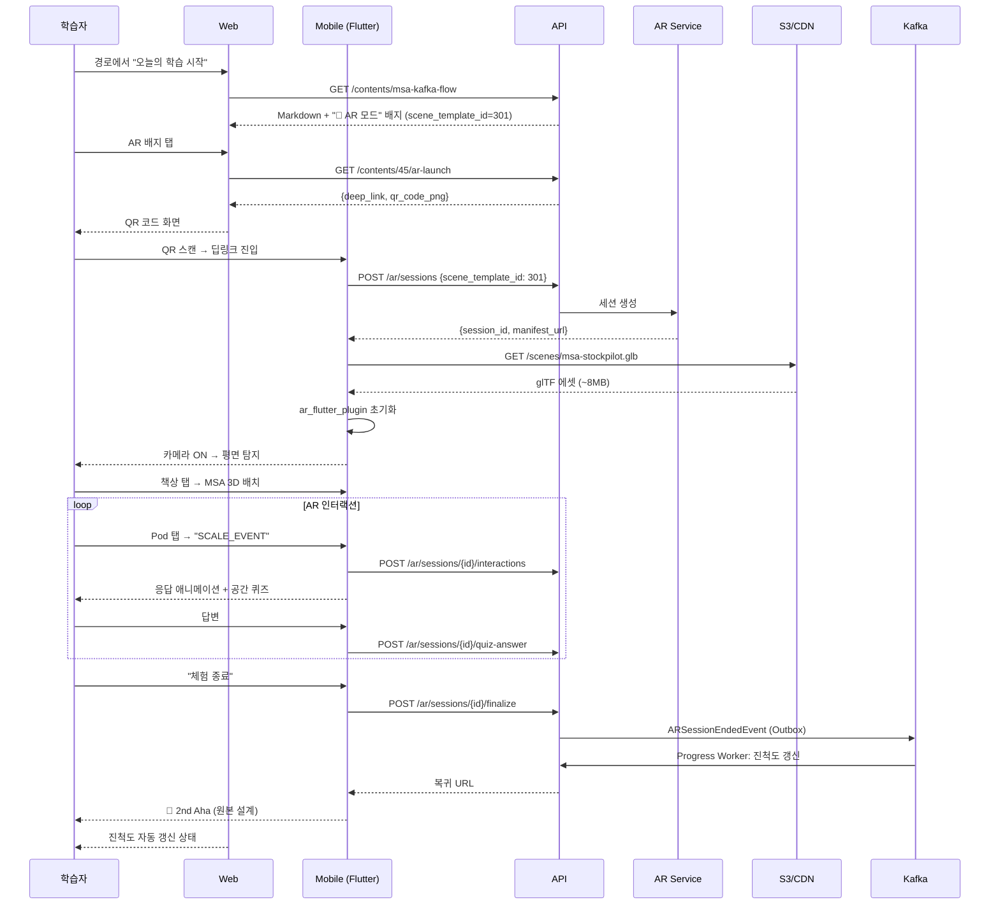

# 22. AR 아키텍처 체험 참고 설계

> **📎 아카이브 문서 (v2.0 — 현재 비활성)**
>
> **문서 성격**: 본 위키 01~20에서 **명시적으로 제외했던 AR(Augmented Reality) 관련 내용**을 한 곳에 모아둔 **참고 자료**.
> 실제 AR 작업은 v1.0 MVP 이후의 작업 대상이며, 필요 시 별도 의사결정을 거쳐 재활성화합니다.
>
> **핵심 전제**
> - 본 문서의 모든 기능은 **v1.0에 포함되지 않음**
> - 2nd Aha Moment는 본 위키에서 **"첫 실습 과제 해결 + AI 코드 리뷰 수신"**으로 재정의됨
> - AR은 차별화의 "마케팅 훅" 후보로만 남겨두며, 본 설계는 실제 착수 시 기초 자료로 활용

---

## 목차
1. AR 전략적 포지셔닝 (왜 연기했나)
2. 2 Aha 컨셉의 원본 설계
3. 기능 요구사항 (FR-AR)
4. 데이터 모델 (scene_templates / ar_sessions)
5. API 스펙 (/ar/*)
6. 시퀀스 다이어그램
7. 화면 — AR Mode Intro / Camera View
8. 와이어프레임 스펙 (A01 / A02)
9. Flutter + ar_flutter_plugin 구현
10. glTF 에셋 파이프라인 · CDN
11. 디바이스 매트릭스 (Firebase Test Lab)
12. 2D 폴백 전략
13. 운영 모니터링 지표
14. 마이크로카피 (Step 5. AR 모드 진입)
15. 리스크와 연기 사유
16. 재활성화 시 영향 문서 체크리스트

---

## 1. AR 전략적 포지셔닝 (왜 연기했나)

**원래 기획 의도**
- **"Pod 간 거리를 걸어서 이해하는 최초의 개발자 교육"** 슬로건
- 추상적 아키텍처(MSA·K8s·자료구조)를 **공간 경험**으로 치환
- 가입 후 10분 안에 두 번의 Aha Moment 제공

**연기 사유**
| 사유 | 상세 |
|------|------|
| 3D 에셋 제작 비용·시간 | 씬 1개당 2~3주 제작. MVP 20~30개 확보가 24주 일정 압박 |
| AR 디바이스 호환성 | ARCore 7.0+ / ARKit 13.0+ 전제. 미지원 기기 비율 높음 |
| 플랫폼 성숙도 | Flutter `ar_flutter_plugin`은 Android 최적화 우선, iOS 안정성 변동 |
| 비용 | CDN 대역폭(평균 씬 8MB) + FTL(Firebase Test Lab) 테스트 비용 |
| 핵심 가치 충돌 | AR 개발 시간만큼 **커뮤니티·콘텐츠 품질**에 투자하는 것이 초기 리텐션 ROI가 더 큼 |

**현재 결정**
- v1.0 MVP 차별화 축은 **AI 개인화 학습 경로 + 학습 맥락 커뮤니티** 두 가지로 수렴
- 2nd Aha Moment는 **"첫 실습 과제 해결 + AI 코드 리뷰 수신"**으로 재정의
- AR은 **v2.0 이후 재검토** (3D 아티스트 확보·CDN 예산·디바이스 MAU 확보 시점)

---

## 2. 2 Aha 컨셉의 원본 설계

```text
[원본]
Step 0. 랜딩
Step 1. OAuth2 가입
Step 2. 온보딩
Step 3. 🎉 1st Aha — 개인화 학습 경로 수신 (3~8초 로딩) ← 유지
Step 4. 첫 학습 세션 (Markdown + 코드 블록 + AR 배지)
Step 5. 🎉 2nd Aha — AR 모드 (책상 위 MSA 3D 배치) ← 본 문서로 이관
Step 6. Sandbox 실습 → AI 코드 리뷰
...

[현재 (본 위키 v1.0)]
Step 3. 🎉 1st Aha — 개인화 학습 경로 수신 ← 유지
Step 4. 첫 학습 세션
Step 5. Sandbox 실습 → AI 코드 리뷰
Step 6. 🎉 2nd Aha — 첫 과제 해결 + 실무급 코드 리뷰 (재정의)
```

AR 복귀 시 Step 5에 다시 삽입할 수 있도록 UX/데이터 구조 후크만 남겨두는 것을 권장.

---

## 3. 기능 요구사항 (FR-AR)

| ID | 요구사항 | 우선순위 |
|----|----------|----------|
| FR-AR-001 | Flutter `ar_flutter_plugin` 통합 | Must |
| FR-AR-002 | ARCore 7.0+ / ARKit 13.0+ 지원 | Must |
| FR-AR-003 | 웹에서 QR 코드 → 앱 딥링크 | Must |
| FR-AR-004 | glTF 에셋 CDN 다운로드 + 캐시 | Must |
| FR-AR-005 | 평면 탐지 + 3D 배치 (anchor) | Must |
| FR-AR-006 | Hotspot 탭 인터랙션 | Must |
| FR-AR-007 | 공간 UI 퀴즈 (interaction_schema 기반) | Must |
| FR-AR-008 | 세션 finalize → 진척도 반영 | Must |
| FR-AR-009 | **미지원 기기 2D 폴백** | Must |
| FR-AR-010 | 다국어 (한국어 우선) | Should |
| FR-AR-011 | MVP 씬 20~30개 (MSA·자료구조·알고리즘 흐름) | Must |

---

## 4. 데이터 모델

### 4.1 `scene_templates`
| 컬럼 | 타입 | 설명 |
|------|------|------|
| id | BIGINT PK | |
| slug | VARCHAR UK | |
| title | VARCHAR | |
| scene_type | ENUM | MSA_ARCHITECTURE / DATA_STRUCTURE / ALGORITHM_FLOW |
| glb_asset_url | VARCHAR | CDN URL |
| thumbnail_url | VARCHAR | |
| interaction_schema | JSONB | hotspots, quizzes |
| required_ar_platform | ENUM | ARCORE_7 / ARKIT_13 |
| created_at | TIMESTAMPTZ | |

### 4.2 `ar_sessions`
| 컬럼 | 타입 | 설명 |
|------|------|------|
| id | BIGINT PK | |
| user_id | BIGINT FK | |
| scene_template_id | BIGINT FK | |
| content_id | BIGINT FK | 원본 콘텐츠 |
| started_at, ended_at | TIMESTAMPTZ | |
| duration_sec | INT | |
| interactions | JSONB | |
| completion_status | ENUM | COMPLETED / INCOMPLETE / ERROR |
| device_model | VARCHAR | |
| ar_platform | ENUM | ARCORE / ARKIT |

### 4.3 `ar_quiz_attempts`
| 컬럼 | 타입 | 설명 |
|------|------|------|
| id | BIGINT PK | |
| ar_session_id | BIGINT FK | |
| quiz_item_id | VARCHAR | interaction_schema 내 id |
| answer | JSONB | |
| is_correct | BOOLEAN | |
| answered_at | TIMESTAMPTZ | |

### 4.4 Contents 관련
- `contents.scene_template_id BIGINT NULL REFERENCES scene_templates(id)` — AR 배지 트리거

### 4.5 interaction_schema 예시
```json
{
  "hotspots": [
    {"id": "order-pod", "label": "Order Service", "action": "SCALE_EVENT"},
    {"id": "inventory-pod", "label": "Inventory Service", "responds_to": "order-pod"}
  ],
  "quizzes": [
    {"id": "q1", "trigger": "after:SCALE_EVENT", "prompt": "Inventory는 어떻게 반응하나요?"}
  ]
}
```

### 4.6 이벤트
- `ARSessionEndedEvent` → Progress Worker (진척도 반영)

---

## 5. API 스펙

| Method | Endpoint | 설명 | 권한 |
|--------|----------|------|------|
| GET | `/contents/{id}/ar-launch` | QR + 딥링크 생성 | LEARNER |
| POST | `/ar/sessions` | 세션 시작 (Flutter) | LEARNER |
| POST | `/ar/sessions/{id}/interactions` | hotspot 이벤트 | OWNER |
| POST | `/ar/sessions/{id}/quiz-answer` | AR 퀴즈 답안 | OWNER |
| POST | `/ar/sessions/{id}/finalize` | 종료 → `ARSessionEndedEvent` | OWNER |
| GET | `/ar/scenes/{id}/manifest` | glTF 매니페스트 + CDN URL | LEARNER |

### 5.1 `GET /contents/{id}/ar-launch` 응답
```json
{
  "scene_template_id": 301,
  "scene_title": "StockPilot MSA Architecture",
  "deep_link": "devpath://ar/scene/301?content=45&session=uuid",
  "qr_code_png_base64": "iVBORw0KG...",
  "required_ar_platform": "ARCORE_7_OR_ARKIT_13",
  "fallback_2d_url": "/contents/45/interactive-diagram"
}
```

### 5.2 `POST /ar/sessions/{id}/finalize` 요청
```json
{
  "ended_at": "2026-04-22T10:45:00Z",
  "duration_sec": 420,
  "device_model": "iPhone 15 Pro",
  "ar_platform": "ARKIT",
  "interactions_count": 12,
  "quizzes_solved": 3
}
```

---

## 6. 시퀀스 다이어그램



---

## 7. 화면 — AR Mode Intro / Camera View

### 7.1 SCR-M-AR-001 (AR 모드 진입)
- 풀스크린, bg radial gradient (neutral/900 → ar/700)
- 96×96 🥽 아이콘
- Glass card 3단 안내: 카메라 권한 / 평면 비추기 / 파란 표시 탭
- 하단 Primary AR 버튼 "AR 시작"

### 7.2 SCR-M-AR-002 (AR Camera View)
- 카메라 피드 위 오버레이
- Top: [🥽 종료] / [? 도움말]
- 중앙: cyan grid 오버레이, 파란 영역 pulse 애니메이션
- 하단 상태 텍스트
  - "책상이나 바닥을 비추세요"
  - "공간 인식 중..."
  - "파란 영역을 탭하세요"

### 7.3 웹 측 2D 폴백 (SCR-W-CNT-002)
ARCore 미지원·iOS 14 이하 → **인터랙티브 2D 다이어그램** (React Flow). 동일 인터랙션·퀴즈 보존, 진척도 동일 처리.

---

## 8. 와이어프레임 스펙 (19번 기준 A01 / A02)

### 8.1 Screen A01. AR Mode Intro
```
┌───────────────────────────────────┐
│  Background: radial-gradient      │
│  (neutral/900 → ar/700)           │
│  + grain texture 3%               │
│                                   │
│  space/16 top                     │
│  [🥽 큰 아이콘 96×96]              │
│                                   │
│  display-md, white, center        │
│  AR 체험 준비                     │
│                                   │
│  space/10                         │
│  ┌─────────────────────────────┐  │
│  │ 1  📷 카메라 권한 허용       │  │ Glass card
│  │ 2  📐 평평한 바닥·책상 비추기│  │ bg rgba(255,255,255,0.1)
│  │ 3  👆 파란 표시 탭           │  │ backdrop-filter blur 20px
│  └─────────────────────────────┘  │
│                                   │
│  body-sm, white/70                │
│  어지러우면 🥽 버튼으로 종료 가능  │
│                                   │
├── Sticky bottom ──────────────────┤
│  ┌─────────────────────────────┐  │
│  │ AR 시작                  →  │  │ Primary AR bg ar/500
│  └─────────────────────────────┘  │
│  [나중에 체험]                    │
└───────────────────────────────────┘
```

### 8.2 Screen A02. AR Camera View
```
┌───────────────────────────────────┐
│  [🥽 종료]              [? 도움말]│
│                                   │
│         카메라 피드                │
│         (평면 탐지 중)             │
│                                   │
│         [cyan grid 오버레이]       │
│         파란 영역 pulse 1.5s       │
│                                   │
├─── bottom overlay ────────────────┤
│  body-md, white, center           │
│  파란 영역을 탭하세요             │
│  (상태별 텍스트 변화)             │
└───────────────────────────────────┘
```

### 8.3 AR Badge 컴포넌트
- Height 44 (대형, 콘텐츠 내 삽입)
- Padding 10 16
- Background `color/ar/50`
- Border 1px `color/ar/500`
- Radius `radius/sm` (8)
- 🥽 아이콘 20×20 + text `body-sm` 600 + 우측 chevron

---

## 9. Flutter + ar_flutter_plugin 구현

### 9.1 권한 설정

**Android** (`android/app/src/main/AndroidManifest.xml`)
```xml
<uses-permission android:name="android.permission.CAMERA" />
<uses-feature android:name="android.hardware.camera.ar" android:required="true" />
<meta-data android:name="com.google.ar.core" android:value="required" />
```

**iOS** (`ios/Runner/Info.plist`)
```xml
<key>NSCameraUsageDescription</key>
<string>AR 아키텍처 체험을 위해 카메라가 필요합니다</string>
<key>ARKit</key>
<true/>
```

### 9.2 런타임 흐름
1. 딥링크 수신 → AR Service.startSession(sceneId, contentId)
2. `ar_flutter_plugin` 초기화 (ARCore/ARKit 확인)
3. glTF 다운로드 (CDN, 첫 실행 후 캐시)
4. 평면 탐지 → 탭하여 배치
5. 인터랙션 이벤트 수집 (hotspot 탭, 퀴즈 응답)
6. 세션 종료 → `POST /ar/sessions/{id}/finalize`
7. `ARSessionEndedEvent` → Progress 갱신

### 9.3 호환성
- ARCore 7.0+ (Android 9+)
- ARKit 13.0+ (iOS 15+)
- 미지원 기기: 2D fallback (인터랙티브 다이어그램)

---

## 10. glTF 에셋 파이프라인 · CDN

```text
3D Artist → glTF 제작 (Blender / GLBF)
     │
     ▼
  Git LFS 별도 저장소 (devpath-ar-assets)
     │
     ▼ GitHub Actions on push
  최적화 (Draco / KTX2 텍스처 압축)
     │
     ▼
  CDN 업로드 (CloudFront origin: S3)
     │
     ▼
  DB scene_templates.glb_asset_url 갱신 (Admin API)
```

- 캐시 전략: 파일명에 hash 포함 → 영구 캐시, 교체 시 새 URL
- 용량 기준: 씬 하나당 15MB 이하 (Draco/KTX2 후)

---

## 11. 디바이스 매트릭스 (Firebase Test Lab)

| 디바이스 | OS | AR 플랫폼 | 기대 |
|---------|-----|----------|------|
| Pixel 6 | Android 14 | ARCore 7 | PASS |
| Galaxy S22 | Android 13 | ARCore 7 | PASS |
| Galaxy A52 | Android 12 | ARCore 7 | PASS (저사양 성능) |
| Galaxy A30 | Android 9 | - | **2D 폴백** 작동 |
| iPhone 15 Pro | iOS 17 | ARKit 13 | PASS |
| iPhone 11 | iOS 15 | ARKit 13 | PASS |
| iPhone SE 2 | iOS 14 | - | **2D 폴백** 작동 |

**측정 지표**: glTF 로드 시간, 평면 탐지 시간, FPS (최소 30), 배터리 소모.

---

## 12. 2D 폴백 전략

- ARCore/ARKit 미지원 기기에서 **동일 학습 성취** 보장
- React Flow 기반 인터랙티브 다이어그램
- Hotspot 클릭 → 동일 이벤트 발행
- 공간 퀴즈 → 2D 모달 퀴즈로 변환
- 진척도 동일 처리 (UI만 다름)

---

## 13. 운영 모니터링 지표

### 13.1 AR 커스텀 메트릭
- `ar_session_started_total{device_model, ar_platform}`
- `ar_gltf_load_duration_seconds`
- `ar_session_completion_ratio`
- `ar_2d_fallback_total` (ARCore 미지원 이벤트)

### 13.2 알람 규칙
```yaml
- alert: ARGltfLoadSlow
  expr: histogram_quantile(0.95, rate(ar_gltf_load_duration_seconds_bucket[10m])) > 5
  for: 15m
- alert: ARCompletionLow
  expr: sum(rate(ar_session_completed_total[1h])) / sum(rate(ar_session_started_total[1h])) < 0.5
  labels: { severity: warning }
```

### 13.3 장애 대응
- **CDN 다운**: 2D 폴백 자동 전환 비율 확인 + 공지 배너
- **평면 탐지 실패 빈발**: 조명 가이드 UI 개선 검토

---

## 14. 마이크로카피 (Step 5. AR 모드 진입)

### 14.1 AR 모드 배지 (콘텐츠 내)

**A안 (권장)**
> 🥽 **AR 모드로 이 구조를 3D로 보기** · 모바일 필요
> Pod와 메시지 흐름을 공간에 띄워 관찰합니다.
> [AR 모드 시작]

**B안 (QR 강조, 웹 유저용)**
> **모바일에서 AR로 체험하세요**
> 이 QR을 폰으로 찍으면 앱이 열리며 3D 씬이 로드됩니다.

### 14.2 AR 모드 로딩
> **AR 체험 준비 중**
> 1. 카메라 권한을 허용해주세요
> 2. 평평한 바닥이나 책상을 비추세요
> 3. 파란 표시가 나타나면 탭하세요
>
> 어지러우면 언제든 🥽 버튼으로 종료 가능

### 14.3 평면 탐지 상태별
- 카메라 켜진 직후: "책상이나 바닥을 비추세요"
- 탐지 중: "공간 인식 중..."
- 탐지 완료: "파란 영역을 탭하면 3D 씬이 나타납니다"

### 14.4 공간 내 상호작용
> **Order Service Pod를 탭해보세요**
> 스케일 이벤트를 발생시켜 Inventory Service 반응을 관찰합니다

### 14.5 AR 세션 완료
> **체험 완료 · +100 XP**
> 오늘 배운 것:
> ✓ MSA 메시지 흐름을 공간으로 체험
> ✓ 장애 전파 시나리오 1개 학습
>
> [웹으로 돌아가 실습 과제 풀기]

### 14.6 AR 피로감 감지 (5분+)
> **잠깐 쉬어갈까요? 👀**
> 3D 몰입은 눈의 피로를 유발할 수 있습니다.
> [계속]  [잠시 쉬고 돌아오기]

### 14.7 AR 디바이스 미지원
> **이 기기는 AR을 지원하지 않습니다**
> 지원 기기: iOS 15+ (ARKit 13.0+), Android 9.0+ ARCore 7.0+ 지원 기종
> 괜찮아요. 웹 3D 뷰어로 동일한 콘텐츠를 볼 수 있습니다.
> [웹 3D로 보기]  [일반 다이어그램으로 보기]

---

## 15. 리스크와 연기 사유

| 리스크 | 영향 | 연기 대응 |
|--------|------|----------|
| AR 디바이스 호환성 | 높음 | v2.0에서 ARCore/ARKit MAU 충분 확보 후 재검토 |
| 3D 에셋 제작 비용·시간 | 높음 | 3D 아티스트 확보 + MVP 씬 10개로 시작 (30개 → 10개 축소) |
| Sandbox 악용 (AR과 무관하지만 동일 일정 경쟁) | 중간 | v1.0은 Sandbox + 커뮤니티에 집중 |
| Claude API 비용 폭주 | 높음 | AR 개발 기간을 AI 품질 고도화에 투자 |
| 10분 내 Aha 실패 (온보딩 이탈) | 매우 높음 | 2nd Aha를 **"첫 과제 해결 + AI 리뷰"**로 재정의 → 더 안정적 |
| OAuth2 GitHub Rate Limit | 중간 | AR과 무관, 본 위키에 유지 |
| 콘텐츠 초기 볼륨 부족 | 중간 | AR 에셋 시간을 콘텐츠 제작에 재투자 |

---

## 16. 재활성화 시 영향 문서 체크리스트

AR을 다시 도입할 때 아래 문서를 함께 업데이트해야 합니다.

| 문서 | 변경 예상 |
|------|----------|
| 01 프로젝트 계획서 | 2 Aha 컨셉 부활, Mobile/AR Dev 2명 + 3D Artist 1명 충원, AR 디바이스 호환성 리스크 |
| 02 ERD | `scene_templates` / `ar_sessions` / `ar_quiz_attempts` / `contents.scene_template_id` |
| 03 아키텍처 | AR Service 모듈, CDN 통합, Flutter ar_flutter_plugin 추가, `ARSessionEndedEvent` |
| 04 API | §5 AR 엔드포인트 재추가, `/contents/{id}/ar-launch` |
| 05 시퀀스 | AR 진입 시퀀스 재추가 |
| 06 화면 정의서 | SCR-M-AR-001/002, SCR-W-CNT-002 (2D 폴백), AR 배지 기능 |
| 07 요구사항 | FR-AR 11개 재추가, NFR AR 성능 기준 |
| 08 스토리보드 | L2.2(AR 체험), L2.3(AR 폴백) 재추가, 2 Aha 컨셉 부활 |
| 10 환경 설정 | AR CDN, Flutter AR 권한, `AR_ASSET_CDN_BASE` |
| 11 테스트 전략 | AR 디바이스 매트릭스 (FTL 7종) |
| 12 코드 리뷰 | AR 전용 체크리스트 (glTF 용량, 기기 가드, 2D 폴백) |
| 13 테스트 보고서 | AR 디바이스 매트릭스 결과 |
| 14 배포 가이드 | AR 에셋 배포 트랙 (glTF 최적화 → CDN) |
| 15 사용자 매뉴얼 | AR 모드 사용법 |
| 16 운영 매뉴얼 | AR 성능 모니터링, AR CDN 장애 플레이북 |
| 17 스케줄 | Phase 4 AR, Week 13-16 재배치 |
| 18 마이크로카피 | Step 5. AR 모드 진입 섹션 재추가 |
| 19 와이어프레임 | A01/A02 AR 스크린 재추가 |
| 21 유료 플랜 | AR 무제한 / 프리미엄 AR 시나리오 항목 재추가 |

---

## 17. 관련 문서

- [01_프로젝트_계획서.md](./01_프로젝트_계획서.md) — 2nd Aha는 AI 코드 리뷰로 재정의됨
- [08_스토리_보드.md](./08_스토리_보드.md) — Epic L2 AR 제거
- [17_스케줄.md](./17_스케줄.md) — Phase 4는 모바일 기본 + UX 안정화로 재배치
- [21_유료_플랜_참고설계.md](./21_유료_플랜_참고설계.md) — 다른 참고본

---

**버전**: v1.0 (참고본) · **상태**: 본 위키 범위에서는 **비활성** · **최종 업데이트**: 2026-04-22
