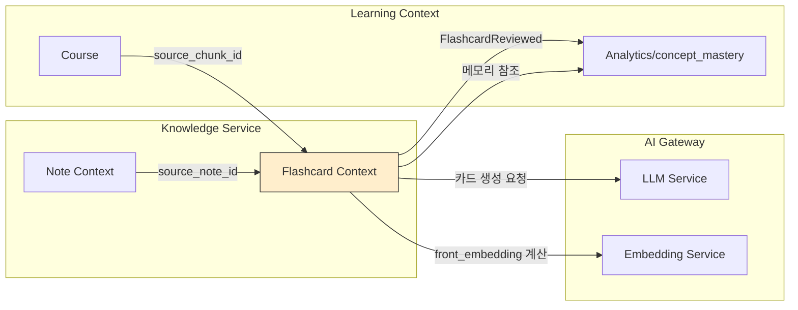

> ⚠️ **아카이브 — 구버전 참고 설계** · 본 문서의 MySQL·LearnFlow 등 표기는 현행과 다릅니다. 현 SSOT는 **PostgreSQL**, 제품명은 **DevPath AI**입니다. (2026-06-13 정합성 점검 — [25_문서_정합성_점검_보고서](./25_문서_정합성_점검_보고서.md))
> **상위 문서**: `AI_LMS_프로젝트_계획서_v5_0_통합완결본.md` (§4.11, §5.8, §9.10)
> **버전**: 1.0
> **작성일**: 2026-04-21
> **범위**: Knowledge Service 내 Flashcard 서브 도메인 — SM-2 알고리즘, 복습 큐, 카드 생성 파이프라인, 모바일 오프라인 동기화
> **독자**: 백엔드 개발자, 모바일 개발자, QA, 관측성 담당

---

## 0. 문서 개요

v5.0 통합 완결본에서 Flashcard 도메인의 **스키마와 SM-2 공식, API 목록**을 정의했다. 이 문서는 그 설계를 **실제 구현 단계까지** 풀어낸다.

### 0.1 이 문서가 다루는 것

| 영역 | 산출물 |
|------|--------|
| 도메인 모델 | Aggregate 경계, Entity/VO, 불변식, JPA 매핑 코드 |
| SM-2 알고리즘 | 의사코드 + Java 구현 + 엣지 케이스 + 속성 기반 테스트 |
| Bloom 가중치 | 확장 공식 + 온보딩 연동 + Feature Flag로 on/off |
| 복습 큐 | Redis ZSET 운영 + DB fallback + 장애 복구 |
| 복습 세션 | 시퀀스 다이어그램 + 트랜잭션 경계 + 멱등성 |
| 카드 생성 | 3종 파이프라인 (강의/노트/선택) + LLM 프롬프트 + 중복 탐지 |
| 이벤트 통합 | Outbox + Analytics Worker + concept_mastery 갱신 |
| API | §9.10 확장 — 전체 요청/응답 스키마 + 에러 케이스 |
| 모바일 | 오프라인 버퍼링 + LWW 충돌 해결 + 동기화 프로토콜 |
| 테스트 | 단위/통합/속성/부하 테스트 전략 |
| 관측성 | 커스텀 메트릭 + 알람 규칙 + Grafana 패널 |
| 롤아웃 | Feature Flag + 베타 그룹 + A/B 지표 |

### 0.2 이 문서가 다루지 않는 것

- **노트 도메인 세부사항** — 별도 상세 설계 문서(Knowledge Notes)에서 다룬다.
- **강의/퀴즈 도메인** — v4.0 범위.
- **UI 구현 상세** — 별도 UX 스펙 문서.
- **인프라 프로비저닝** — 별도 배포 런북.

### 0.3 설계 원칙

1. **Tell, Don't Ask** — SM-2 계산은 `ReviewState` Entity 내부 메서드로. Service에 알고리즘 로직 금지.
2. **Aggregate 경계 = 트랜잭션 경계** — 하나의 복습 결과 제출은 하나의 DB 트랜잭션 안에서 완결.
3. **이벤트 발행은 Outbox로만** — 트랜잭션 안에서 `outbox_events` INSERT. Kafka 직접 호출 금지.
4. **Redis는 캐시/큐로만** — DB가 항상 Source of Truth. Redis 날아가도 서비스 연속.
5. **멱등성 기본** — 같은 복습 결과를 두 번 제출해도 부작용 없음.

---

## 1. 유비쿼터스 언어

도메인 전반에 사용되는 용어를 정의한다. 코드·문서·대화 모두 이 용어로 통일한다.

| 용어 | 영문 | 정의 |
|------|------|------|
| 덱 | Deck | 카드의 논리적 묶음. 사용자 소유이며 강의/노트와 선택적 연결. |
| 카드 | Card | 앞면(질문)/뒷면(답) 쌍. 덱에 속한다. |
| 복습 | Review | 사용자가 카드를 보고 quality(0~5)를 입력하는 단일 행위. |
| 복습 상태 | Review State | 특정 사용자의 특정 카드에 대한 SM-2 파라미터(EF, interval, repetitions, due_at). |
| 복습 큐 | Due Queue | 현재 시각 기준 복습해야 할 카드들의 순서 (Redis ZSET + DB 인덱스). |
| 용이도 | Ease Factor (EF) | SM-2의 난이도 역수. 1.3 ~ ∞. 기본 2.5. |
| 간격 | Interval | 다음 복습까지 일수. |
| 품질 | Quality | 복습 시 사용자가 입력하는 0~5 스코어. 3 이상이 성공. |
| 반복 | Repetitions | 연속 성공 횟수. 실패 시 0으로 리셋. |
| Leech | Leech | 반복 실패 카드. 연속 실패 카운터 8 이상이면 재작성 제안. |
| Bloom 가중치 | Bloom Weight | 카드의 Bloom 레벨(REMEMBER~CREATE)과 concept_mastery의 confidence를 결합한 값. interval 조정용. |
| 세션 | Review Session | 한 번의 복습 실행 단위. 여러 카드를 연속으로 복습한 묶음. `session_id`로 식별. |
| Suspended | Suspended | 사용자가 수동 또는 leech 자동으로 복습 대상에서 제외한 카드. |
| 카드 생성 출처 | Source Type | COURSE_CHUNK / NOTE_CHUNK / MANUAL / AI_GEN. 역추적 경로. |

---

## 2. 바운디드 컨텍스트 & 컨텍스트 맵

### 2.1 Flashcard 컨텍스트의 위치



### 2.2 컨텍스트 관계

| 관계 | 타입 | 설명 |
|------|------|------|
| Flashcard ← Note | **Partnership** | 같은 Knowledge Service 내부. 노트에서 카드 파생 시 `source_note_id` 직접 참조. |
| Flashcard ← Course | **Customer/Supplier** | Course가 안정적 Supplier. `source_chunk_id`로 content_embeddings 참조. |
| Flashcard → Analytics | **Published Language (Outbox 이벤트)** | `FlashcardReviewed` 이벤트 스키마 공유. Analytics는 수신만. |
| Flashcard → LLM Service | **Conformist** | AI Gateway 스펙을 그대로 따른다. 카드 생성 프롬프트/응답 스키마. |
| Flashcard → Embedding Service | **Conformist** | `front_embedding` 계산 API 호출. |

**핵심 원칙**: Flashcard 컨텍스트는 **자기 Aggregate 내부의 SM-2 상태**만 소유한다. concept_mastery 갱신은 이벤트 발행 후 Analytics Worker가 자체 트랜잭션으로 처리.

---

## 3. 도메인 모델

### 3.1 Aggregate 설계

```
┌──────────────────────────────────────────────────────────┐
│  Deck Aggregate (Aggregate Root: Deck)                    │
│  ├─ Deck (Entity, Root)                                   │
│  │   ├─ id, ownerUserId, title, description, settings     │
│  │   ├─ addCard(Card): 카드 추가 (개수 집계)              │
│  │   ├─ archive(): 덱 보관                                │
│  │   └─ updateSettings(DeckSettings): 설정 변경           │
│  └─ DeckSettings (VO, 불변)                               │
│      ├─ sm2EaseDefault: Double                           │
│      ├─ dailyReviewLimit: Integer                        │
│      └─ bloomWeightingEnabled: Boolean                   │
└──────────────────────────────────────────────────────────┘

┌──────────────────────────────────────────────────────────┐
│  Card Aggregate (Aggregate Root: Card)                    │
│  ├─ Card (Entity, Root)                                   │
│  │   ├─ id, deckId, front, back, bloomLevel              │
│  │   ├─ sourceType, sourceChunkId, sourceNoteId          │
│  │   ├─ frontEmbedding: VECTOR(1536)                     │
│  │   ├─ suspend(reason): 카드 보류                        │
│  │   ├─ revive(): 보류 해제                               │
│  │   └─ softDelete(): 삭제 마킹                           │
│  ├─ BloomLevel (Enum VO)                                 │
│  └─ AiGenerationMeta (VO, 불변)                          │
│      ├─ promptVersion: String                            │
│      ├─ model: String                                    │
│      └─ confidence: Double                               │
└──────────────────────────────────────────────────────────┘

┌──────────────────────────────────────────────────────────┐
│  ReviewState Aggregate (Aggregate Root: ReviewState)      │
│  ├─ ReviewState (Entity, Root)                            │
│  │   ├─ id, cardId, userId                                │
│  │   ├─ easeFactor, intervalDays, repetitions            │
│  │   ├─ dueAt, lastReviewedAt, leechCount                │
│  │   ├─ confidenceWeight                                  │
│  │   └─ applyReview(Quality, bloomLevel): ReviewResult   │
│  │        ↑ 핵심 도메인 행위. SM-2 공식이 여기 산다.      │
│  └─ ReviewResult (VO, 반환값)                             │
│      ├─ newState: ReviewState 스냅샷                     │
│      ├─ event: FlashcardReviewed (Outbox 발행용)         │
│      └─ suggestion: Optional<LeechSuggestion>            │
└──────────────────────────────────────────────────────────┘

┌──────────────────────────────────────────────────────────┐
│  Review Aggregate (Append-Only Log)                       │
│  └─ Review (Entity)                                       │
│      ├─ id, cardId, userId, quality, elapsedMs           │
│      ├─ sessionId, reviewContext, reviewedAt             │
│      └─ (수정 불가 — 이력)                                │
└──────────────────────────────────────────────────────────┘
```

### 3.2 Aggregate 경계 결정 근거

| 결정 | 이유 |
|------|------|
| Deck과 Card 분리 | 덱 하나에 카드가 수백~수천 장일 수 있음. 카드 한 장 수정에 덱 전체 락은 비효율. |
| Card와 ReviewState 분리 | 카드는 공유 가능(팀 덱), 복습 상태는 per-user. 수명주기와 접근 패턴이 다름. |
| Review는 별도 append-only | 이력은 수정되지 않는 이벤트 로그 성격. 별도 파티션/아카이빙 적용. |
| 외부 참조는 ID로 | `ReviewState` → `Card` 객체 참조 금지. `cardId`만 보유. |

### 3.3 불변식 (Invariants)

```
Deck:
  - ownerUserId != null
  - title.length in [1, 100]
  - settings.dailyReviewLimit >= 0

Card:
  - deckId != null
  - front.length in [1, 10000]
  - back.length in [1, 10000]
  - front_embedding dimension == 1536 (생성 시점)
  - status in {ACTIVE, SUSPENDED, DELETED}

ReviewState:
  - easeFactor >= 1.3
  - intervalDays >= 0
  - repetitions >= 0
  - dueAt != null
  - leechCount >= 0
  - confidenceWeight in [0.0, 1.0]
  - quality 입력 시 0 <= q <= 5
```

불변식 위반은 `DomainException` 계열 예외로 즉시 실패. 컨트롤러에서 `@ExceptionHandler`로 400 응답.

### 3.4 JPA 매핑 (핵심 Entity만)

```java
// Deck.java
@Entity
@Table(name = "flashcard_decks")
@Getter
@NoArgsConstructor(access = AccessLevel.PROTECTED)
public class Deck {

    @Id @GeneratedValue(strategy = GenerationType.IDENTITY)
    private Long id;

    @Column(nullable = false)
    private Long ownerUserId;

    @Column(name = "course_id")
    private Long courseId; // nullable

    @Column(name = "source_note_id")
    private Long sourceNoteId; // nullable

    @Column(nullable = false, length = 100)
    private String title;

    @Column(columnDefinition = "TEXT")
    private String description;

    @Type(JsonType.class)
    @Column(columnDefinition = "jsonb")
    private DeckSettings settings;

    @Column(nullable = false)
    private Integer cardCount = 0;

    @Column(nullable = false)
    private Integer dueCount = 0;

    @Enumerated(EnumType.STRING)
    @Column(nullable = false)
    private DeckStatus status = DeckStatus.ACTIVE;

    @CreationTimestamp
    private LocalDateTime createdAt;

    @UpdateTimestamp
    private LocalDateTime updatedAt;

    // ─── 팩토리 ───
    public static Deck create(Long ownerUserId, String title,
                              DeckSettings settings) {
        Deck d = new Deck();
        d.ownerUserId = ownerUserId;
        d.title = requireValidTitle(title);
        d.settings = settings != null ? settings : DeckSettings.defaults();
        return d;
    }

    // ─── 도메인 행위 ───
    public void archive() {
        if (this.status == DeckStatus.ARCHIVED) {
            throw new DeckAlreadyArchivedException(this.id);
        }
        this.status = DeckStatus.ARCHIVED;
    }

    public void incrementCardCount() {
        this.cardCount++;
    }

    public void decrementCardCount() {
        if (this.cardCount <= 0) return;
        this.cardCount--;
    }

    public void updateSettings(DeckSettings newSettings) {
        this.settings = Objects.requireNonNull(newSettings);
    }

    private static String requireValidTitle(String title) {
        if (title == null || title.isBlank() || title.length() > 100) {
            throw new InvalidDeckTitleException(title);
        }
        return title.trim();
    }
}

// DeckSettings.java — Value Object (불변)
public record DeckSettings(
    Double sm2EaseDefault,
    Integer dailyReviewLimit,
    Boolean bloomWeightingEnabled
) {
    public static DeckSettings defaults() {
        return new DeckSettings(2.5, 50, true);
    }

    public DeckSettings {
        if (sm2EaseDefault == null || sm2EaseDefault < 1.3) {
            throw new InvalidDeckSettingsException("ease_default < 1.3");
        }
        if (dailyReviewLimit == null || dailyReviewLimit < 0) {
            throw new InvalidDeckSettingsException("daily_limit < 0");
        }
    }
}
```

`Card`와 `ReviewState` 매핑은 유사 패턴. 핵심은 **setter 금지, 의도 드러난 메서드만 공개**. 아래 §4에서 `ReviewState.applyReview()`를 상세히 다룬다.

---

## 4. SM-2 알고리즘 구현

### 4.1 원본 SM-2 공식 (Piotr Wozniak, 1985)

Anki 계열 SRS의 표준 공식. 품질 점수 q ∈ {0,1,2,3,4,5} 입력 기준.

```
if q < 3:
    repetitions = 0
    interval = 1
else:
    if repetitions == 0: interval = 1
    elif repetitions == 1: interval = 6
    else: interval = previousInterval * easeFactor
    repetitions += 1

# EF 갱신 (성공/실패 모두)
EF' = EF + (0.1 − (5 − q) × (0.08 + (5 − q) × 0.02))
EF' = max(1.3, EF')
```

**q별 EF 증분 테이블** (미리 계산해두면 편함):

| q | Δ EF |
|---|------|
| 0 | −0.80 |
| 1 | −0.54 |
| 2 | −0.32 |
| 3 | −0.14 |
| 4 | 0.00 |
| 5 | +0.10 |

### 4.2 Bloom 가중치 확장 (v5.0 신규)

v5.0 §5.8에서 정의한 확장. concept_mastery의 confidence와 카드의 Bloom 레벨을 결합해 **고차원 사고 카드는 더 자주 복습**하도록 조정한다.

```
confidence_base = concept_mastery.confidence (0.0 ~ 1.0)
bloom_multiplier by level:
  REMEMBER    : 1.00
  UNDERSTAND  : 0.95
  APPLY       : 0.85
  ANALYZE     : 0.75
  EVALUATE    : 0.65
  CREATE      : 0.55

weight = clamp(confidence_base × bloom_multiplier, 0.1, 1.0)

# SM-2 공식으로 구한 interval에 가중치 적용
effective_interval = ceil(interval × (0.5 + 0.5 × weight))
```

**의미**:
- REMEMBER(기억) 수준 카드는 원본 SM-2 공식 그대로
- CREATE(창조) 수준 카드는 같은 quality=5라도 interval이 약 0.5×로 짧아짐
- confidence가 낮으면 (온보딩 직후) 전체적으로 interval 보수적

**Feature Flag**: `Deck.settings.bloomWeightingEnabled = false`면 가중치 미적용. 초기 베타는 일부 덱만 on, A/B로 효과 측정 후 전사 on.

### 4.3 엣지 케이스

| 케이스 | 처리 |
|--------|------|
| q < 3이 연속 8회 | `leechCount++` → 8 도달 시 사용자에게 "재작성 제안" 알림 (SUSPENDED 자동 전환 아님) |
| 새 카드 (repetitions == 0, 첫 복습) | repetitions=0 유지, interval=1 또는 6 (q에 따라) |
| 복습을 오래 미룸 (lapse) | SM-2에 명시 없음. Anki는 lapse 후 EF를 더 크게 감소. 우리는 **원본 공식 유지** + leech로 처리 |
| quality = 3 (힘들게 성공) | 성공으로 간주. 단, q=3 지속 시 EF가 −0.14씩 감소해 점점 어려워짐 (의도된 동작) |
| 동일 카드 동일 세션 재복습 | 허용하되 첫 번째만 SM-2 적용. 이후는 `reviewContext=CRAM`으로 이력만 기록 |
| EF가 1.3 미만으로 떨어지려 함 | 1.3 클램프 (SM-2 원본) |
| 카드 SUSPENDED 상태 | 복습 큐에서 제외. 복습 API 호출 시 404 아닌 409 Conflict |

### 4.4 Java 구현 — `ReviewState.applyReview()`

```java
// ReviewState.java (Aggregate Root)
@Entity
@Table(name = "flashcard_review_states",
       uniqueConstraints = @UniqueConstraint(columnNames = {"card_id", "user_id"}))
@Getter
@NoArgsConstructor(access = AccessLevel.PROTECTED)
public class ReviewState {

    private static final double MIN_EASE_FACTOR = 1.3;
    private static final double DEFAULT_EASE_FACTOR = 2.5;
    private static final int LEECH_THRESHOLD = 8;

    @Id @GeneratedValue(strategy = GenerationType.IDENTITY)
    private Long id;

    @Column(nullable = false) private Long cardId;
    @Column(nullable = false) private Long userId;

    @Column(nullable = false) private Double easeFactor;
    @Column(nullable = false) private Integer intervalDays;
    @Column(nullable = false) private Integer repetitions;
    @Column(nullable = false) private LocalDateTime dueAt;

    private LocalDateTime lastReviewedAt;

    @Column(nullable = false)
    private Integer leechCount = 0;

    @Column(nullable = false)
    private Double confidenceWeight = 1.0;

    @Column(nullable = false)
    private Short lastQuality = 0;

    @Version
    private Long version; // 낙관적 락

    @CreationTimestamp private LocalDateTime createdAt;
    @UpdateTimestamp   private LocalDateTime updatedAt;

    // ─── 팩토리: 새 카드 최초 등록 시 호출 ───
    public static ReviewState initial(Long cardId, Long userId,
                                      double defaultEase,
                                      double confidenceWeight) {
        ReviewState rs = new ReviewState();
        rs.cardId = cardId;
        rs.userId = userId;
        rs.easeFactor = defaultEase;
        rs.intervalDays = 0;
        rs.repetitions = 0;
        rs.dueAt = LocalDateTime.now(); // 즉시 복습 대기
        rs.confidenceWeight = clamp(confidenceWeight, 0.1, 1.0);
        return rs;
    }

    // ─── 핵심 도메인 행위: 복습 결과 반영 ───
    public ReviewResult applyReview(int quality,
                                    BloomLevel bloomLevel,
                                    boolean bloomWeightingEnabled,
                                    Clock clock) {
        validateQuality(quality);
        LocalDateTime now = LocalDateTime.now(clock);

        // 1. 기본 SM-2 계산
        int newRepetitions;
        int newIntervalDays;

        if (quality < 3) {
            newRepetitions = 0;
            newIntervalDays = 1;
            this.leechCount++;
        } else {
            newRepetitions = this.repetitions + 1;
            newIntervalDays = computeNewInterval(
                this.intervalDays, newRepetitions, this.easeFactor);
        }

        // 2. EF 갱신
        double newEase = this.easeFactor + efDelta(quality);
        newEase = Math.max(MIN_EASE_FACTOR, newEase);

        // 3. Bloom 가중치 적용 (옵션)
        int effectiveInterval = bloomWeightingEnabled
            ? applyBloomWeight(newIntervalDays, bloomLevel, this.confidenceWeight)
            : newIntervalDays;

        // 4. 상태 갱신 (setter 아닌 의도 명시 메서드)
        this.repetitions = newRepetitions;
        this.intervalDays = effectiveInterval;
        this.easeFactor = newEase;
        this.dueAt = now.plusDays(effectiveInterval);
        this.lastReviewedAt = now;
        this.lastQuality = (short) quality;

        // 5. Leech 제안 (자동 SUSPEND 아님, 사용자 결정)
        Optional<LeechSuggestion> suggestion = this.leechCount >= LEECH_THRESHOLD
            ? Optional.of(new LeechSuggestion(this.cardId, this.leechCount))
            : Optional.empty();

        // 6. 이벤트 생성 (Outbox 발행은 Service에서)
        FlashcardReviewedEvent event = FlashcardReviewedEvent.of(
            this.cardId, this.userId, quality,
            effectiveInterval, newEase, now);

        return new ReviewResult(this, event, suggestion);
    }

    // SM-2 원본 기준: repetitions==0 → interval=1, repetitions==1 → interval=6
    // 여기서 newRepetitions는 이미 +1된 값이므로: newRepetitions==1 ↔ 원본 repetitions==0
    private static int computeNewInterval(int prevInterval,
                                          int newRepetitions,
                                          double ease) {
        if (newRepetitions == 1) return 1;  // 원본 SM-2: repetitions==0
        if (newRepetitions == 2) return 6;  // 원본 SM-2: repetitions==1
        return (int) Math.max(1, Math.round(prevInterval * ease));
    }

    private static double efDelta(int q) {
        // 0.1 − (5 − q)(0.08 + (5 − q) × 0.02)
        double diff = 5 - q;
        return 0.1 - diff * (0.08 + diff * 0.02);
    }

    private static int applyBloomWeight(int interval, BloomLevel level, double confidence) {
        double multiplier = level.getMultiplier();
        double weight = clamp(confidence * multiplier, 0.1, 1.0);
        return (int) Math.ceil(interval * (0.5 + 0.5 * weight));
    }

    private static double clamp(double v, double lo, double hi) {
        return Math.max(lo, Math.min(hi, v));
    }

    private static void validateQuality(int q) {
        if (q < 0 || q > 5) {
            throw new InvalidQualityException(q);
        }
    }

    public void suspend() { /* 도메인 행위 */ }
    public void resetLeech() { this.leechCount = 0; }
}

// BloomLevel.java
public enum BloomLevel {
    REMEMBER(1.00),
    UNDERSTAND(0.95),
    APPLY(0.85),
    ANALYZE(0.75),
    EVALUATE(0.65),
    CREATE(0.55);

    private final double multiplier;
    BloomLevel(double m) { this.multiplier = m; }
    public double getMultiplier() { return multiplier; }
}

// ReviewResult.java (VO)
public record ReviewResult(
    ReviewState state,
    FlashcardReviewedEvent event,
    Optional<LeechSuggestion> leechSuggestion
) {}
```

**설계 포인트**:
- `applyReview()`는 SM-2 공식 전체를 한 메서드에 모았다. Service는 이걸 호출만 한다.
- `Clock` 주입으로 테스트에서 시간 고정 가능.
- `@Version`으로 동시 복습 제출 시 낙관적 락.
- 반환값 `ReviewResult`에 이벤트까지 담아서, Service가 Outbox 발행을 단순 위임으로 처리.

### 4.5 속성 기반 테스트 (Property-Based)

SM-2는 수학적 성질이 있어 속성 테스트에 적합하다. jqwik 사용.

```java
@Property
void qualityGreaterEqual3_alwaysIncreasesRepetitions(
        @ForAll @IntRange(min = 0, max = 100) int initialRepetitions,
        @ForAll @IntRange(min = 3, max = 5) int quality) {

    ReviewState state = givenStateWithRepetitions(initialRepetitions);
    ReviewResult result = state.applyReview(quality, BloomLevel.REMEMBER, false, clock);
    assertThat(result.state().getRepetitions()).isEqualTo(initialRepetitions + 1);
}

@Property
void qualityLessThan3_alwaysResetsRepetitions(
        @ForAll @IntRange(min = 0, max = 2) int quality) {
    ReviewState state = givenStateWithRepetitions(10);
    ReviewResult result = state.applyReview(quality, BloomLevel.REMEMBER, false, clock);
    assertThat(result.state().getRepetitions()).isZero();
    assertThat(result.state().getIntervalDays()).isEqualTo(1);
}

@Property
void easeFactor_neverGoesBelow1_3(
        @ForAll @IntRange(min = 0, max = 2) int quality) {
    ReviewState state = givenStateWithEase(1.35); // 이미 최저 근접
    for (int i = 0; i < 100; i++) {
        state.applyReview(quality, BloomLevel.REMEMBER, false, clock);
    }
    assertThat(state.getEaseFactor()).isGreaterThanOrEqualTo(1.3);
}

@Property
void bloomHigherLevel_shortensIntervalOrEqual(
        @ForAll @IntRange(min = 3, max = 5) int quality) {
    ReviewState rememberState = givenFresh();
    ReviewState createState = givenFresh();

    int rememberInterval = rememberState
        .applyReview(quality, BloomLevel.REMEMBER, true, clock)
        .state().getIntervalDays();
    int createInterval = createState
        .applyReview(quality, BloomLevel.CREATE, true, clock)
        .state().getIntervalDays();

    assertThat(createInterval).isLessThanOrEqualTo(rememberInterval);
}
```

### 4.6 Anki 레퍼런스 값과 회귀 테스트

Anki의 공식 구현과 동일한 입력에 동일한 출력을 내는지 **골든 테스트** 20개 이상을 준비한다. (Anki 소스 `rslib/src/scheduler/`의 테스트 벡터 참고)

```java
// 예: 새 카드 → q=5 5연속 → interval 전이 시퀀스
@Test
void goldenCase_q5_fiveTimes() {
    ReviewState s = ReviewState.initial(1L, 1L, 2.5, 1.0);
    int[] expectedIntervals = {1, 6, 15, 38, 98};
    for (int i = 0; i < 5; i++) {
        s.applyReview(5, BloomLevel.REMEMBER, false, clock);
        assertThat(s.getIntervalDays()).isEqualTo(expectedIntervals[i]);
        clock.advanceDays(s.getIntervalDays());
    }
}
```

---


## 5. 복습 큐 운영 (Redis Sorted Set)

### 5.1 자료 구조 선택 근거

복습 큐가 갖춰야 할 속성:
1. **시간 기반 정렬** — 가장 오래 기다린 카드부터 꺼내야 함
2. **동시성** — 같은 사용자가 여러 디바이스에서 동시에 복습해도 중복 서빙 없음
3. **고성능** — 복습 세션 시작 시 p95 < 50ms
4. **내구성 아닌 캐시** — 장애 시 DB에서 재구축 가능

Redis Sorted Set (`ZSET`)은 O(log N) 범위 조회가 가능하고 score 기반 정렬이 기본이라 딱 맞는다.

```
KEY: flashcard:due:{user_id}
SCORE: dueAt epoch millis
MEMBER: card_id

# 예: user 42의 복습 대기 카드들
flashcard:due:42 → {
  1001: 1745200800000,  # 2026-04-21 09:00
  1005: 1745203200000,  # 2026-04-21 09:40
  1012: 1745250000000,  # 2026-04-22 ...
}
```

### 5.2 읽기 경로

```java
@Service
public class ReviewQueueService {

    private final StringRedisTemplate redis;
    private final ReviewStateRepository repository;

    public List<CardDueDto> fetchDueCards(Long userId, int limit) {
        String key = "flashcard:due:" + userId;
        long nowMs = System.currentTimeMillis();

        Set<ZSetOperations.TypedTuple<String>> tuples = redis.opsForZSet()
            .rangeByScoreWithScores(key, Double.NEGATIVE_INFINITY, nowMs, 0, limit);

        if (tuples != null && !tuples.isEmpty()) {
            return tuples.stream()
                .map(this::toDto)
                .toList();
        }

        // 캐시 미스 → DB 조회 + 큐 재구축
        return rebuildQueueFromDb(userId, limit);
    }

    private List<CardDueDto> rebuildQueueFromDb(Long userId, int limit) {
        List<ReviewState> dueStates = repository
            .findByUserIdAndDueAtBeforeOrderByDueAtAsc(
                userId, LocalDateTime.now(), PageRequest.of(0, 500));

        if (!dueStates.isEmpty()) {
            // Redis 큐 backfill (최대 500개까지)
            String key = "flashcard:due:" + userId;
            Map<String, Double> items = dueStates.stream()
                .collect(Collectors.toMap(
                    s -> s.getCardId().toString(),
                    s -> (double) toEpochMilli(s.getDueAt())));
            redis.opsForZSet().add(key, toTuples(items));
            redis.expire(key, Duration.ofHours(24));
        }

        return dueStates.stream().limit(limit).map(this::toDto).toList();
    }
}
```

**설계 포인트**:
- Redis는 **hot 캐시**, DB는 source of truth
- 캐시 미스 시 자동 backfill (500개까지만 — 메모리 보호)
- TTL 24시간으로 오래된 큐 자동 정리

### 5.3 쓰기 경로 (복습 제출 시)

```java
@Transactional
public ReviewSubmissionResult submitReview(Long userId, ReviewSubmission req) {
    // 1. 상태 조회 + 낙관적 락
    ReviewState state = repository.findByCardIdAndUserId(req.cardId(), userId)
        .orElseThrow(() -> new ReviewStateNotFoundException(req.cardId(), userId));

    Card card = cardRepository.findById(req.cardId())
        .orElseThrow(() -> new CardNotFoundException(req.cardId()));

    Deck deck = deckRepository.findById(card.getDeckId()).orElseThrow();

    // 2. 도메인 행위 호출
    ReviewResult result = state.applyReview(
        req.quality(),
        card.getBloomLevel(),
        deck.getSettings().bloomWeightingEnabled(),
        clock);

    // 3. 이력 append
    Review review = Review.of(req.cardId(), userId, req.quality(),
                               req.elapsedMs(), req.sessionId());
    reviewRepository.save(review);

    // 4. Outbox 이벤트 발행 (같은 트랜잭션)
    outboxPublisher.publish(result.event());

    // 5. Redis 큐 갱신 (트랜잭션 이후 by @TransactionalEventListener)
    publishQueueUpdate(userId, req.cardId(), state.getDueAt());

    return ReviewSubmissionResult.from(result);
}

@TransactionalEventListener(phase = TransactionPhase.AFTER_COMMIT)
public void onQueueUpdate(QueueUpdateEvent evt) {
    String key = "flashcard:due:" + evt.userId();
    long newScore = toEpochMilli(evt.nextDueAt());

    // ZADD XX로 기존 항목만 업데이트
    redis.opsForZSet().add(key, evt.cardId().toString(), newScore);
}
```

**왜 커밋 후 Redis 갱신?**
- DB 트랜잭션이 롤백되면 Redis도 이전 상태 유지해야 일관성 보장
- 커밋 실패 시 Redis만 갱신되어 "유령 due_at" 방지
- Redis 갱신 실패해도 다음 fetch 시 DB rebuild로 자연 복구

### 5.4 동시성 제어

같은 사용자가 웹 + 모바일에서 동시에 같은 카드를 복습 제출하면?

```
시나리오:
  Web:    t0에 quality=5 제출
  Mobile: t0+50ms에 quality=3 제출 (오프라인 버퍼였음)

현재 상태: easeFactor=2.5, intervalDays=6, repetitions=2

케이스 분석:
  @Version 낙관적 락 → 두 번째 제출은 OptimisticLockingFailureException
  → 자동 재시도 1회 (@Retryable) → 최신 상태에서 다시 적용
  → 최종: 두 번의 complete 기록 둘 다 Review 테이블에 append
        단, ReviewState는 후행 순서대로 최종 계산됨

결과 허용 가능: append-only 로그(Review)는 둘 다 보존, 상태는 시간순 반영
```

추가로, **같은 세션 내 같은 카드 중복 제출은 애플리케이션 레벨에서 차단**:

```java
// session_id + card_id 기반 멱등성 체크
@Component
public class ReviewIdempotencyGuard {

    private final StringRedisTemplate redis;

    public boolean acquireSlot(String sessionId, Long cardId) {
        String key = "review:idem:" + sessionId + ":" + cardId;
        Boolean ok = redis.opsForValue().setIfAbsent(key, "1", Duration.ofMinutes(10));
        return Boolean.TRUE.equals(ok);
    }
}
```

### 5.5 장애 시나리오

| 장애 | 대응 |
|------|------|
| Redis 전체 다운 | DB 직접 조회로 fallback. p95는 느려지지만 서비스 연속. |
| Redis 데이터 일부 소실 | 다음 fetch 시 DB에서 backfill. 사용자 영향 거의 없음. |
| Redis-DB 불일치 (update 누락) | 다음 복습 제출 시 `@TransactionalEventListener`가 재적용. 최악의 경우 나이트 배치가 전체 reconciliation. |
| DB 다운 | 서비스 중단. 복습 API 503 반환. (Redis만으론 source of truth 불가) |

**나이트 Reconciliation 배치:**
```java
@Scheduled(cron = "0 0 3 * * *") // 매일 3시
@SchedulerLock(name = "redisReconciliation")
public void reconcile() {
    // 최근 24시간 복습 있었던 사용자만 대상
    List<Long> activeUsers = reviewRepository.findActiveUsersIn(Duration.ofDays(1));

    for (Long userId : activeUsers) {
        rebuildQueueFromDb(userId, 500);
    }
}
```

---

## 6. 복습 세션 플로우

### 6.1 시퀀스 다이어그램

```
Client (Web/Mobile)         API Server              Redis           MySQL           Kafka
      │                         │                      │               │               │
      │  GET /review/queue      │                      │               │               │
      ├────────────────────────>│                      │               │               │
      │                         │  ZRANGEBYSCORE       │               │               │
      │                         ├─────────────────────>│               │               │
      │                         │  카드 IDs            │               │               │
      │                         │<─────────────────────┤               │               │
      │                         │  SELECT cards by IDs │               │               │
      │                         ├─────────────────────────────────────>│               │
      │                         │  카드 상세 N건        │               │               │
      │                         │<─────────────────────────────────────┤               │
      │  [cards + metadata]     │                      │               │               │
      │<────────────────────────┤                      │               │               │
      │                         │                      │               │               │
      │  (사용자가 카드 복습)     │                      │               │               │
      │                         │                      │               │               │
      │  POST /review           │                      │               │               │
      │  {card_id, quality, ...}│                      │               │               │
      ├────────────────────────>│                      │               │               │
      │                         │  SELECT state FOR UPDATE             │               │
      │                         ├─────────────────────────────────────>│               │
      │                         │<─────────────────────────────────────┤               │
      │                         │  applyReview() (도메인 로직)          │               │
      │                         │  UPDATE state + INSERT review        │               │
      │                         ├─────────────────────────────────────>│               │
      │                         │  INSERT outbox_events                │               │
      │                         ├─────────────────────────────────────>│               │
      │                         │  COMMIT                              │               │
      │                         │<─────────────────────────────────────┤               │
      │                         │  ZADD new due_at                     │               │
      │                         ├─────────────────────>│               │               │
      │  {next_due_at, delta}   │                      │               │               │
      │<────────────────────────┤                      │               │               │
      │                         │                      │               │               │
      │                         │  (백그라운드: Outbox Relay)           │               │
      │                         │                      │               │   Kafka pub   │
      │                         │                      │               ├──────────────>│
      │                         │                      │               │               │
      │                         │  (Analytics Worker consume)          │               │
      │                         │  → concept_mastery 갱신              │               │
```

### 6.2 트랜잭션 경계

**하나의 복습 제출 = 하나의 DB 트랜잭션**:
1. ReviewState UPDATE
2. Review INSERT (append-only 이력)
3. outbox_events INSERT
4. (커밋)
5. 커밋 후 Redis 갱신 (`@TransactionalEventListener`)

**트랜잭션 밖으로 뺀 것**:
- Redis ZADD (커밋 후)
- Kafka 발행 (Outbox Relay가 별도 배치)
- concept_mastery 갱신 (Analytics Worker의 별도 트랜잭션)
- 푸시 알림 (Notification Service 비동기)

**이유**: 트랜잭션이 오래 열리면 DB 락 경합. 외부 I/O는 모두 커밋 후로.

### 6.3 API 응답 예시

```json
POST /api/v1/flashcards/review
{
  "card_id": 12345,
  "quality": 4,
  "elapsed_ms": 3200,
  "session_id": "s_2026042101_abc"
}

200 OK
{
  "card_id": 12345,
  "previous_state": {
    "interval_days": 6,
    "ease_factor": 2.50,
    "repetitions": 2
  },
  "new_state": {
    "interval_days": 13,
    "ease_factor": 2.50,
    "repetitions": 3,
    "due_at": "2026-05-04T09:00:00Z"
  },
  "bloom_weight_applied": true,
  "effective_interval_days": 13,
  "concept_mastery_delta_pending": true,
  "leech_suggestion": null,
  "message": "13일 후 다시 만나요."
}
```

`concept_mastery_delta_pending: true`는 "이벤트 발행됐고 Analytics Worker가 처리할 것" 신호. 프론트는 다음 mastery 조회 때 갱신된 값을 보게 된다. 즉시성은 손해지만 트랜잭션 단순성이 이득.

---


## 7. 카드 생성 파이프라인

카드를 만드는 경로는 3가지. 공통 파이프라인(LLM 호출 → 응답 파싱 → 중복 탐지 → 미리보기 → 승인 → 저장)을 공유하고, 소스별로 프롬프트와 메타데이터만 다르다.

### 7.1 공통 파이프라인

```
[1] 소스 텍스트 확보
      ├─ from-lesson: content_embeddings의 chunk_text 집계
      ├─ from-note:   note_embeddings의 chunk_text 집계
      └─ from-selection: 사용자가 전송한 텍스트 블록
             │
             ▼
[2] LLM Service 호출 (동기)
      ├─ 프롬프트: 소스별 템플릿 + Bloom 레벨 다양화 지시
      ├─ 응답: JSON strict mode
      └─ 재시도: JSON 파싱 실패 시 1회
             │
             ▼
[3] 응답 파싱 & 검증
      ├─ 스키마 검증: front(str), back(str), bloom_level(enum), concept_tags(arr)
      └─ 품질 필터: front 10자 미만 / back 비어있음 → 탈락
             │
             ▼
[4] front_embedding 계산 (Embedding Service)
             │
             ▼
[5] 중복 탐지 (사용자 기존 카드)
      ├─ HNSW 쿼리: cosine similarity > 0.90 → 중복으로 간주
      └─ 중복 카드 → 기존 카드에 concept_tag 추가 제안 UI
             │
             ▼
[6] 미리보기 반환 (DRAFT 상태, 아직 저장 안 함)
             │
             ▼
[7] 사용자가 편집 후 승인
             │
             ▼
[8] flashcards INSERT + flashcard_review_states INSERT
    + outbox: FlashcardGenerated 이벤트
```

### 7.2 프롬프트 템플릿

```yaml
# prompts/flashcard_from_content_v1.yaml
version: "1.0"
model: claude-haiku-4-5  # 저렴한 모델로 충분
temperature: 0.3
max_tokens: 2000

system: |
  당신은 학습 자료에서 Spaced Repetition용 플래시카드를 만드는 전문가입니다.
  다음 원칙을 지키세요:
  - 카드 1장 = 원자적 개념 1개
  - 앞면은 명확한 질문, 뒷면은 간결한 답 (3문장 이내)
  - Bloom's Taxonomy 레벨을 다양하게 섞으세요 (REMEMBER만 몰리지 않도록)
  - 답이 "예/아니오"로 끝나는 질문은 피하세요
  - 코드 블록은 ```로 감싸세요 (Markdown)
  - 수식은 $...$ (inline) 또는 $$...$$ (block)으로

user: |
  다음 자료에서 플래시카드 {{count}}장을 생성하세요.

  [자료]
  {{source_text}}

  [제약]
  - Bloom 레벨 분포: REMEMBER 30%, UNDERSTAND 30%, APPLY 30%, 기타 10%
  - 한국어로 작성

  [응답 형식 — JSON만, 다른 텍스트 금지]
  {
    "cards": [
      {
        "front": "질문",
        "back": "답",
        "bloom_level": "UNDERSTAND",
        "concept_tags": ["jpa-fetch"],
        "difficulty_hint": 0.4
      }
    ]
  }
```

**from-note 프롬프트는 동일하되** 다음만 다름:
- system에 "사용자가 직접 정리한 노트이므로, 노트의 어조와 용어를 존중하세요" 추가
- 사용자의 개인적 표현은 유지 (표준 용어로 치환 X)

### 7.3 LLM Service 연동 코드

```java
@Service
@RequiredArgsConstructor
public class FlashcardGenerationService {

    private final AiGatewayClient aiGateway;
    private final EmbeddingServiceClient embeddingService;
    private final CardDuplicateDetector duplicateDetector;
    private final CardRepository cardRepository;
    private final DeckRepository deckRepository;

    @Transactional
    public List<CardDraftDto> generateFromLesson(Long userId, Long lessonId, int count) {
        // 1. 소스 텍스트 확보
        List<ContentEmbedding> chunks = contentEmbeddingRepository
            .findByLessonIdAndStatus(lessonId, Status.ACTIVE);
        String sourceText = chunks.stream()
            .limit(10) // 토큰 예산 고려
            .map(ContentEmbedding::getChunkText)
            .collect(Collectors.joining("\n\n"));

        // 2. LLM 호출
        GenerateCardsResponse resp = aiGateway.generateCards(
            GenerateCardsRequest.builder()
                .promptVersion("flashcard_from_content_v1")
                .sourceText(sourceText)
                .count(count)
                .userId(userId)
                .build()
        );

        // 3. 응답 검증 & 변환
        List<CardCandidate> candidates = resp.cards().stream()
            .filter(this::isValidCard)
            .toList();

        // 4. Front 임베딩 일괄 계산
        List<String> fronts = candidates.stream().map(CardCandidate::front).toList();
        List<float[]> embeddings = embeddingService.embedBatch(fronts);

        // 5. 중복 탐지
        List<CardDraftDto> drafts = new ArrayList<>();
        for (int i = 0; i < candidates.size(); i++) {
            CardCandidate c = candidates.get(i);
            float[] emb = embeddings.get(i);

            Optional<Card> dup = duplicateDetector.findDuplicate(userId, emb, 0.90);
            CardDraftDto draft = CardDraftDto.builder()
                .front(c.front())
                .back(c.back())
                .bloomLevel(c.bloomLevel())
                .conceptTags(c.conceptTags())
                .sourceType(SourceType.COURSE_CHUNK)
                .sourceChunkId(chunks.get(0).getId())
                .duplicateOfCardId(dup.map(Card::getId).orElse(null))
                .frontEmbedding(emb)
                .build();
            drafts.add(draft);
        }

        return drafts; // 사용자에게 미리보기로 보여줌. 아직 저장 안 됨.
    }

    @Transactional
    public List<Long> confirmDrafts(Long userId, Long deckId, List<CardDraftDto> drafts) {
        Deck deck = deckRepository.findByIdAndOwnerUserId(deckId, userId)
            .orElseThrow(() -> new DeckNotFoundException(deckId));

        List<Long> createdIds = new ArrayList<>();
        for (CardDraftDto draft : drafts) {
            if (draft.duplicateOfCardId() != null) {
                // 사용자가 중복 알고도 저장 택 → 허용. (본인 판단)
            }
            Card card = Card.createFromDraft(deck.getId(), draft);
            cardRepository.save(card);
            deck.incrementCardCount();

            // 사용자의 기존 ReviewState 초기화 (새 카드는 즉시 복습 대기)
            ReviewState rs = ReviewState.initial(
                card.getId(), userId,
                deck.getSettings().sm2EaseDefault(),
                1.0); // 온보딩 confidence 있으면 그 값 사용
            reviewStateRepository.save(rs);

            outboxPublisher.publish(FlashcardGeneratedEvent.of(card.getId(), userId));
            createdIds.add(card.getId());
        }

        return createdIds;
    }

    private boolean isValidCard(CardCandidate c) {
        return c.front() != null && c.front().length() >= 10
            && c.back() != null && !c.back().isBlank()
            && c.bloomLevel() != null;
    }
}
```

### 7.4 중복 탐지 알고리즘

```java
@Component
public class CardDuplicateDetector {

    private final CardEmbeddingRepository cardEmbeddingRepo;
    private static final double DEFAULT_THRESHOLD = 0.90;

    public Optional<Card> findDuplicate(Long userId, float[] newEmb, double threshold) {
        // pgvector HNSW 쿼리 (사용자의 모든 ACTIVE 카드)
        return cardEmbeddingRepo
            .findNearestByUserId(userId, newEmb, 1)
            .filter(hit -> hit.getSimilarity() >= threshold)
            .map(Hit::getCard);
    }
}

// Repository (네이티브 쿼리)
public interface CardEmbeddingRepository extends JpaRepository<Card, Long> {

    @Query(value = """
        SELECT c.*, 1 - (c.front_embedding <=> :query) AS similarity
        FROM flashcards c
        JOIN flashcard_decks d ON c.deck_id = d.id
        WHERE d.owner_user_id = :userId
          AND c.status = 'ACTIVE'
        ORDER BY c.front_embedding <=> :query
        LIMIT :limit
        """, nativeQuery = true)
    List<Hit> findNearestByUserId(
        @Param("userId") Long userId,
        @Param("query") float[] queryEmb,
        @Param("limit") int limit);
}
```

**임계값 튜닝**:
- 0.90: 매우 유사 (사실상 중복, 표현만 다름) — 기본값
- 0.85: 유사 주제 — 너무 공격적 (다른 측면 질문 놓침)
- 0.95: 거의 동일 — 너무 관대 (중복 허용)

A/B 테스트로 최적값 탐색. 초기는 0.90.

### 7.5 FinOps 훅

카드 생성은 LLM 비용이 발생하므로 엄격 관리:

```java
@Aspect
@Component
public class FlashcardGenQuotaGuard {

    private final UserQuotaService quotaService;
    private final FinOpsKillSwitch killSwitch;

    @Around("@annotation(QuotaControlled)")
    public Object check(ProceedingJoinPoint pjp) throws Throwable {
        Long userId = SecurityContext.currentUserId();

        // 1. 전사 Kill-switch
        if (killSwitch.isCardGenerationBlocked()) {
            throw new QuotaExceededException("전체 카드 생성이 일시 중단되었습니다.");
        }

        // 2. 사용자 월간 한도 (Free: 50 / Pro: 500)
        UserQuota quota = quotaService.getFlashcardGenQuota(userId);
        if (quota.isExceeded()) {
            throw new QuotaExceededException(
                String.format("월 %d장 한도 도달 (남은: 0)", quota.monthlyLimit()));
        }

        // 3. 실행 후 차감
        Object result = pjp.proceed();
        int generatedCount = extractGeneratedCount(result);
        quotaService.consumeFlashcardGenQuota(userId, generatedCount);

        return result;
    }
}
```

**Semantic Cache 활용**:
- 같은 `source_chunk_id`에 대해 이전에 생성된 카드가 있으면 재사용 제안
- 캐시 키: `card_gen:{source_chunk_id}:{prompt_version}`
- Hit 시 LLM 호출 스킵, 기존 카드 복제 제안

---

## 8. 도메인 이벤트 & Outbox 통합

### 8.1 이벤트 스키마

```java
// FlashcardReviewedEvent.java
public record FlashcardReviewedEvent(
    Long cardId,
    Long userId,
    Integer quality,
    Integer newIntervalDays,
    Double newEaseFactor,
    LocalDateTime reviewedAt,
    List<String> conceptTags,
    String bloomLevel
) {
    public static FlashcardReviewedEvent of(Long cardId, Long userId, int quality,
                                             int intervalDays, double ease,
                                             LocalDateTime reviewedAt) {
        return new FlashcardReviewedEvent(
            cardId, userId, quality, intervalDays, ease, reviewedAt,
            null, null); // Outbox 발행 시 enrichment
    }
}

// FlashcardGeneratedEvent.java
public record FlashcardGeneratedEvent(
    Long cardId,
    Long userId,
    Long deckId,
    Long sourceNoteId, // nullable
    Long sourceChunkId, // nullable
    String sourceType,
    LocalDateTime generatedAt
) {}

// CardBatchDueEvent.java (스케줄러 발행)
public record CardBatchDueEvent(
    Long userId,
    Integer dueCardCount,
    LocalDate scheduledFor
) {}
```

### 8.2 Outbox 발행

```java
@Component
@RequiredArgsConstructor
public class OutboxPublisher {

    private final OutboxEventRepository repository;
    private final ObjectMapper objectMapper;

    public void publish(Object event) {
        String eventType = event.getClass().getSimpleName();
        String destinationTopic = TopicMapper.map(eventType);
        String aggregateType = extractAggregateType(event);
        Long aggregateId = extractAggregateId(event);
        String dedupKey = aggregateType + ":" + aggregateId + ":" + eventType + ":" + UUID.randomUUID();

        OutboxEvent outbox = OutboxEvent.builder()
            .aggregateType(aggregateType)
            .aggregateId(aggregateId)
            .eventType(eventType)
            .dedupKey(dedupKey)
            .destinationTopic(destinationTopic)
            .payload(objectMapper.writeValueAsString(event))
            .status(OutboxStatus.PENDING)
            .build();

        repository.save(outbox); // 같은 트랜잭션 내
    }
}
```

### 8.3 Analytics Worker — concept_mastery 갱신 알고리즘

```java
@Component
@KafkaListener(topics = "flashcard.reviewed", groupId = "analytics-worker")
public class FlashcardReviewedConsumer {

    private final ConceptMasteryService masteryService;
    private final OutboxConsumerDedup dedup;

    @Transactional
    public void consume(FlashcardReviewedEvent event, @Header String dedupKey) {
        if (!dedup.tryAcquire(dedupKey)) {
            return; // 이미 처리됨 (멱등성)
        }

        // quality → mastery delta 매핑
        double delta = switch (event.quality()) {
            case 0 -> -0.05;
            case 1 -> -0.03;
            case 2 -> -0.02;
            case 3 -> +0.01;
            case 4 -> +0.03;
            case 5 -> +0.05;
            default -> 0.0;
        };

        // Bloom 레벨에 따라 가중 (고차원 성공은 더 큰 mastery 증가)
        double bloomWeight = switch (event.bloomLevel()) {
            case "REMEMBER" -> 1.0;
            case "UNDERSTAND" -> 1.1;
            case "APPLY" -> 1.25;
            case "ANALYZE" -> 1.4;
            case "EVALUATE" -> 1.55;
            case "CREATE" -> 1.7;
            default -> 1.0;
        };
        delta *= bloomWeight;

        // concept_tags 각각에 대해 mastery 업데이트
        for (String tag : event.conceptTags()) {
            masteryService.addDelta(event.userId(), tag, delta,
                /* confidence += 0.02 */);
        }
    }
}
```

**설계 포인트**:
- Flashcard 도메인은 concept_mastery를 **직접 쓰지 않음**. 이벤트만 발행.
- Analytics Worker가 별도 트랜잭션으로 처리 → 느슨한 결합.
- `dedupKey`로 재처리 시 멱등성 보장.

---


## 9. 스케줄러 (Quartz + ShedLock)

### 9.1 배치 작업 목록

| 잡 | 실행 주기 | 목적 |
|----|----------|------|
| `DueCardNotification` | 매일 09:00 (사용자 로컬 TZ) | 복습 대기 카드 있으면 푸시 알림 |
| `LeechReportWeekly` | 매주 월 08:00 | leech 카드 주간 리포트 (이메일) |
| `RedisQueueReconciliation` | 매일 03:00 | Redis-DB 일관성 재구축 |
| `DeckDueCountRefresh` | 매시간 | flashcard_decks.due_count 집계 갱신 |
| `StaleCardArchive` | 매일 04:00 | 90일간 복습 없는 SUSPENDED 카드 → ARCHIVED |

### 9.2 구현 — DueCardNotification

```java
@Component
@RequiredArgsConstructor
public class DueCardNotificationJob {

    private final ReviewStateRepository repository;
    private final OutboxPublisher outbox;
    private final UserPreferenceService userPref;

    @Scheduled(cron = "0 0 * * * *") // 매시간 (TZ별 처리)
    @SchedulerLock(name = "dueCardNotification", lockAtMostFor = "PT10M")
    public void run() {
        ZoneId currentHour = ZoneId.systemDefault();
        LocalDateTime nowUtc = LocalDateTime.now(ZoneOffset.UTC);

        // 현재 UTC 시각이 사용자 로컬 09:00인 TZ 탐색
        List<ZoneId> targetZones = findZonesWhereLocalTimeIs(nowUtc, LocalTime.of(9, 0));

        for (ZoneId zone : targetZones) {
            // 해당 TZ 사용자 중 복습 알림 enable 상태인 사람
            Page<Long> userIds = userPref.findUsersWithNotificationEnabled(
                zone, PageRequest.of(0, 1000));

            for (Long userId : userIds) {
                long dueCount = repository.countByUserIdAndDueAtBefore(
                    userId, LocalDateTime.now());

                if (dueCount > 0) {
                    outbox.publish(new CardBatchDueEvent(
                        userId, (int) dueCount, LocalDate.now(zone)));
                }
            }
        }
    }
}
```

**ShedLock**으로 다중 인스턴스 환경에서 중복 실행 방지. `lockAtMostFor`는 잡이 죽어도 락 자동 해제되는 안전 타임아웃.

### 9.3 Notification Service 연동

`CardBatchDueEvent`는 Kafka로 발행되어 Notification Service가 수신:

```java
@KafkaListener(topics = "flashcard.batch-due")
public void onCardBatchDue(CardBatchDueEvent event) {
    FcmMessage msg = FcmMessage.builder()
        .userId(event.userId())
        .title("오늘 복습할 카드 " + event.dueCardCount() + "장이 있어요")
        .body("지금 3분만 투자해봐요")
        .deepLink("learnflow://flashcard/review/due")
        .build();

    fcmClient.send(msg);
}
```

---

## 10. API 상세 명세

### 10.1 엔드포인트 전체 목록 (v5.0 §9.10 상세화)

| Method | Endpoint | 인증 | Rate Limit | Idempotency |
|--------|----------|------|-----------|-------------|
| GET | `/api/v1/flashcards/decks` | LEARNER | 100/min | - |
| POST | `/api/v1/flashcards/decks` | LEARNER | 10/min | - |
| PUT | `/api/v1/flashcards/decks/{id}` | OWNER | 30/min | - |
| DELETE | `/api/v1/flashcards/decks/{id}` | OWNER | 10/min | - |
| GET | `/api/v1/flashcards/decks/{id}/cards` | OWNER | 100/min | - |
| POST | `/api/v1/flashcards/decks/{id}/cards` | OWNER | 60/min | Idempotency-Key |
| PUT | `/api/v1/flashcards/cards/{id}` | OWNER | 60/min | - |
| DELETE | `/api/v1/flashcards/cards/{id}` | OWNER | 30/min | - |
| POST | `/api/v1/flashcards/cards/{id}/suspend` | OWNER | 30/min | - |
| GET | `/api/v1/flashcards/review/queue` | LEARNER | 60/min | - |
| **POST** | **`/api/v1/flashcards/review`** | **LEARNER** | **300/min** | **session_id+card_id** |
| POST | `/api/v1/flashcards/generate/from-lesson/{id}` | LEARNER | 5/min + 월한도 | Idempotency-Key |
| POST | `/api/v1/flashcards/generate/from-note/{id}` | OWNER | 5/min + 월한도 | Idempotency-Key |
| POST | `/api/v1/flashcards/generate/from-selection` | LEARNER | 5/min + 월한도 | Idempotency-Key |
| POST | `/api/v1/flashcards/generate/confirm` | LEARNER | 10/min | Idempotency-Key |
| GET | `/api/v1/flashcards/stats/retention` | LEARNER | 30/min | - |
| GET | `/api/v1/flashcards/stats/heatmap` | LEARNER | 30/min | - |
| POST | `/api/v1/flashcards/sync/offline` | LEARNER | 10/min | per batch |

### 10.2 핵심 요청/응답 스키마

#### `POST /api/v1/flashcards/review`

요청:
```json
{
  "card_id": 12345,
  "quality": 4,
  "elapsed_ms": 3200,
  "session_id": "s_2026042101_abc",
  "client_timestamp": "2026-04-21T09:05:32Z",
  "review_context": "SCHEDULED"
}
```

응답 200:
```json
{
  "card_id": 12345,
  "previous_state": {
    "interval_days": 6,
    "ease_factor": 2.50,
    "repetitions": 2,
    "due_at": "2026-04-21T09:00:00Z"
  },
  "new_state": {
    "interval_days": 13,
    "ease_factor": 2.50,
    "repetitions": 3,
    "due_at": "2026-05-04T09:05:32Z"
  },
  "bloom_weighting": {
    "enabled": true,
    "bloom_level": "UNDERSTAND",
    "confidence_weight": 0.92,
    "raw_interval_days": 15,
    "effective_interval_days": 13
  },
  "leech_suggestion": null,
  "message": "잘했어요! 13일 후 다시 만나요."
}
```

응답 409 (중복 제출):
```json
{
  "error": "DUPLICATE_REVIEW",
  "message": "이미 제출된 복습입니다.",
  "existing_review_id": 98765
}
```

응답 422 (유효성):
```json
{
  "error": "INVALID_QUALITY",
  "message": "quality는 0~5 사이여야 합니다.",
  "detail": {"field": "quality", "value": 7}
}
```

#### `GET /api/v1/flashcards/review/queue`

요청:
```
GET /api/v1/flashcards/review/queue?limit=20&deck_id=42
```

응답 200:
```json
{
  "cards": [
    {
      "card_id": 12345,
      "deck_id": 42,
      "front": "JPA에서 fetch join은 언제 써야 하나요?",
      "back_preview": null,
      "bloom_level": "UNDERSTAND",
      "concept_tags": ["jpa-fetch"],
      "source_note_id": 301,
      "review_state": {
        "interval_days": 6,
        "ease_factor": 2.50,
        "repetitions": 2,
        "due_at": "2026-04-21T09:00:00Z"
      }
    }
  ],
  "queue_size": 23,
  "next_due_at_if_empty": "2026-04-22T09:00:00Z"
}
```

응답에 `back`은 **포함하지 않음** (카드 뒤집기 전 클라이언트가 알면 안 됨). `GET /cards/{id}/reveal`로 별도 조회.

#### `POST /api/v1/flashcards/generate/from-note/{noteId}`

요청:
```json
{
  "deck_id": 42,
  "count": 10,
  "bloom_distribution": {
    "REMEMBER": 0.3,
    "UNDERSTAND": 0.4,
    "APPLY": 0.3
  }
}
```

응답 200 (미리보기, DRAFT 상태):
```json
{
  "draft_session_id": "draft_20260421_abc",
  "drafts": [
    {
      "tmp_id": 1,
      "front": "Lazy 로딩과 Eager 로딩의 차이는?",
      "back": "Lazy는 프록시로 감싸서 접근 시점에 쿼리, Eager는 조회 즉시 연관 엔티티까지 로드.",
      "bloom_level": "UNDERSTAND",
      "concept_tags": ["jpa-fetch"],
      "source_note_id": 301,
      "source_chunk_id": 5501,
      "duplicate_of_card_id": null
    },
    {
      "tmp_id": 2,
      "front": "N+1 문제를 해결하는 방법 3가지를 제시하세요.",
      "back": "1) fetch join, 2) @EntityGraph, 3) BatchSize",
      "bloom_level": "APPLY",
      "concept_tags": ["jpa-fetch", "n-plus-1"],
      "duplicate_of_card_id": 11234,
      "duplicate_similarity": 0.93
    }
  ],
  "quota_after": {
    "used": 22,
    "limit": 50,
    "remaining": 28
  }
}
```

#### `POST /api/v1/flashcards/generate/confirm`

요청:
```json
{
  "draft_session_id": "draft_20260421_abc",
  "tmp_ids": [1, 2],
  "edits": [
    {"tmp_id": 1, "back": "추가 설명 포함한 답..."}
  ]
}
```

응답 201:
```json
{
  "created_card_ids": [12350, 12351],
  "deck_id": 42,
  "deck_card_count": 47
}
```

### 10.3 에러 응답 공통 구조

```json
{
  "error": "ERROR_CODE",
  "message": "사용자용 메시지",
  "detail": { /* 컨텍스트 */ },
  "trace_id": "abc-def-123",
  "timestamp": "2026-04-21T09:05:32Z"
}
```

주요 에러 코드:
- `DECK_NOT_FOUND`, `CARD_NOT_FOUND`, `REVIEW_STATE_NOT_FOUND`
- `DUPLICATE_REVIEW` (멱등성 위반)
- `QUOTA_EXCEEDED`, `KILL_SWITCH_ACTIVE`
- `CARD_SUSPENDED` (409)
- `OPTIMISTIC_LOCK_FAILURE` (자동 재시도 후에도 실패 시 409)
- `LLM_GENERATION_FAILED`, `EMBEDDING_SERVICE_UNAVAILABLE`

---

## 11. 모바일 오프라인 동기화 프로토콜

### 11.1 요구사항

- 지하철에서 네트워크 없어도 30분간 복습 가능
- 복구되면 자동으로 서버와 동기화
- 충돌 시 합리적 해결 (웹에서도 복습했던 경우)

### 11.2 로컬 저장소 (Flutter + SQLite via drift)

```dart
// drift 스키마 예시
class LocalReviewStates extends Table {
  IntColumn get cardId => integer()();
  IntColumn get userId => integer()();
  RealColumn get easeFactor => real()();
  IntColumn get intervalDays => integer()();
  IntColumn get repetitions => integer()();
  DateTimeColumn get dueAt => dateTime()();
  IntColumn get serverVersion => integer()();  // ← 낙관적 락용
  DateTimeColumn get lastSyncAt => dateTime()();

  @override Set<Column> get primaryKey => {cardId, userId};
}

class PendingReviews extends Table {
  TextColumn get localId => text()();  // UUID
  IntColumn get cardId => integer()();
  IntColumn get quality => integer()();
  IntColumn get elapsedMs => integer()();
  TextColumn get sessionId => text()();
  DateTimeColumn get reviewedAt => dateTime()();
  IntColumn get syncStatus => intEnum<SyncStatus>()();
    // PENDING / SYNCING / SYNCED / CONFLICT

  @override Set<Column> get primaryKey => {localId};
}
```

### 11.3 오프라인 복습 흐름

```
[온라인]
  Client → GET /review/queue?limit=50
         ← [카드 50장] (다운로드 + 로컬 저장, serverVersion 포함)

[오프라인 진입]
  Client: 로컬 SQLite에서 복습 계속
  Client: 로컬에서 SM-2 계산 (서버와 동일 알고리즘)
  Client: ReviewState 로컬 갱신 + PendingReviews 추가

[온라인 복귀]
  Client → POST /flashcards/sync/offline
         {
           "reviews": [
             {
               "local_id": "uuid-1",
               "card_id": 12345,
               "quality": 4,
               "elapsed_ms": 3200,
               "session_id": "s_mob_abc",
               "reviewed_at": "2026-04-21T10:32:00Z",
               "client_server_version": 15  ← 로컬이 알던 서버 버전
             },
             ...
           ]
         }
```

### 11.4 서버 측 일괄 처리

```java
@Transactional
public BatchSyncResult batchSync(Long userId, BatchSyncRequest req) {
    List<ReviewSyncResult> results = new ArrayList<>();

    for (PendingReview pending : req.reviews()) {
        try {
            // 1. 멱등성 체크 (local_id 기반)
            if (reviewRepository.existsByLocalId(pending.localId())) {
                results.add(ReviewSyncResult.alreadySynced(pending.localId()));
                continue;
            }

            // 2. 서버 버전 충돌 체크
            ReviewState current = reviewStateRepo
                .findByCardIdAndUserId(pending.cardId(), userId).orElseThrow();

            if (current.getVersion() > pending.clientServerVersion()) {
                // 서버가 더 최신 → 충돌
                results.add(ReviewSyncResult.conflict(
                    pending.localId(),
                    current /* 서버 상태 반환 */));
                continue; // 클라이언트가 재시도 판단
            }

            // 3. 정상 적용
            ReviewResult result = current.applyReview(
                pending.quality(), card.getBloomLevel(),
                deck.getSettings().bloomWeightingEnabled(),
                Clock.fixed(pending.reviewedAt()));  // ← 이때 당시 시각으로

            reviewStateRepo.save(current);
            reviewRepository.save(Review.fromSync(pending, userId));
            outboxPublisher.publish(result.event());

            results.add(ReviewSyncResult.success(pending.localId(), result));

        } catch (Exception e) {
            results.add(ReviewSyncResult.failed(pending.localId(), e.getMessage()));
        }
    }

    return new BatchSyncResult(results);
}
```

**Last-Write-Wins 정책 + 충돌 시 사용자 선택**:
- 로컬과 서버 모두 동일 카드 복습 시 → 서버가 최신이면 로컬 변경 폐기
- 사용자에게 "오프라인에서 한 복습이 웹 복습과 충돌했어요. 어떻게 할까요?" 다이얼로그
- 대부분 무해 (quality 입력이 비슷할 확률 높음)

### 11.5 세션 데이터 용량 추정

오프라인 50장 다운로드 = 카드 본문(평균 200자) + 메타(100 바이트) = 300자 * 50 = 15KB. Pending 50개 업로드 = 50 * 100B = 5KB. 지하철 한 번 왕복 기준 20KB 이하. 충분히 감당 가능.

---

## 12. 성능 설계 & 인덱스

### 12.1 SLO (Service Level Objective)

| 엔드포인트 | p50 | p95 | p99 |
|-----------|-----|-----|-----|
| GET /review/queue | 30ms | 100ms | 200ms |
| POST /review | 50ms | 150ms | 300ms |
| POST /generate/from-* | 2s | 5s | 10s (LLM) |
| POST /sync/offline (50 reviews) | 500ms | 1.5s | 3s |

### 12.2 핵심 인덱스

```sql
-- 복습 큐 조회 (가장 중요)
CREATE INDEX idx_review_states_user_due
  ON flashcard_review_states(user_id, due_at)
  WHERE leech_count < 8; -- 필터 인덱스로 leech 제외

-- 카드 목록 조회
CREATE INDEX idx_cards_deck_status
  ON flashcards(deck_id, status);

-- 중복 탐지 (pgvector HNSW)
CREATE INDEX idx_cards_front_emb_hnsw
  ON flashcards USING hnsw (front_embedding vector_cosine_ops)
  WHERE status = 'ACTIVE';

-- 복습 이력 시계열
CREATE INDEX idx_reviews_user_time
  ON flashcard_reviews(user_id, reviewed_at DESC);
-- 파티션: PARTITION BY RANGE (reviewed_at) PARTITION monthly

-- 덱 집계 갱신용
CREATE INDEX idx_decks_owner_status
  ON flashcard_decks(owner_user_id, status);
```

### 12.3 N+1 방지 (QueryDSL)

```java
// ❌ N+1 유발 (카드 조회 후 각각 ReviewState 조회)
List<Card> cards = cardRepo.findByDeckId(deckId);
for (Card c : cards) {
    ReviewState rs = reviewStateRepo.findByCardIdAndUserId(c.getId(), userId);
}

// ✅ JOIN 한 번 + DTO 투영
@Repository
public class FlashcardQueryDsl {
    public List<CardWithStateDto> findDeckCardsWithState(Long deckId, Long userId) {
        return queryFactory
            .select(Projections.constructor(CardWithStateDto.class,
                card.id, card.front, card.bloomLevel,
                reviewState.intervalDays, reviewState.dueAt))
            .from(card)
            .leftJoin(reviewState)
              .on(reviewState.cardId.eq(card.id)
                  .and(reviewState.userId.eq(userId)))
            .where(card.deckId.eq(deckId).and(card.status.eq(ACTIVE)))
            .fetch();
    }
}
```

### 12.4 읽기 부하 대응

- **CQRS 패턴**: 복습 큐 조회는 Redis ZSET이 대부분 흡수
- **복습 히트맵 통계**: 미리 집계한 `flashcard_daily_stats` 테이블 활용 (매일 새벽 배치)
- **덱 카드 목록**: `deck_card_count` 컬럼 캐싱 + 증감 이벤트 기반 갱신

---


## 13. 테스트 전략

### 13.1 테스트 피라미드

```
         ┌─────────────┐
         │  E2E (~5%)  │  Playwright: 복습 세션 전체 플로우
         └─────────────┘
       ┌─────────────────┐
       │  통합 (~20%)     │  @SpringBootTest: 복습 제출 → DB → Outbox → Kafka
       └─────────────────┘
     ┌─────────────────────┐
     │  슬라이스 (~30%)     │  @DataJpaTest, @WebMvcTest: 레이어별
     └─────────────────────┘
   ┌─────────────────────────┐
   │  단위 (~45%)              │  SM-2 도메인 로직, 속성 기반
   └─────────────────────────┘
```

### 13.2 단위 테스트 — SM-2 도메인

```java
class ReviewStateTest {

    private final Clock clock = Clock.fixed(Instant.parse("2026-04-21T09:00:00Z"), UTC);

    @Nested
    class SuccessfulReview {

        @Test
        void firstReview_q5_setsIntervalTo1() {
            ReviewState s = ReviewState.initial(1L, 1L, 2.5, 1.0);
            ReviewResult result = s.applyReview(5, BloomLevel.REMEMBER, false, clock);

            assertThat(s.getIntervalDays()).isEqualTo(1);
            assertThat(s.getRepetitions()).isEqualTo(1);
            assertThat(s.getEaseFactor()).isEqualTo(2.6); // 2.5 + 0.10
        }

        @Test
        void thirdReview_usesEaseFactorMultiplication() {
            ReviewState s = givenState(prevInterval=6, repetitions=2, ef=2.5);
            s.applyReview(5, BloomLevel.REMEMBER, false, clock);

            assertThat(s.getIntervalDays()).isEqualTo(15); // 6 * 2.5
            assertThat(s.getRepetitions()).isEqualTo(3);
        }
    }

    @Nested
    class FailedReview {

        @Test
        void q0_resetsRepetitionsAndIncrementsLeech() {
            ReviewState s = givenState(prevInterval=30, repetitions=5, ef=2.3);
            s.applyReview(0, BloomLevel.REMEMBER, false, clock);

            assertThat(s.getRepetitions()).isZero();
            assertThat(s.getIntervalDays()).isEqualTo(1);
            assertThat(s.getLeechCount()).isEqualTo(1);
        }

        @Test
        void eightConsecutiveFails_suggestsLeech() {
            ReviewState s = givenState(leechCount=7);
            ReviewResult result = s.applyReview(0, BloomLevel.REMEMBER, false, clock);

            assertThat(result.leechSuggestion()).isPresent();
        }
    }

    @Nested
    class BloomWeighting {

        @Test
        void createLevel_shortensInterval() {
            ReviewState remember = givenState(prevInterval=10, repetitions=2, ef=2.5);
            ReviewState create = givenState(prevInterval=10, repetitions=2, ef=2.5);

            remember.applyReview(5, BloomLevel.REMEMBER, true, clock);
            create.applyReview(5, BloomLevel.CREATE, true, clock);

            assertThat(create.getIntervalDays())
                .isLessThan(remember.getIntervalDays());
        }

        @Test
        void weightingDisabled_identicalToOriginalSm2() {
            ReviewState s1 = givenState(ef=2.5);
            ReviewState s2 = givenState(ef=2.5);

            s1.applyReview(5, BloomLevel.CREATE, false, clock); // 미적용
            s2.applyReview(5, BloomLevel.REMEMBER, false, clock);

            assertThat(s1.getIntervalDays()).isEqualTo(s2.getIntervalDays());
        }
    }

    @Nested
    class InvariantViolation {

        @ParameterizedTest
        @ValueSource(ints = {-1, 6, 100})
        void invalidQuality_throws(int q) {
            ReviewState s = givenState();
            assertThatThrownBy(() -> s.applyReview(q, BloomLevel.REMEMBER, false, clock))
                .isInstanceOf(InvalidQualityException.class);
        }
    }
}
```

### 13.3 통합 테스트 — 복습 제출 End-to-End

```java
@SpringBootTest
@AutoConfigureMockMvc
@Testcontainers
class FlashcardReviewIntegrationTest {

    @Container static PostgreSQLContainer<?> pg = new PostgreSQLContainer<>("postgres:15");
    @Container static RedisContainer redis = new RedisContainer("redis:7");
    @Container static KafkaContainer kafka = new KafkaContainer();

    @Autowired MockMvc mvc;
    @Autowired ReviewStateRepository reviewStateRepo;
    @Autowired OutboxEventRepository outboxRepo;

    @Test
    @DisplayName("복습 제출 시 DB + Redis + Outbox가 모두 일관되게 갱신된다")
    void submitReview_updatesAll() throws Exception {
        // Given
        Long userId = givenUser();
        Long cardId = givenCardWithReviewState(userId, prevInterval=6, ef=2.5);

        // When
        mvc.perform(post("/api/v1/flashcards/review")
                .with(user(userId))
                .contentType(APPLICATION_JSON)
                .content("""
                    {"card_id": %d, "quality": 5, "elapsed_ms": 3000,
                     "session_id": "s_test"}
                    """.formatted(cardId)))
            .andExpect(status().isOk())
            .andExpect(jsonPath("$.new_state.interval_days").value(15));

        // Then: DB 갱신됨
        ReviewState state = reviewStateRepo.findByCardIdAndUserId(cardId, userId).get();
        assertThat(state.getIntervalDays()).isEqualTo(15);

        // Outbox 이벤트 생성됨
        List<OutboxEvent> events = outboxRepo.findAllByAggregateId(cardId);
        assertThat(events).hasSize(1);
        assertThat(events.get(0).getEventType()).isEqualTo("FlashcardReviewedEvent");

        // Redis 큐 갱신됨 (커밋 후 이벤트로)
        await().atMost(Duration.ofSeconds(2)).untilAsserted(() -> {
            Double score = redis.opsForZSet().score("flashcard:due:" + userId, cardId.toString());
            assertThat(score).isCloseTo(expectedDueEpoch, within(1000.0));
        });
    }

    @Test
    void concurrentReviews_onlyOneSucceeds() {
        // @Version으로 두 번째 제출은 OptimisticLockingFailure
        // 재시도 후에도 실패 시 409
    }
}
```

### 13.4 속성 기반 테스트 (Property-Based)

§4.5 참고. jqwik으로 SM-2의 수학적 성질 검증.

### 13.5 Chaos 테스트

| 시나리오 | 기대 동작 |
|---------|----------|
| Redis 다운 중 복습 제출 | DB는 정상 갱신, 응답 성공, Redis 갱신만 스킵 |
| Kafka 다운 중 Outbox 적재 | PENDING 상태로 DB에 남음. Kafka 복구 시 Relay가 처리 |
| 갑작스런 트래픽 10x | p95 SLO 유지 (HPA 자동 스케일) |
| PostgreSQL 마스터 장애 | 읽기 전용으로 복습 큐만 서빙, 제출은 503 |
| 카드 생성 LLM 5초 이상 지연 | Circuit Breaker 열림, 사용자에게 "잠시 후 다시 시도" 안내 |

### 13.6 부하 테스트 (k6)

```javascript
// scripts/review-submission-load.js
import http from 'k6/http';
import { check, sleep } from 'k6';

export const options = {
  stages: [
    { duration: '2m', target: 100 },  // ramp up
    { duration: '5m', target: 500 },  // steady
    { duration: '2m', target: 1000 }, // peak
    { duration: '2m', target: 0 },    // ramp down
  ],
  thresholds: {
    http_req_duration: ['p(95)<150'],  // SLO
    http_req_failed: ['rate<0.01'],
  },
};

export default function () {
  const userId = __VU % 1000 + 1;
  const token = getToken(userId);

  // 1. 큐 조회
  const queueRes = http.get(`${BASE}/flashcards/review/queue?limit=20`, authHeaders(token));
  check(queueRes, { 'queue 200': r => r.status === 200 });

  const cards = queueRes.json('cards');
  if (cards.length === 0) return;

  // 2. 복습 10장 연속 제출
  for (let i = 0; i < Math.min(10, cards.length); i++) {
    const quality = Math.floor(Math.random() * 3) + 3; // 3~5
    const reviewRes = http.post(`${BASE}/flashcards/review`, JSON.stringify({
      card_id: cards[i].card_id,
      quality, elapsed_ms: 3000,
      session_id: `s_vu${__VU}_${Date.now()}`,
    }), authHeaders(token));
    check(reviewRes, { 'review 200': r => r.status === 200 });
    sleep(0.5);
  }
}
```

---

## 14. 관측성

### 14.1 커스텀 메트릭

```java
@Component
@RequiredArgsConstructor
public class FlashcardMetrics {

    private final MeterRegistry registry;

    public void recordReview(int quality, String bloomLevel) {
        registry.counter("flashcard.reviews.total",
            "quality", String.valueOf(quality),
            "bloom_level", bloomLevel).increment();

        registry.summary("flashcard.reviews.quality",
            "bloom_level", bloomLevel).record(quality);
    }

    public void recordGeneration(String sourceType, int cardCount, long latencyMs) {
        registry.counter("flashcard.generated.total",
            "source_type", sourceType).increment(cardCount);

        registry.timer("flashcard.generation.latency",
            "source_type", sourceType).record(latencyMs, MILLISECONDS);
    }

    public void recordLeech(Long userId) {
        registry.counter("flashcard.leech.detected").increment();
    }

    public void recordQueueFetchLatency(long ms, boolean cacheHit) {
        registry.timer("flashcard.queue.fetch.latency",
            "cache_hit", String.valueOf(cacheHit)).record(ms, MILLISECONDS);
    }
}
```

### 14.2 Grafana 패널 (Knowledge Dashboard 확장)

```
┌────────────────────────────────────────────────────────────────┐
│ Flashcard SRS                                                  │
├────────────────────────────────────────────────────────────────┤
│                                                                │
│ [Panel 1] 시간당 복습 제출 수 (line)                           │
│   rate(flashcard_reviews_total[5m])                            │
│                                                                │
│ [Panel 2] Quality 분포 (histogram heatmap)                     │
│   sum by (quality) (rate(flashcard_reviews_total[1h]))         │
│                                                                │
│ [Panel 3] 평균 EF 추이 by Bloom 레벨 (multi-line)              │
│   avg by (bloom_level) (                                       │
│     flashcard_review_ease_factor                               │
│   )                                                            │
│                                                                │
│ [Panel 4] Leech 카드 비율 (gauge)                              │
│   sum(flashcard_leech_count > 8) / sum(flashcard_cards_total)  │
│                                                                │
│ [Panel 5] 복습 큐 fetch 레이턴시 p95 (Redis vs DB)             │
│   histogram_quantile(0.95,                                     │
│     rate(flashcard_queue_fetch_latency_bucket[5m]))            │
│                                                                │
│ [Panel 6] 카드 생성 비용 (Unit Economics)                      │
│   sum(ai_cost_usd{operation="flashcard_generation"})           │
│   / sum(flashcard_generated_total)                             │
│                                                                │
│ [Panel 7] Bloom 가중치 A/B 효과 (table)                        │
│   - 그룹 A (off): avg 성공률, avg interval                     │
│   - 그룹 B (on):  avg 성공률, avg interval                     │
│                                                                │
└────────────────────────────────────────────────────────────────┘
```

### 14.3 알람 규칙

```yaml
# prometheus-rules.yml
groups:
- name: flashcard-srs
  rules:
  - alert: FlashcardReviewErrorRateHigh
    expr: rate(http_requests_total{endpoint=~"/api/v1/flashcards/review.*",status=~"5.."}[5m])
          / rate(http_requests_total{endpoint=~"/api/v1/flashcards/review.*"}[5m]) > 0.01
    for: 5m
    labels: { severity: critical }
    annotations:
      summary: "복습 API 에러율 1% 초과"

  - alert: FlashcardQueueLatencyHigh
    expr: histogram_quantile(0.95,
            rate(flashcard_queue_fetch_latency_bucket[5m])) > 0.2
    for: 10m
    labels: { severity: warning }

  - alert: FlashcardGenerationCostSpike
    expr: sum(increase(ai_cost_usd{operation="flashcard_generation"}[1h])) > 50
    labels: { severity: warning }
    annotations:
      summary: "카드 생성 비용 시간당 $50 초과 — FinOps 점검"

  - alert: RedisQueueDbMismatch
    expr: abs(flashcard_redis_queue_size - flashcard_db_due_count) > 100
    for: 30m
    labels: { severity: warning }
    annotations:
      summary: "Redis 큐와 DB 복습 수 불일치 > 100. Reconciliation 배치 확인"
```

### 14.4 OTel Span 속성

```java
@Observed(name = "flashcard.review.submit")
@Transactional
public ReviewSubmissionResult submitReview(Long userId, ReviewSubmission req) {
    Span.current()
        .setAttribute("flashcard.card_id", req.cardId())
        .setAttribute("flashcard.quality", req.quality())
        .setAttribute("flashcard.session_id", req.sessionId());

    // ... 로직 ...

    Span.current()
        .setAttribute("flashcard.sm2.new_interval", result.state().getIntervalDays())
        .setAttribute("flashcard.sm2.new_ease", result.state().getEaseFactor())
        .setAttribute("flashcard.bloom_weighting_applied", bloomOn);

    return result;
}
```

---

## 15. 롤아웃 전략

### 15.1 Feature Flag 구성

```yaml
# application-prod.yml
flashcard:
  features:
    bloom_weighting:
      enabled: false  # 초기 off
      rollout_percentage: 10  # 점진 확대
    offline_sync:
      enabled: true
      max_pending: 100
    ai_generation_from_note:
      enabled: true
      free_monthly_limit: 50
      pro_monthly_limit: 500
    auto_leech_suspend:
      enabled: false  # 사용자 선택 기능
```

### 15.2 단계적 롤아웃

```
Week 28 (M7): SRS MVP 내부 베타
  ├─ 대상: 팀 내부 10명
  ├─ 기능: 수동 덱 생성 + 복습
  └─ 지표: 버그 수, p95 레이턴시, Quality 분포

Week 29-30: 비공개 베타
  ├─ 대상: 초청 사용자 100명
  ├─ 기능: + 강의에서 카드 생성
  └─ 지표: 일일 복습 수, 리텐션 (d1, d7)

Week 31-32: A/B 테스트 (Bloom 가중치)
  ├─ 그룹 A (50%): bloom_weighting OFF
  ├─ 그룹 B (50%): bloom_weighting ON
  ├─ 측정: 4주간 mastery 향상, 카드 유지율
  └─ 결정: 통계적 유의 차이 → 승자 전체 적용

Week 33: 전면 공개 (무료 플랜 포함)
  └─ 모니터링 강화: 비용, 에러율, 사용자 만족도

Week 34+: Pro 플랜 출시
```

### 15.3 Feature Flag 적용 코드

```java
@Service
public class FeatureFlagService {

    @Value("${flashcard.features.bloom_weighting.enabled:false}")
    private boolean bloomWeightingGlobalEnabled;

    @Value("${flashcard.features.bloom_weighting.rollout_percentage:0}")
    private int bloomRolloutPercentage;

    public boolean isBloomWeightingEnabledFor(Long userId, Deck deck) {
        if (!bloomWeightingGlobalEnabled) return false;
        if (!deck.getSettings().bloomWeightingEnabled()) return false;

        // 사용자 ID 기반 해시로 일관성 있게 rollout
        int bucket = Math.abs(userId.hashCode()) % 100;
        return bucket < bloomRolloutPercentage;
    }
}
```

### 15.4 A/B 테스트 측정 지표

| 지표 | 정의 | 가설 (가중치 ON이 더 좋다) |
|------|------|---------------------------|
| 4주 후 카드 보유율 | 생성된 카드 중 ACTIVE 비율 | +5%p 이상 |
| 재복습 성공률 | 첫 실패 카드가 나중에 성공하는 비율 | +3%p 이상 |
| concept_mastery 평균 상승 | 4주 전후 평균 mastery delta | 유의미 |
| 복습 세션 지속 시간 | 평균 세션 길이 (이탈률 반영) | -10% (지루함 감소) |
| leech 비율 | 전체 카드 중 leech 상태 | -5%p 이상 |

---

## 16. 구현 체크리스트 (Phase 7, Week 25-28)

### Week 25: 스키마 + CRUD
- [ ] Flyway 마이그레이션: `V2026_04_25_001__create_flashcard_tables.sql`
- [ ] JPA Entity: Deck, Card, ReviewState, Review
- [ ] Repository: 기본 CRUD + QueryDSL 커스텀 메서드
- [ ] REST API: 덱/카드 CRUD (12개 엔드포인트)
- [ ] @WebMvcTest + @DataJpaTest 커버
- [ ] Postman Collection 공유

### Week 26: SM-2 + Redis 복습 큐
- [ ] ReviewState.applyReview() 도메인 로직 구현
- [ ] 단위 테스트 30+ 케이스 (q 0~5 × Bloom 6단계 × 엣지 케이스)
- [ ] 속성 기반 테스트 (jqwik, 5가지 성질)
- [ ] Golden test (Anki 레퍼런스 값 10+)
- [ ] ReviewQueueService (Redis ZSET) 구현
- [ ] @TransactionalEventListener로 Redis 갱신
- [ ] Reconciliation 배치 (Quartz + ShedLock)
- [ ] 통합 테스트: 복습 제출 → DB + Redis + Outbox 일관성

### Week 27: 카드 생성 + 중복 탐지
- [ ] 프롬프트 템플릿 관리 (버전 태깅)
- [ ] FlashcardGenerationService (from-lesson 우선)
- [ ] Front embedding + HNSW 중복 탐지
- [ ] 미리보기 → 승인 2단계 플로우
- [ ] Idempotency-Key 처리
- [ ] FinOps Guard (사용자 월 한도 + Kill-switch)
- [ ] 통합 테스트: 카드 생성 → 미리보기 → 확정 → 복습 큐 진입

### Week 28: 모바일 + 관측성
- [ ] Flutter 로컬 DB 스키마 (drift)
- [ ] 오프라인 복습 UX (스와이프)
- [ ] 배치 동기화 API + 충돌 해결
- [ ] 커스텀 메트릭 모두 적용
- [ ] Grafana Knowledge Dashboard 패널 추가
- [ ] 알람 규칙 Prometheus 적용
- [ ] k6 부하 테스트 시나리오
- [ ] 내부 베타 배포 (Feature Flag ON)

### M7 완료 기준 (Week 28)
- [ ] 카드 수동 생성 + 강의에서 생성 모두 작동
- [ ] SM-2 복습 p95 < 150ms
- [ ] 오프라인 50장 복습 + 재접속 시 동기화 성공
- [ ] Bloom 가중치 A/B 인프라 준비 (아직 OFF)
- [ ] 10명 내부 사용자 2주간 버그 0 Critical

---

## 17. 부록

### 17.1 참고 자료

- Wozniak, P. A. (1990). *Optimization of learning* (원본 SM-2 논문)
- Anki Manual: SM-2 구현 디테일 <https://docs.ankiweb.net>
- FSRS (Free Spaced Repetition Scheduler): SM-2의 현대 개선판 (향후 v6.0 검토)
- Bloom, B. S. (1956). *Taxonomy of Educational Objectives*

### 17.2 향후 과제

| 항목 | 시기 | 비고 |
|------|------|------|
| FSRS 알고리즘 도입 (SM-2 개선판) | v6.0 | 더 정확한 간격 예측, 학습 데이터 충분히 쌓인 후 |
| 카드 임베딩 클러스터링 | v5.1 | 자동 덱 구조 제안 |
| 공유 덱 마켓플레이스 | v6.0 | 사용자 간 덱 공유 + 평점 |
| 음성/이미지 카드 | v6.0 | 멀티모달 (Qdrant 전환 후) |
| 집단 학습 모드 | v7.0 | 퀴즈 배틀 스타일 |

### 17.3 용어 빠른 참조

| 약어 | 풀이름 |
|------|--------|
| SRS | Spaced Repetition System |
| SM-2 | SuperMemo 2 알고리즘 |
| EF | Ease Factor |
| HITL | Human-In-The-Loop |
| RLS | Row-Level Security |
| LWW | Last-Write-Wins |
| FCM | Firebase Cloud Messaging |
| TZ | Time Zone |

---

> **문서 끝**
> Flashcard SRS 상세 설계 v1.0 — Phase 7 (Week 25-28) 구현 기준 문서.
> 상위 컨텍스트: `AI_LMS_프로젝트_계획서_v5_0_통합완결본.md` §4.11, §5.8, §9.10.
> 다음 문서: `Knowledge_Notes_상세설계_v1_0.md` (Obsidian Lite, §4.12, §5.9~§5.10, §9.11).

