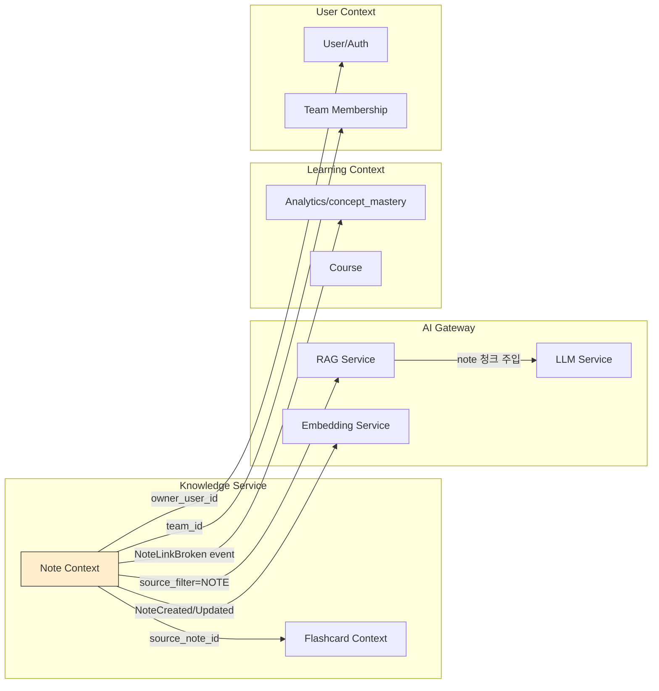

> ⚠️ **아카이브 — 구버전 참고 설계** · 본 문서의 MySQL·LearnFlow 등 표기는 현행과 다릅니다. 현 SSOT는 **PostgreSQL**, 제품명은 **DevPath AI**입니다. (2026-06-13 정합성 점검 — [25_문서_정합성_점검_보고서](./25_문서_정합성_점검_보고서.md))
> **상위 문서**: `AI_LMS_프로젝트_계획서_v5_0_통합완결본.md` (§4.12, §5.9, §5.10, §9.11)
> **버전**: 1.0
> **작성일**: 2026-04-21
> **범위**: Knowledge Service 내 Note 서브 도메인 — 마크다운 + 위키링크 파서, 백링크/미해결 링크 배치, 노트 임베딩, 지식 그래프, RAG 통합, AI 튜터 개인 노트 참조, RLS 권한 격리
>
> **⚠️ 아키텍처 결정 필요 (Blocker A3)**: 이 문서는 notes 테이블에 PostgreSQL RLS를 전제하나, MVP(v1.0) SSOT는 MySQL(03_아키텍처 §002). 구현 전 결정 필요:
> - **(a)** notes 테이블을 PostgreSQL(pgvector와 동일 인스턴스)로 이전 — RLS 활용 가능, 트랜잭션 분리 복잡도 증가
> - **(b)** notes 테이블을 MySQL에 유지 — RLS 불가, 앱 레이어 권한 통제(`WHERE owner_user_id = :userId`)로 대체. 이 경우 본 문서 §10(RLS 설계) 전면 수정 필요
> - **결정 담당**: Backend Lead / **기한**: 구현 착수 전(Week 29 이전)
> **독자**: 백엔드 개발자, 프론트엔드 개발자(그래프 뷰), 보안/프라이버시 담당, QA

---

## 0. 문서 개요

Knowledge Notes는 v5.0의 두 번째 신규 모듈이다. Flashcard가 학습의 *출력*(암기·복습)을 다룬다면, Notes는 *입력과 구조화*(정리·연결·회상)를 다룬다. Obsidian의 핵심 경험(마크다운 + `[[wiki-link]]` + 백링크 + 그래프 뷰)을 LearnFlow AI 내부에 이식하되, **v4.0 인프라(pgvector, RAG 파이프라인, AI 튜터 Long-term Memory)와 교차 결합**하는 것이 이 모듈의 존재 이유다.

### 0.1 이 문서가 다루는 것

| 영역 | 산출물 |
|------|--------|
| 도메인 모델 | Aggregate 경계, Entity/VO, 불변식, JPA + RLS 매핑 코드 |
| 마크다운 파이프라인 | Flexmark AST 기반 `[[wiki-link]]` 파서 확장, 파싱 정규화 |
| 백링크 알고리즘 | 동기 해석 + 미해결 링크 배치 처리 + 노트 rename 시 링크 유지 |
| 임베딩 파이프라인 | Heading-aware 청킹, chunk_hash 증분 갱신, pgvector 저장 |
| RAG 통합 | `source_filter` 확장, Hybrid Search across course+note |
| AI 튜터 연동 | Long-term Memory 개인 노트 주입 + Opt-in UX + 감사 로그 |
| 지식 그래프 | 서버 사전 계산(force-directed), 캐시 전략, 클러스터 축약 |
| 권한 격리 | PostgreSQL Row-Level Security + 애플리케이션 이중 방어 |
| 공유 협업 | SHARED_TEAM visibility, 팀 멤버십, Output PII 스캔 게이팅 |
| API | §9.11 확장 — 전체 요청/응답 스키마 + 에러 케이스 |
| 모바일 | 퀵 캡처 + 오프라인 편집 + 충돌 해결 |
| 테스트 | 단위/슬라이스/통합/보안/부하 테스트 전략 |
| 관측성 | 커스텀 메트릭 + 알람 + Grafana 패널 |
| 롤아웃 | Feature Flag + 단계적 베타 + 프라이버시 검증 |

### 0.2 이 문서가 다루지 않는 것

- **Flashcard 모듈** — 별도 문서 (`Flashcard_SRS_상세설계_v1_0.md`)
- **강의/퀴즈 도메인** — v4.0 범위
- **AI 튜터 전체 설계** — v4.0 §5.2~§5.3 참고. 이 문서는 튜터의 *노트 참조 확장*만 다룸
- **PII Masking Pipeline 자체** — v4.0 §6 참고. 이 문서는 *노트 맥락에서의 적용*만 다룸

### 0.3 설계 원칙

1. **Privacy by Default** — 개인 노트는 작성자 외 누구도(AI 포함) 읽지 않음. 튜터 참조도 명시적 Opt-in.
2. **RLS 이중 방어** — PostgreSQL RLS 정책 + 애플리케이션 권한 체크. ORM 버그가 있어도 DB가 막음.
3. **Markdown이 진실의 원천** — 파싱·그래프·검색은 모두 `notes.content_md`에서 파생. 파생 데이터 불일치 시 원문 기준 재구축.
4. **미해결 링크를 1급 시민으로** — Obsidian과 동일하게 "아직 없는 노트로의 링크"를 허용하고 나중에 연결.
5. **Tell, Don't Ask** — 도메인 로직(위키링크 해석, 그래프 갱신)은 Aggregate 내부로.
6. **이벤트 기반 연결** — 튜터·그래프·Flashcard와의 결합은 Outbox 이벤트로만.

---

## 1. 유비쿼터스 언어

| 용어 | 영문 | 정의 |
|------|------|------|
| 노트 | Note | 사용자가 작성한 마크다운 문서 단위. 제목 + 본문 + 태그 + 폴더. |
| 노트 링크 | Note Link | 한 노트에서 다른 노트로의 참조. 위키링크·태그링크·외부URL 세 종류. |
| 위키링크 | Wiki Link | `[[Note Title]]` 또는 `[[Title|Display]]` 형식의 노트 간 참조. |
| 백링크 | Backlink | 특정 노트를 *가리키는* 다른 노트들의 목록. `note_links`의 역방향 조회. |
| 아웃링크 | Outlink | 특정 노트가 *가리키는* 다른 노트들. |
| 미해결 링크 | Unresolved Link | 대상 노트가 아직 존재하지 않는 위키링크. `target_note_id = NULL`. |
| 고립 노드 | Orphan Note | 어떤 노트와도 링크로 연결되지 않은 노트. 그래프에서 외딴섬. |
| 태그 | Tag | `#keyword` 형식의 분류 레이블. 여러 노트에 중복 가능. |
| 폴더 경로 | Folder Path | `/dev/spring/jpa` 같은 계층 경로. 순수 조직화용(권한 없음). |
| 가시성 | Visibility | `PRIVATE` (본인만) / `SHARED_TEAM` (팀 전체) |
| 퀵 캡처 | Quick Capture | 모바일에서 최소 마찰로 노트 생성하는 흐름. 제목 자동 생성. |
| 지식 그래프 | Knowledge Graph | 노트=노드, 링크=엣지로 구성된 사용자별 전체 네트워크 뷰. |
| 튜터 Opt-in | Tutor Opt-in | AI 튜터가 사용자의 개인 노트를 참조하도록 사용자가 명시적으로 허용한 상태. |
| 청크 | Chunk | 노트 본문을 의미 단위로 쪼갠 조각. 임베딩 단위. |
| 노트 임베딩 | Note Embedding | 청크의 벡터 표현. `note_embeddings` 테이블에 저장. |
| 소스 필터 | Source Filter | RAG 검색 시 범위 제어 파라미터. `COURSE` / `NOTE` / `BOTH`. |

---

## 2. 바운디드 컨텍스트 & 컨텍스트 맵

### 2.1 Note 컨텍스트의 위치



### 2.2 컨텍스트 관계

| 관계 | 타입 | 설명 |
|------|------|------|
| Note ↔ Flashcard | **Partnership** | 같은 Knowledge Service 내부. 노트 → 카드 파생 시 `source_note_id` 직접 참조. 노트 삭제 시 카드 링크 무효화. |
| Note → Embedding Service | **Conformist** | 강의와 동일한 Embedding 인터페이스 재사용. `source_type=NOTE`로 구분만. |
| Note → RAG Service | **Customer/Supplier** | RAG가 `source_filter` 파라미터를 제공(Supplier). Note가 그것을 사용(Customer). |
| Note → AI Tutor | **Open Host Service** | Note는 Long-term Memory 주입용 `/notes/memory-context` API 공개. 튜터가 선택적으로 호출. |
| Note → User/Team | **Conformist** | 기존 User/Team 모델 그대로 차용. `owner_user_id`, `team_id`. |
| Note → Analytics | **Published Language** | `NoteCreated`, `NoteLinkResolved` 이벤트 발행. Analytics는 집계만. |

**핵심 원칙**: Note 컨텍스트는 **자기 Aggregate 내부**(Note, NoteLink, NoteTag)만 소유한다. 그래프 렌더링은 캐시 테이블로 CQRS, 임베딩은 별도 저장소(pgvector)로 위임.

### 2.3 Knowledge Service 내부 분리

Note와 Flashcard를 하나의 마이크로서비스로 묶은 이유(v5.0 §2.1): 데이터 소유권이 같고(user_id), 교차 참조(Note → Flashcard)가 빈번하다. 그러나 **모듈 경계는 엄격히 분리**한다.

```
knowledge-service/
├── note/                 ← 이 문서
│   ├── domain/
│   ├── wikilink/         ← [[link]] 파서
│   ├── graph/            ← 그래프 빌더/캐시
│   ├── search/           ← RAG Service 연동
│   └── memory/           ← AI 튜터 context 제공
├── flashcard/            ← 별도 문서
└── shared/
    ├── outbox/
    └── tenancy/          ← RLS 세션 주입
```

---

## 3. 도메인 모델

### 3.1 Aggregate 설계

```
┌──────────────────────────────────────────────────────────┐
│  Note Aggregate (Aggregate Root: Note)                   │
│  ├─ Note (Entity, Root)                                   │
│  │   ├─ id, ownerUserId, teamId(nullable)                 │
│  │   ├─ title, slug, folderPath                           │
│  │   ├─ contentMd, wordCount, visibility, status          │
│  │   ├─ tags: Set<NoteTag>                                │
│  │   ├─ updateContent(markdown): ParsedContent            │
│  │   │    ↑ 마크다운 갱신 → AST 파싱 → 링크/태그 동기화   │
│  │   ├─ rename(newTitle): RenameResult                   │
│  │   │    ↑ 제목 변경 시 기존 백링크 보존                │
│  │   ├─ share(teamId): 팀 공유 전환 (PII 스캔 게이트)    │
│  │   └─ softDelete(): 삭제 마킹 + 링크 보존              │
│  ├─ NoteTag (Entity, 내부)                                │
│  │   └─ tag (정규화된 소문자)                             │
│  └─ ParsedContent (VO, 불변)                              │
│      ├─ ast: MarkdownAst                                 │
│      ├─ outlinks: List<WikiLinkRef>                      │
│      ├─ tags: Set<String>                                │
│      └─ chunks: List<NoteChunk>                          │
└──────────────────────────────────────────────────────────┘

┌──────────────────────────────────────────────────────────┐
│  NoteLink Aggregate (Aggregate Root: NoteLink)            │
│  └─ NoteLink (Entity, Root)                               │
│      ├─ id                                                │
│      ├─ sourceNoteId (Note 참조, ID만)                    │
│      ├─ targetNoteId (Note 참조, ID만 — nullable 미해결)  │
│      ├─ targetTitle (미해결 링크 추적용)                  │
│      ├─ linkType: WIKI / TAG / EXTERNAL_URL              │
│      ├─ anchorText, position                             │
│      ├─ resolve(targetNote): 미해결 → 해결               │
│      └─ unresolve(): 해결 → 미해결 (타겟 삭제 시)        │
└──────────────────────────────────────────────────────────┘

┌──────────────────────────────────────────────────────────┐
│  NoteEmbedding (별도 저장소: pgvector)                    │
│  └─ NoteEmbedding (Entity)                                │
│      ├─ id, noteId, ownerUserId (RLS)                    │
│      ├─ chunkIndex, chunkText, chunkHash                 │
│      ├─ embedding: VECTOR(1536)                          │
│      ├─ metadata: { heading, position, ... }             │
│      └─ (내부 상태 변경 없음, DELETE + INSERT)            │
└──────────────────────────────────────────────────────────┘

┌──────────────────────────────────────────────────────────┐
│  NoteGraphCache (Read Model, CQRS)                        │
│  └─ NoteGraphCache (Entity)                               │
│      ├─ userId (PK)                                       │
│      ├─ graphJson: { nodes, edges }                      │
│      ├─ layoutCoords: Map<NodeId, {x,y}>                 │
│      ├─ generatedAt                                       │
│      └─ invalidatedBy: NoteCreated/Updated/Linked 이벤트 │
└──────────────────────────────────────────────────────────┘
```

### 3.2 Aggregate 경계 결정 근거

| 결정 | 이유 |
|------|------|
| Note가 NoteTag를 내부로 소유 | 태그는 노트 수명을 따름. 노트 삭제 시 태그도 삭제. 노트 없이 태그 단독 존재 의미 없음. |
| NoteLink가 별도 Aggregate | 링크는 양쪽 노트의 상태 변화(해결/미해결)를 독립적으로 갖는다. 링크 수정에 노트 본문 락은 과도. |
| NoteEmbedding을 Aggregate에서 분리 | 임베딩은 벡터 저장소에 속한 읽기 전용 파생 데이터. 본문 변경 시 워커가 비동기 재생성. |
| NoteGraphCache가 별도 Read Model | 그래프는 여러 노트·링크의 집계. CQRS로 Write(Note/Link) ↔ Read(Graph) 분리. |
| 외부 참조는 ID로 | `NoteLink.sourceNoteId` → Note 객체 참조 금지. 항상 ID. |

### 3.3 불변식

```
Note:
  - ownerUserId != null
  - title.length in [1, 200]
  - slug 정규식: ^[a-z0-9][a-z0-9-]*$
  - (owner_user_id, title) UNIQUE  ← 위키링크 해석 키
  - (owner_user_id, slug) UNIQUE
  - contentMd.length <= 1_000_000 (1MB, 실용 한계)
  - visibility in {PRIVATE, SHARED_TEAM}
  - visibility = SHARED_TEAM → teamId != null
  - status in {DRAFT, PUBLISHED, ARCHIVED}

NoteLink:
  - sourceNoteId != null
  - linkType != null
  - linkType = WIKI → targetTitle != null (targetNoteId nullable)
  - linkType = EXTERNAL_URL → anchorText가 URL 형식
  - sourceNoteId != targetNoteId (자기 참조 금지)

NoteTag:
  - tag 정규화: 소문자, 공백 → 하이픈, 앞뒤 # 제거
  - tag.length in [1, 50]
  - (note_id, tag) UNIQUE

NoteEmbedding:
  - ownerUserId == notes.ownerUserId (RLS 기반)
  - embedding 차원 = 1536
  - chunkHash는 SHA-256(chunkText)
```

### 3.4 JPA 매핑 (핵심)

```java
// Note.java (Aggregate Root)
@Entity
@Table(name = "notes",
       uniqueConstraints = {
         @UniqueConstraint(name = "uq_notes_owner_title",
                           columnNames = {"owner_user_id", "title"}),
         @UniqueConstraint(name = "uq_notes_owner_slug",
                           columnNames = {"owner_user_id", "slug"})
       })
@Getter
@NoArgsConstructor(access = AccessLevel.PROTECTED)
public class Note {

    @Id @GeneratedValue(strategy = GenerationType.IDENTITY)
    private Long id;

    @Column(nullable = false)
    private Long ownerUserId;

    @Column
    private Long teamId;  // SHARED_TEAM일 때만

    @Column(nullable = false, length = 200)
    private String title;

    @Column(nullable = false, length = 220) // title 기반 slug
    private String slug;

    @Column(name = "course_id")
    private Long courseId;  // 강의 연동 옵셔널

    @Column(name = "lesson_id")
    private Long lessonId;

    @Column(length = 500)
    private String folderPath;

    @Lob
    @Column(name = "content_md", columnDefinition = "TEXT")
    private String contentMd;

    @Column(nullable = false)
    private Integer wordCount = 0;

    @Enumerated(EnumType.STRING)
    @Column(nullable = false, length = 20)
    private Visibility visibility = Visibility.PRIVATE;

    @Enumerated(EnumType.STRING)
    @Column(nullable = false, length = 20)
    private NoteStatus status = NoteStatus.DRAFT;

    @OneToMany(mappedBy = "noteId", cascade = CascadeType.ALL, orphanRemoval = true)
    private Set<NoteTag> tags = new HashSet<>();

    @Version
    private Long version;

    @CreationTimestamp
    private LocalDateTime createdAt;

    @UpdateTimestamp
    private LocalDateTime updatedAt;

    // ─── 팩토리 ───
    public static Note create(Long ownerUserId, String title, String contentMd) {
        Note n = new Note();
        n.ownerUserId = requireNonNull(ownerUserId);
        n.title = validateTitle(title);
        n.slug = SlugGenerator.from(n.title);
        n.contentMd = contentMd != null ? contentMd : "";
        n.wordCount = WordCounter.count(n.contentMd);
        return n;
    }

    // ─── 핵심 도메인 행위: 본문 갱신 ───
    public ContentUpdateResult updateContent(String newMarkdown,
                                             MarkdownParser parser) {
        String old = this.contentMd;
        String normalized = MarkdownNormalizer.normalize(newMarkdown);

        ParsedContent parsed = parser.parse(normalized, this.id, this.ownerUserId);

        this.contentMd = normalized;
        this.wordCount = WordCounter.count(normalized);

        // 태그 동기화 (현재 태그 - 새 태그 차집합 삭제, 없던 태그 추가)
        syncTags(parsed.tags());

        // 링크 delta는 Service가 별도 적용 (Aggregate 경계 존중)
        return new ContentUpdateResult(parsed, old);
    }

    public void rename(String newTitle, MarkdownParser parser) {
        String oldTitle = this.title;
        this.title = validateTitle(newTitle);
        this.slug = SlugGenerator.from(this.title);

        // 백링크 보존: 다른 노트들의 [[oldTitle]] → [[newTitle]] 리라이트는
        // Service에서 별도 트랜잭션으로 처리 (이 트랜잭션 안에서는 링크만 기록)
    }

    public void share(Long teamId) {
        if (this.visibility == Visibility.SHARED_TEAM) {
            throw new AlreadySharedException(this.id);
        }
        requireNonNull(teamId);
        // PII 스캔 게이트는 Service에서 선체크 → 통과 후 이 메서드 호출
        this.teamId = teamId;
        this.visibility = Visibility.SHARED_TEAM;
    }

    public void unshare() {
        this.visibility = Visibility.PRIVATE;
        this.teamId = null;
    }

    public void publish() {
        if (this.contentMd.isBlank()) {
            throw new EmptyNoteException(this.id);
        }
        this.status = NoteStatus.PUBLISHED;
    }

    public void archive() {
        this.status = NoteStatus.ARCHIVED;
    }

    private void syncTags(Set<String> newTagValues) {
        Set<String> current = this.tags.stream()
            .map(NoteTag::getTag).collect(Collectors.toSet());

        Set<String> toRemove = Sets.difference(current, newTagValues);
        Set<String> toAdd = Sets.difference(newTagValues, current);

        this.tags.removeIf(t -> toRemove.contains(t.getTag()));
        toAdd.forEach(t -> this.tags.add(NoteTag.of(this.id, t)));
    }

    private static String validateTitle(String title) {
        if (title == null || title.isBlank() || title.length() > 200) {
            throw new InvalidNoteTitleException(title);
        }
        String trimmed = title.trim();
        if (trimmed.contains("[[") || trimmed.contains("]]")) {
            throw new InvalidNoteTitleException("제목에 위키링크 구문 금지");
        }
        return trimmed;
    }
}

// Visibility.java
public enum Visibility { PRIVATE, SHARED_TEAM }

// NoteStatus.java
public enum NoteStatus { DRAFT, PUBLISHED, ARCHIVED }
```

`NoteLink`는 별도 Aggregate이므로 `Note.updateContent()`가 반환한 `ParsedContent`를 **Service가 받아 NoteLinkRepository에 반영**한다. 이 분리는 §5에서 상세히.

---

## 4. 마크다운 처리 파이프라인

### 4.1 파싱 요구사항

노트 본문 파싱은 이 모듈의 기술적 핵심이다. 다음 요소를 정확히 식별해야 한다:

1. **위키링크** — `[[Note Title]]`, `[[Title|Display]]`, `[[Title#Heading]]`, `[[Title^block-id]]`
2. **태그** — `#tag`, `#multi-word-tag`, 코드 블록 내부의 `#`은 태그 아님
3. **외부 URL** — `[text](https://...)` (표준 마크다운)
4. **헤딩 구조** — `#`, `##`, `###` (청킹 경계)
5. **코드 블록** — ```` ``` ```` (파싱 대상 제외)
6. **수식** — `$inline$`, `$$block$$` (파싱 대상 제외)
7. **이미지** — `` (외부 URL만, 내부 업로드는 별도)

### 4.2 파서 선택: Flexmark-java + 커스텀 Extension

```
선택지 비교:
├── CommonMark-java: 표준 준수. 확장성 부족. 위키링크 플러그인 없음.
├── Flexmark-java: GFM + 확장 시스템 풍부. AST 접근 용이. ← 선택
└── Markdown4j: 구식, 유지보수 중단
```

Flexmark의 `Parser.Builder`에 커스텀 Extension을 등록해 `[[...]]` 구문을 AST 노드로 파싱한다.

### 4.3 WikiLinkExtension 구현

```java
// WikiLinkExtension.java
public class WikiLinkExtension implements Parser.ParserExtension {

    public static WikiLinkExtension create() {
        return new WikiLinkExtension();
    }

    @Override
    public void parserOptions(MutableDataHolder options) {}

    @Override
    public void extend(Parser.Builder parserBuilder) {
        parserBuilder.customInlineParserExtensionFactory(
            new WikiLinkInlineParser.Factory());
    }
}

// WikiLinkInlineParser.java (실제 파싱 로직)
public class WikiLinkInlineParser implements InlineParserExtension {

    @Override
    public boolean parse(LightInlineParser parser) {
        int startIndex = parser.getIndex();

        // [[ 확인
        if (!parser.matches("[[")) return false;
        parser.advance();
        parser.advance();

        int contentStart = parser.getIndex();
        int closeIndex = findClosingBrackets(parser);
        if (closeIndex < 0) {
            parser.setIndex(startIndex);
            return false; // unbalanced, 원본 [[ 그대로 유지
        }

        String raw = parser.getInput().subSequence(contentStart, closeIndex).toString();
        WikiLinkRef ref = WikiLinkRef.parse(raw);

        WikiLinkNode node = new WikiLinkNode(
            parser.getInput().subSequence(startIndex, closeIndex + 2),
            ref);

        parser.getBlock().appendChild(node);
        parser.setIndex(closeIndex + 2);
        return true;
    }

    private int findClosingBrackets(LightInlineParser parser) {
        // 중첩 허용 안 함, 한 줄 내에서만 탐색
        CharSequence input = parser.getInput();
        int i = parser.getIndex();
        while (i < input.length() - 1) {
            if (input.charAt(i) == '\n') return -1;
            if (input.charAt(i) == ']' && input.charAt(i + 1) == ']') return i;
            i++;
        }
        return -1;
    }
}

// WikiLinkRef.java — 파싱 결과 VO (불변)
public record WikiLinkRef(
    String targetTitle,
    String displayText,
    String heading,  // [[Note#heading]] 의 heading 부분
    String blockId   // [[Note^block-id]] 의 block-id 부분
) {
    public static WikiLinkRef parse(String raw) {
        // 1. display 분리: [[Title|Display]]
        String target, display;
        int pipe = raw.indexOf('|');
        if (pipe >= 0) {
            target = raw.substring(0, pipe).trim();
            display = raw.substring(pipe + 1).trim();
        } else {
            target = raw.trim();
            display = null;
        }

        // 2. heading/block 분리
        String heading = null, block = null;
        int hash = target.indexOf('#');
        int caret = target.indexOf('^');
        int splitAt = -1;

        if (hash >= 0 && (caret < 0 || hash < caret)) {
            splitAt = hash;
            heading = target.substring(hash + 1).trim();
        } else if (caret >= 0) {
            splitAt = caret;
            block = target.substring(caret + 1).trim();
        }

        if (splitAt > 0) {
            target = target.substring(0, splitAt).trim();
        }

        // 3. 정규화: 제목은 대소문자 구분 유지, 공백 정규화
        target = target.replaceAll("\\s+", " ");

        if (target.isEmpty()) {
            throw new InvalidWikiLinkException("빈 위키링크: " + raw);
        }

        return new WikiLinkRef(target, display, heading, block);
    }
}
```

### 4.4 파서 진입점

```java
@Component
public class MarkdownParser {

    private final Parser parser;
    private final TagExtractor tagExtractor;
    private final HeadingAwareChunker chunker;

    public MarkdownParser() {
        MutableDataSet options = new MutableDataSet();
        options.set(Parser.EXTENSIONS, List.of(
            TablesExtension.create(),
            StrikethroughExtension.create(),
            TaskListExtension.create(),
            WikiLinkExtension.create()
        ));
        this.parser = Parser.builder(options).build();
    }

    public ParsedContent parse(String markdown, Long noteId, Long ownerUserId) {
        Node root = parser.parse(markdown);

        // 1. 위키링크 추출 (AST traversal)
        List<WikiLinkRef> wikilinks = new ArrayList<>();
        int position = 0;
        for (Node node : AstNodeIterator.of(root)) {
            if (node instanceof WikiLinkNode wl) {
                wikilinks.add(new WikiLinkRefWithPosition(wl.getRef(), position));
            }
            position++;
        }

        // 2. 태그 추출 (코드 블록 제외)
        Set<String> tags = tagExtractor.extractFromAst(root);

        // 3. 청킹 (헤딩 경계 + 토큰 제한)
        List<NoteChunk> chunks = chunker.chunk(root, markdown);

        // 4. 외부 링크 추출
        List<ExternalLink> externalLinks = extractExternalLinks(root);

        return new ParsedContent(root, wikilinks, tags, chunks, externalLinks);
    }
}
```

### 4.5 파싱 엣지 케이스

| 입력 | 처리 |
|------|------|
| `[[]]` | `InvalidWikiLinkException` — 빈 제목 금지 |
| `[[  Note Title  ]]` | 공백 정규화 → `"Note Title"` |
| `[[a|b|c]]` | 첫 번째 `\|`만 분리자. `target="a"`, `display="b|c"` |
| `[[Note Title#]]` | heading 빈 문자열 → null 처리 |
| 코드 블록 내 `[[fake]]` | Flexmark이 자동 제외 (inline parser가 code span 내부 진입 안 함) |
| 줄바꿈을 가로지르는 `[[\nNote]]` | 닫는 괄호 찾기 실패 → 원본 문자열 유지 |
| `\[[escaped]]` | `\[` 이스케이프 → 위키링크 아님 |
| 대소문자 다른 제목 `[[JPA]]` vs `[[jpa]]` | 기본 대소문자 구분. 설정으로 무시 옵션 제공 |

### 4.6 Markdown Normalizer

저장 전 정규화로 파생 데이터 안정화.

```java
public final class MarkdownNormalizer {

    public static String normalize(String md) {
        if (md == null) return "";
        String s = md;

        // 1. 개행 문자 통일 (CRLF, CR → LF)
        s = s.replaceAll("\\r\\n|\\r", "\n");

        // 2. 후행 공백 제거 (라인 끝)
        s = Arrays.stream(s.split("\n", -1))
            .map(line -> line.replaceAll("[\\t ]+$", ""))
            .collect(Collectors.joining("\n"));

        // 3. 파일 끝 단일 개행 보장
        if (!s.endsWith("\n")) s += "\n";

        // 4. BOM 제거
        if (s.startsWith("\uFEFF")) s = s.substring(1);

        return s;
    }
}
```

정규화 덕분에 동일 의미의 마크다운이 서로 다른 `chunk_hash`를 갖는 문제 예방.

---

## 5. 백링크 & 미해결 링크 배치 처리

### 5.1 링크 해석 흐름

```
사용자가 노트 저장 →
  Note.updateContent() → ParsedContent 반환 →
    NoteLinkService.syncLinks(noteId, parsedContent.outlinks()):
      1. 기존 NoteLink(source=noteId, type=WIKI) 전체 조회
      2. 새 outlinks와 비교 → diff (추가/삭제/유지)
      3. 추가 링크: targetTitle로 동기 해석 시도
         ├── notes.findByOwnerAndTitle(ownerUserId, targetTitle) 존재 → resolve()
         └── 존재하지 않음 → targetNoteId=NULL로 INSERT (미해결)
      4. 삭제 링크: DELETE
      5. Outbox: NoteLinksUpdated 이벤트
```

### 5.2 도메인 로직

```java
// NoteLink.java
@Entity
@Table(name = "note_links")
@Getter
@NoArgsConstructor(access = AccessLevel.PROTECTED)
public class NoteLink {

    @Id @GeneratedValue(strategy = GenerationType.IDENTITY)
    private Long id;

    @Column(nullable = false)
    private Long sourceNoteId;

    @Column
    private Long targetNoteId;  // NULL = 미해결

    @Column(nullable = false, length = 200)
    private String targetTitle;

    @Enumerated(EnumType.STRING)
    @Column(nullable = false, length = 20)
    private LinkType linkType;

    @Column(length = 200)
    private String anchorText;

    @Column(nullable = false)
    private Integer position;

    @CreationTimestamp
    private LocalDateTime createdAt;

    public static NoteLink createResolved(Long source, Long target,
                                          String title, LinkType type,
                                          int position, String anchor) {
        NoteLink l = new NoteLink();
        l.sourceNoteId = requireNonNull(source);
        l.targetNoteId = requireNonNull(target);
        l.targetTitle = title;
        l.linkType = type;
        l.position = position;
        l.anchorText = anchor;
        l.validate();
        return l;
    }

    public static NoteLink createUnresolved(Long source, String targetTitle,
                                            int position, String anchor) {
        NoteLink l = new NoteLink();
        l.sourceNoteId = requireNonNull(source);
        l.targetTitle = targetTitle;
        l.linkType = LinkType.WIKI;
        l.position = position;
        l.anchorText = anchor;
        l.validate();
        return l;
    }

    public void resolve(Note target) {
        if (target == null) throw new IllegalArgumentException();
        if (!target.getTitle().equals(this.targetTitle)) {
            throw new LinkTargetMismatchException(this.targetTitle, target.getTitle());
        }
        this.targetNoteId = target.getId();
    }

    public void unresolve() {
        this.targetNoteId = null;
    }

    public boolean isResolved() {
        return this.targetNoteId != null;
    }

    private void validate() {
        if (linkType == LinkType.WIKI && targetTitle == null) {
            throw new InvalidLinkException("wiki link must have targetTitle");
        }
        if (Objects.equals(sourceNoteId, targetNoteId)) {
            throw new SelfLinkException(sourceNoteId);
        }
    }
}

// LinkType.java
public enum LinkType { WIKI, TAG, EXTERNAL_URL }
```

### 5.3 NoteLinkService: 동기 해석

```java
@Service
@Transactional
@RequiredArgsConstructor
public class NoteLinkService {

    private final NoteRepository noteRepository;
    private final NoteLinkRepository linkRepository;
    private final OutboxPublisher outbox;

    public LinkSyncResult syncLinks(Note sourceNote,
                                    List<WikiLinkRefWithPosition> outlinks) {
        // 1. 기존 링크
        List<NoteLink> existing = linkRepository
            .findBySourceNoteIdAndLinkType(sourceNote.getId(), LinkType.WIKI);

        Map<String, NoteLink> existingByTitle = existing.stream()
            .collect(Collectors.toMap(NoteLink::getTargetTitle, l -> l, (a, b) -> a));

        Set<String> newTitles = outlinks.stream()
            .map(ol -> ol.ref().targetTitle())
            .collect(Collectors.toSet());

        // 2. 삭제 (기존에 있지만 새 본문에 없음)
        List<NoteLink> toRemove = existing.stream()
            .filter(l -> !newTitles.contains(l.getTargetTitle()))
            .toList();
        linkRepository.deleteAll(toRemove);

        // 3. 추가
        List<NoteLink> toAdd = new ArrayList<>();
        for (WikiLinkRefWithPosition ol : outlinks) {
            String title = ol.ref().targetTitle();
            if (existingByTitle.containsKey(title)) continue; // 유지

            Optional<Note> target = noteRepository
                .findByOwnerUserIdAndTitle(sourceNote.getOwnerUserId(), title);

            NoteLink link = target.isPresent()
                ? NoteLink.createResolved(sourceNote.getId(), target.get().getId(),
                                          title, LinkType.WIKI,
                                          ol.position(), ol.ref().displayText())
                : NoteLink.createUnresolved(sourceNote.getId(), title,
                                            ol.position(), ol.ref().displayText());
            toAdd.add(link);
        }
        linkRepository.saveAll(toAdd);

        // 4. 이벤트
        outbox.publish(new NoteLinksUpdatedEvent(
            sourceNote.getId(),
            sourceNote.getOwnerUserId(),
            toAdd.stream().map(NoteLink::getTargetTitle).toList(),
            toRemove.stream().map(NoteLink::getTargetTitle).toList()));

        return new LinkSyncResult(toAdd, toRemove);
    }
}
```

### 5.4 미해결 → 해결 배치 처리

새 노트 생성 시, 그 제목을 가리키는 미해결 링크들이 있으면 일괄 resolve.

```java
@EventListener  // @TransactionalEventListener(AFTER_COMMIT)
public class UnresolvedLinkResolver {

    @TransactionalEventListener(phase = AFTER_COMMIT)
    @Async("noteTaskExecutor")
    public void onNoteCreated(NoteCreatedEvent event) {
        Note newNote = noteRepository.findById(event.noteId()).orElseThrow();

        // 같은 사용자의 미해결 링크 중 targetTitle == newNote.title 조회
        List<NoteLink> pending = linkRepository
            .findUnresolvedByOwnerAndTitle(
                newNote.getOwnerUserId(), newNote.getTitle());

        if (pending.isEmpty()) return;

        // 트랜잭션 분할: 링크 많으면 100개씩
        Lists.partition(pending, 100).forEach(batch -> {
            linkResolutionTxService.resolveBatch(batch, newNote);
        });
    }
}

@Service
public class LinkResolutionTxService {

    @Transactional
    public void resolveBatch(List<NoteLink> batch, Note target) {
        for (NoteLink link : batch) {
            link.resolve(target);
        }
        linkRepository.saveAll(batch);

        // 그래프 캐시 무효화
        outbox.publish(new NoteLinksResolvedEvent(
            target.getOwnerUserId(),
            batch.stream().map(NoteLink::getSourceNoteId).distinct().toList()));
    }
}
```

### 5.5 노트 Rename 시 백링크 보존

"JPA" 노트를 "JPA 심화"로 rename하면, 다른 노트들의 `[[JPA]]` 링크는 어떻게 되나?

**Obsidian 기본 정책**: 원본 링크 텍스트 유지. 단, 사용자 선택으로 "모든 백링크 자동 업데이트" 가능.

우리 정책 (v5.0 MVP):
- **Rename 시 기존 링크는 미해결로 전환** (targetNoteId=NULL, targetTitle=oldTitle 유지)
- 사용자 UI에 "N개의 백링크가 끊어졌어요. 자동 업데이트할까요?" 배너
- 수락 시 → 모든 소스 노트의 `content_md`에서 `[[oldTitle]]` → `[[newTitle]]` 일괄 치환 (배치)
- 거절 시 → 미해결 링크로 남음, 사용자가 수동으로 수정

```java
@Service
public class NoteRenameService {

    @Transactional
    public RenameResult rename(Long noteId, Long userId, String newTitle) {
        Note note = noteRepository.findByIdAndOwner(noteId, userId).orElseThrow();
        String oldTitle = note.getTitle();

        note.rename(newTitle, markdownParser);

        // 기존 백링크 unresolve
        List<NoteLink> backlinks = linkRepository
            .findByTargetNoteIdAndLinkType(noteId, LinkType.WIKI);
        backlinks.forEach(NoteLink::unresolve);

        // 새 제목으로 미해결 링크 재해결 (다른 노트들이 [[newTitle]] 있었다면)
        unresolvedLinkResolver.onNoteCreated(new NoteCreatedEvent(noteId, userId));

        outbox.publish(new NoteRenamedEvent(noteId, oldTitle, newTitle));

        return new RenameResult(backlinks.size(), /* suggested update */);
    }

    @Transactional
    public void autoRewriteBacklinks(Long userId, String oldTitle, String newTitle) {
        // 백링크 있는 노트들 본문 스캔 → [[oldTitle]] 치환 → updateContent() 호출
        // 주의: [[oldTitle|display]] → [[newTitle|display]] 는 치환, display 텍스트 보존
        List<Note> sources = noteRepository.findNotesLinkingTo(userId, oldTitle);
        for (Note src : sources) {
            String rewritten = WikiLinkRewriter.rewrite(src.getContentMd(), oldTitle, newTitle);
            if (!rewritten.equals(src.getContentMd())) {
                noteUpdateService.updateContent(src.getId(), userId, rewritten);
            }
        }
    }
}
```

---


## 6. 노트 임베딩 파이프라인

### 6.1 요구사항

- 강의 콘텐츠와 **같은 Embedding Service, 같은 pgvector 인덱스 전략** 재사용
- 그러나 **저장 테이블은 분리**(`note_embeddings`) — RLS로 권한 격리
- 노트 수정 시 **변경된 청크만 재임베딩** (chunk_hash 비교)
- 긴 노트(10k+ 단어)도 허용하되 임베딩 비용 제어

### 6.2 Heading-Aware 청킹

노트는 강의와 달리 **저자가 헤딩으로 논리 구조를 명시**하는 경우가 많다. 이를 존중해 청킹 경계로 쓴다.

```
청킹 전략 우선순위:
1순위: ## heading (또는 ###) 경계
2순위: 문단(빈 줄) 경계
3순위: 문장(마침표) 경계
4순위: 토큰 limit(400)

제약:
- 최소 청크 크기: 100 토큰 (너무 짧으면 이웃과 병합)
- 최대 청크 크기: 512 토큰 (하드 리밋)
- overlap: 10% (이웃 청크 간 문맥 연결)
```

### 6.3 HeadingAwareChunker 구현

```java
@Component
public class HeadingAwareChunker {

    private static final int MIN_TOKENS = 100;
    private static final int MAX_TOKENS = 512;
    private static final int TARGET_TOKENS = 300;
    private static final double OVERLAP_RATIO = 0.10;

    private final TokenCounter tokenCounter;

    public List<NoteChunk> chunk(Node astRoot, String originalMarkdown) {
        // 1. Heading 위치 수집 (line 단위)
        List<HeadingBoundary> boundaries = collectHeadings(astRoot);

        // 2. 본문을 heading 경계로 1차 분할
        List<Section> sections = splitByHeadings(originalMarkdown, boundaries);

        // 3. 각 섹션을 토큰 제한 내로 2차 분할
        List<NoteChunk> chunks = new ArrayList<>();
        int chunkIndex = 0;

        for (Section section : sections) {
            int tokens = tokenCounter.count(section.text());

            if (tokens < MIN_TOKENS && !chunks.isEmpty()) {
                // 너무 짧음 → 앞 청크에 병합
                NoteChunk last = chunks.get(chunks.size() - 1);
                last.append(section.text());
                continue;
            }

            if (tokens <= MAX_TOKENS) {
                chunks.add(NoteChunk.of(chunkIndex++, section.text(),
                                       section.heading(), section.position()));
            } else {
                // 문단/문장 경계로 재분할
                List<String> splits = splitBySentences(section.text(),
                                                        TARGET_TOKENS);
                for (String s : splits) {
                    chunks.add(NoteChunk.of(chunkIndex++, s,
                                           section.heading(), section.position()));
                }
            }
        }

        // 4. Overlap 적용 (선택, MVP에는 생략 가능)
        return applyOverlap(chunks);
    }

    private record Section(String heading, String text, int position) {}
    private record HeadingBoundary(int line, int level, String text) {}
}

// NoteChunk.java — VO
public record NoteChunk(
    int chunkIndex,
    String text,
    String heading,  // 소속 heading (있으면)
    int position,    // 원문 내 라인 번호
    String chunkHash // SHA-256(text)
) {
    public static NoteChunk of(int idx, String text, String heading, int pos) {
        return new NoteChunk(idx, text, heading, pos, sha256(text));
    }

    public static String sha256(String s) {
        MessageDigest md = MessageDigest.getInstance("SHA-256");
        byte[] hash = md.digest(s.getBytes(StandardCharsets.UTF_8));
        return HexFormat.of().formatHex(hash);
    }
}
```

### 6.4 증분 임베딩 갱신

노트 수정 시 전체 재임베딩이 아니라 **변경된 청크만 처리**한다.

```
NoteUpdated 이벤트 수신:
  1. 기존 note_embeddings 조회 (noteId)
  2. 새 청킹 결과 (chunk_index, chunk_hash)
  3. Diff 계산:
     - chunk_index가 같고 hash도 같음 → 변경 없음, 스킵
     - chunk_index 같지만 hash 다름 → UPDATE 필요
     - 기존 chunk_index가 새 결과에 없음 → DELETE (청크 수 감소)
     - 새 chunk_index가 기존에 없음 → INSERT (청크 수 증가)
  4. INSERT/UPDATE 청크만 Embedding API 호출 (FinOps)
  5. Outbox: NoteEmbeddingsUpdated
```

구현:

```java
@Component
@KafkaListener(topics = "note.updated", groupId = "note-embedding-worker")
public class NoteEmbeddingWorker {

    @Transactional
    public void consume(NoteUpdatedEvent event) {
        if (!dedup.tryAcquire(event.dedupKey())) return;

        Note note = noteRepository.findById(event.noteId()).orElseThrow();
        ParsedContent parsed = markdownParser.parse(
            note.getContentMd(), note.getId(), note.getOwnerUserId());
        List<NoteChunk> newChunks = parsed.chunks();

        List<NoteEmbedding> existing = noteEmbeddingRepo
            .findByNoteIdOrderByChunkIndex(note.getId());

        ChunkDiff diff = ChunkDiffCalculator.diff(existing, newChunks);

        // 1. 삭제
        noteEmbeddingRepo.deleteAllById(diff.toDelete());

        // 2. 변경된 것 + 새 것 → 임베딩 API 일괄 호출
        List<NoteChunk> toEmbed = new ArrayList<>(diff.toUpdate().size() + diff.toInsert().size());
        toEmbed.addAll(diff.toUpdate());
        toEmbed.addAll(diff.toInsert());

        if (!toEmbed.isEmpty()) {
            List<float[]> embeddings = embeddingService.embedBatch(
                toEmbed.stream().map(NoteChunk::text).toList());

            // INSERT 또는 UPDATE
            for (int i = 0; i < toEmbed.size(); i++) {
                NoteChunk c = toEmbed.get(i);
                float[] emb = embeddings.get(i);
                noteEmbeddingRepo.upsert(NoteEmbeddingDto.builder()
                    .noteId(note.getId())
                    .ownerUserId(note.getOwnerUserId())
                    .chunkIndex(c.chunkIndex())
                    .chunkText(c.text())
                    .chunkHash(c.chunkHash())
                    .embedding(emb)
                    .metadata(Map.of("heading", c.heading(),
                                    "position", c.position()))
                    .build());
            }
        }

        outbox.publish(new NoteEmbeddingsUpdatedEvent(
            note.getId(), diff.toInsert().size(),
            diff.toUpdate().size(), diff.toDelete().size()));
    }
}

// ChunkDiffCalculator.java
public class ChunkDiffCalculator {

    public static ChunkDiff diff(List<NoteEmbedding> existing,
                                 List<NoteChunk> newChunks) {
        Map<Integer, NoteEmbedding> oldByIndex = existing.stream()
            .collect(Collectors.toMap(NoteEmbedding::getChunkIndex, e -> e));
        Map<Integer, NoteChunk> newByIndex = newChunks.stream()
            .collect(Collectors.toMap(NoteChunk::chunkIndex, c -> c));

        List<Long> toDelete = new ArrayList<>();
        List<NoteChunk> toUpdate = new ArrayList<>();
        List<NoteChunk> toInsert = new ArrayList<>();

        for (var e : oldByIndex.entrySet()) {
            int idx = e.getKey();
            NoteChunk newChunk = newByIndex.get(idx);
            if (newChunk == null) {
                toDelete.add(e.getValue().getId());
            } else if (!e.getValue().getChunkHash().equals(newChunk.chunkHash())) {
                toUpdate.add(newChunk);
            }
        }

        for (var e : newByIndex.entrySet()) {
            if (!oldByIndex.containsKey(e.getKey())) {
                toInsert.add(e.getValue());
            }
        }

        return new ChunkDiff(toDelete, toUpdate, toInsert);
    }
}
```

**성능 효과**: 사용자가 노트의 마지막 문단만 수정하면 1개 청크만 재임베딩. 100청크 노트에서도 비용 1%.

### 6.5 임베딩 한도 및 플랜 연동

v5.0 §7 FinOps와 연결:

```java
@Aspect
@Component
public class NoteEmbeddingQuotaGuard {

    @Before("execution(* NoteEmbeddingWorker.consume(..))")
    public void check(JoinPoint jp) {
        NoteUpdatedEvent event = extractEvent(jp);
        UserPlan plan = userPlanService.getCurrentPlan(event.ownerUserId());

        MonthlyEmbeddingUsage usage = usageService.getEmbeddingUsage(event.ownerUserId());

        if (usage.totalChunks() >= plan.monthlyEmbeddingChunkLimit()) {
            // 한도 초과 시: 임베딩 스킵, 노트는 저장되지만 의미 검색에서 제외
            metrics.incrementQuotaExceeded(event.ownerUserId());
            throw new EmbeddingQuotaExceededException(event.ownerUserId());
        }
    }
}
```

한도 초과 시 **노트 저장은 성공하되 의미 검색에서 빠진다**. 사용자에게 배너로 "이 노트는 검색 인덱스에서 제외됐어요 (월 한도). Pro 플랜으로 전체 검색 활성화" 안내.

---

## 7. RAG Service source_filter 확장

### 7.1 요구사항

v4.0의 RAG 파이프라인(Query Rewrite → Hybrid Search → Re-ranking → Compression)을 **코드 최소 변경**으로 노트 검색에 재사용한다. 핵심은 `source_filter` 파라미터 추가.

### 7.2 API 변경

```java
// 기존 v4.0
RagSearchRequest {
  String query;
  Long courseId;        // 강의 범위 제한
  Long userId;
  int topK;
}

// v5.0 확장
RagSearchRequest {
  String query;
  Long userId;
  int topK;

  SourceFilter sourceFilter;  // NEW
  SearchScope scope;          // NEW
}

enum SourceFilter { COURSE, NOTE, BOTH }

record SearchScope(
  Long courseId,       // COURSE 모드에서 사용
  List<String> tags,   // NOTE 모드에서 태그 필터
  String folderPrefix  // NOTE 모드에서 폴더 필터
) {}
```

### 7.3 Hybrid Search 라우팅

```java
@Service
public class HybridSearchService {

    private final VectorSearchRepository vectorRepo;
    private final ElasticsearchClient esClient;
    private final RrFusion rrFusion;

    public List<ScoredChunk> search(RagSearchRequest req) {
        return switch (req.sourceFilter()) {
            case COURSE -> searchCourses(req);
            case NOTE -> searchNotes(req);
            case BOTH -> searchBoth(req);
        };
    }

    private List<ScoredChunk> searchCourses(RagSearchRequest req) {
        // v4.0 기존 로직 그대로
        List<ScoredChunk> vector = vectorRepo.searchContentEmbeddings(
            req.queryEmbedding(), req.scope().courseId(), 20);
        List<ScoredChunk> bm25 = esClient.searchCourses(
            req.query(), req.scope().courseId(), 20);
        return rrFusion.fuse(vector, bm25, 20);
    }

    private List<ScoredChunk> searchNotes(RagSearchRequest req) {
        // NEW: 노트 검색
        List<ScoredChunk> vector = vectorRepo.searchNoteEmbeddings(
            req.queryEmbedding(),
            req.userId(),  // RLS 강제
            req.scope().tags(),
            req.scope().folderPrefix(),
            20);
        List<ScoredChunk> bm25 = esClient.searchNotes(
            req.query(), req.userId(), 20);
        return rrFusion.fuse(vector, bm25, 20);
    }

    private List<ScoredChunk> searchBoth(RagSearchRequest req) {
        // 두 결과를 동일 스코어 공간에서 병합 후 re-ranking
        CompletableFuture<List<ScoredChunk>> courseFt =
            CompletableFuture.supplyAsync(() -> searchCourses(req), virtualThreadExecutor);
        CompletableFuture<List<ScoredChunk>> noteFt =
            CompletableFuture.supplyAsync(() -> searchNotes(req), virtualThreadExecutor);

        List<ScoredChunk> combined = new ArrayList<>();
        combined.addAll(courseFt.join());
        combined.addAll(noteFt.join());

        // 서로 다른 source의 스코어를 정규화 (min-max per source)
        return normalizeAndMerge(combined, 40);
    }
}
```

### 7.4 pgvector 노트 검색 쿼리

```java
// VectorSearchRepository.java (네이티브)
public interface VectorSearchRepository {

    @Query(value = """
        SELECT
          ne.note_id, ne.chunk_index, ne.chunk_text, ne.metadata,
          n.title as note_title,
          1 - (ne.embedding <=> :queryEmb) AS score
        FROM note_embeddings ne
        JOIN notes n ON n.id = ne.note_id
        WHERE ne.owner_user_id = :userId
          AND n.status != 'ARCHIVED'
          AND (:folderPrefix IS NULL OR n.folder_path LIKE :folderPrefix || '%')
          AND (:tagFilter IS NULL OR EXISTS (
              SELECT 1 FROM note_tags nt
              WHERE nt.note_id = n.id AND nt.tag = ANY(:tagFilter)
          ))
        ORDER BY ne.embedding <=> :queryEmb
        LIMIT :k
        """, nativeQuery = true)
    List<NoteChunkHit> searchNoteEmbeddings(
        @Param("queryEmb") float[] queryEmb,
        @Param("userId") Long userId,
        @Param("tagFilter") String[] tagFilter,
        @Param("folderPrefix") String folderPrefix,
        @Param("k") int k);
}
```

**RLS 이중 방어**: WHERE 절의 `owner_user_id = :userId` + DB 레벨 RLS 정책. ORM에서 필터를 빠뜨려도 DB가 막음.

### 7.5 Elasticsearch 노트 인덱싱

```
인덱스: notes_v1
샤딩: 1 primary + 1 replica (초기). 노트 총량 10M+ 되면 user_id 기반 routing.

매핑:
{
  "properties": {
    "note_id":        {"type": "long"},
    "owner_user_id":  {"type": "long"},
    "title":          {"type": "text", "analyzer": "nori"},
    "content_md":     {"type": "text", "analyzer": "nori"},
    "tags":           {"type": "keyword"},
    "folder_path":    {"type": "keyword"},
    "status":         {"type": "keyword"},
    "updated_at":     {"type": "date"}
  }
}
```

`nori`는 한국어 형태소 분석기 (Elasticsearch 공식). 강의 인덱스와 동일 설정 공유.

### 7.6 Re-ranking 통합

CrossEncoder는 source에 무관하게 `query-chunk` 페어를 점수화한다. 두 source의 결과를 섞어도 **공정한 재정렬** 가능:

```java
List<ScoredChunk> combined = hybridSearch.search(req);

List<RerankedChunk> reranked = reranker.rerank(
    req.query(),
    combined.stream().map(ScoredChunk::text).toList(),
    5);

// 각 결과에 source type 태그 (튜터 프롬프트에서 구분 표시용)
return reranked.stream()
    .map(r -> r.withSourceType(combined.get(r.originalIndex()).sourceType()))
    .toList();
```

---

## 8. AI 튜터 개인 노트 참조

### 8.1 개요

v5.0에서 가장 강력한 교차 시너지. 사용자가 질문하면 튜터가 **그 사용자의 과거 노트**를 참고해 답하게 한다. "당신이 2주 전 정리한 X 노트에도 관련 내용이 있어요..." 같은 개인화.

### 8.2 Opt-in UX 플로우

```
1. 최초 노트 10개 작성 후:
   → 배너: "AI 튜터가 내 노트를 참고하도록 허용할까요?"
   → [자세히 보기] → 무엇이 어떻게 사용되는지 설명 + 언제든 끄기

2. 동의 시: user_preferences.tutorRefersToNotes = true

3. 튜터 UI:
   → 답변 하단에 "이 답변은 당신의 노트 N편을 참고했어요" 표기
   → [참고한 노트 보기] 클릭 시 어떤 노트가 인용됐는지 상세

4. 언제든 설정에서 off 가능 (즉시 반영)
```

### 8.3 Long-term Memory 주입 파이프라인

```
튜터 요청 (POST /ai/tutor/chat):
  1. 사용자 동의 여부 체크 (user_preferences.tutorRefersToNotes)
     → false면 기존 v4.0 로직 그대로 (노트 참조 없음)

  2. 동의 있음:
     RAG Service 호출:
       sourceFilter = BOTH (강의 + 노트 모두 검색)
       또는 NOTE (현재 세션이 노트 기반 질의라면)

  3. 재정렬된 결과에서 source별로 분리:
     - course chunks: [...] (v4.0 동일 처리)
     - note chunks:   [...] (LLM 프롬프트에 별도 섹션)

  4. 프롬프트 조립 (v5.0 §5.10 형식):
     [System]
     당신은 학습자의 튜터입니다. 학습자의 개인 노트가 있으면
     반드시 참조하고, "당신이 이전에 정리한" 표현으로 연결하세요.

     [Long-term Memory]
     - 학습자 수준: 중급 (mastery 0.6)
     - 취약 개념: N+1 문제

     [학습자의 관련 노트 N편]
     ● "JPA 페치 전략" (2주 전 작성):
       {chunk_text}
     ● "성능 튜닝 체크리스트" (어제 작성):
       {chunk_text}

     [RAG 강의 컨텍스트]
     (수강 중인 강의 청크)

     [User] {질문}

  5. LLM 응답 + 참고한 노트 ID 목록 → 프론트에 전달

  6. 감사 로그 기록:
     audit_logs INSERT (action=TUTOR_NOTE_REFERENCE,
                         note_ids=[101, 204],
                         session_id=...)
```

### 8.4 구현 코드

```java
@Service
public class TutorMemoryService {

    private final UserPreferenceService prefService;
    private final RagService ragService;
    private final AuditLogService auditLog;

    public TutorMemoryContext buildContext(Long userId, String query,
                                           Long lessonId, String sessionId) {
        UserPreference pref = prefService.get(userId);

        if (!pref.tutorRefersToNotes()) {
            return TutorMemoryContext.courseOnly(
                ragService.searchCourseOnly(userId, query, lessonId));
        }

        // 양쪽 검색
        RagSearchResult result = ragService.search(
            RagSearchRequest.builder()
                .userId(userId)
                .query(query)
                .sourceFilter(SourceFilter.BOTH)
                .topK(8)  // 재정렬 전
                .build());

        List<RerankedChunk> top5 = result.reranked();
        List<RerankedChunk> courseChunks = top5.stream()
            .filter(c -> c.sourceType() == SourceType.COURSE).toList();
        List<RerankedChunk> noteChunks = top5.stream()
            .filter(c -> c.sourceType() == SourceType.NOTE).toList();

        if (!noteChunks.isEmpty()) {
            auditLog.record(AuditEntry.tutorNoteReference(
                userId, sessionId,
                noteChunks.stream().map(RerankedChunk::sourceId).toList()));
        }

        return TutorMemoryContext.combined(courseChunks, noteChunks);
    }
}

// Prompt 조립 (LLM Service 내부)
public class TutorPromptBuilder {

    public String build(String query, TutorMemoryContext memory,
                        ConceptMastery mastery, String conversationHistory) {
        StringBuilder sb = new StringBuilder();

        sb.append(systemPrompt(mastery.level(), memory.hasNoteReferences()));

        sb.append("\n[Long-term Memory]\n");
        sb.append("- 학습자 수준: ").append(mastery.levelName())
          .append(" (mastery ").append(mastery.average()).append(")\n");

        if (!memory.noteChunks().isEmpty()) {
            sb.append("- 학습자의 관련 노트:\n");
            for (RerankedChunk chunk : memory.noteChunks()) {
                sb.append("  ● \"").append(chunk.metadata().get("note_title")).append("\" (")
                  .append(humanize(chunk.metadata().get("updated_at"))).append(" 작성):\n")
                  .append("    ").append(chunk.text().substring(0, Math.min(200, chunk.text().length())))
                  .append("\n");
            }
        }

        if (!memory.courseChunks().isEmpty()) {
            sb.append("\n[RAG 강의 컨텍스트]\n");
            for (RerankedChunk chunk : memory.courseChunks()) {
                sb.append("---\n").append(chunk.text()).append("\n");
            }
        }

        sb.append("\n[User] ").append(query);
        return sb.toString();
    }

    private String systemPrompt(String level, boolean hasNotes) {
        String base = switch (level) {
            case "beginner" -> "비유와 그림으로 설명하고...";
            case "intermediate" -> "개념 + 코드 예시...";
            case "advanced" -> "내부 구현 레벨...";
            default -> "";
        };

        if (hasNotes) {
            base += "\n학습자가 이전에 정리한 노트가 있으면 반드시 참조하고,"
                  + " '당신이 이전에 정리한 X 노트에서도' 같은 자연스러운 연결로 답하세요."
                  + " 노트 내용과 강의 내용이 충돌하면 강의를 우선하되 학습자 노트의 관점도 언급하세요.";
        }

        return "[System]\n" + base;
    }
}
```

### 8.5 PII 주의점

노트는 사용자 본인 데이터이므로 저장 시 마스킹하지 않는다. 그러나 **LLM API 호출 시에는** 제3자 PII를 마스킹한다 (친구 이름, 회사 내부 정보 등).

```
파이프라인:
  프롬프트 조립 →
  [Input PII 마스킹] Presidio 스캔
    - 본인 이름/이메일은 화이트리스트 (사용자 프로필과 매칭되면 마스킹 제외)
    - 제3자 이름, 전화번호, 주민번호 패턴 → 토큰 치환
  → LLM API 호출
  → 응답 수신
  [Output PII 스캔] 응답에 PII 있으면 demasking 전 필터링
  → 클라이언트 전달
```

### 8.6 참고 노트 가시화

사용자가 "왜 이 답변?"을 이해할 수 있도록, 응답에 **어떤 노트가 참조됐는지** 메타데이터로 제공.

```json
POST /api/v1/ai/tutor/chat
Response:
{
  "message": "JPA fetch join은 N+1 문제 해결에... 당신이 2주 전 정리한 'JPA 페치 전략' 노트에도 비슷한 관점이 있었네요.",
  "metadata": {
    "referenced_notes": [
      {"note_id": 101, "title": "JPA 페치 전략", "chunk_index": 2,
       "relevance_score": 0.89},
      {"note_id": 204, "title": "성능 튜닝 체크리스트", "chunk_index": 0,
       "relevance_score": 0.72}
    ],
    "referenced_course_lessons": [
      {"lesson_id": 5501, "relevance_score": 0.91}
    ],
    "trace_id": "abc-def-123"
  }
}
```

프론트는 이 목록을 클릭 가능한 링크로 렌더. 사용자가 투명하게 확인.

---


## 9. 지식 그래프 빌더

### 9.1 요구사항

- 사용자별 전체 노트-링크 네트워크를 시각화 (Obsidian 그래프 뷰와 유사)
- 규모: 평균 사용자 50~500 노트, 파워 유저 1000~5000 노트
- 렌더링 성능: 300 노드까지 60fps, 1000 노드 인터랙티브, 그 이상은 축약
- 레이아웃은 **서버에서 사전 계산**하여 클라이언트는 좌표만 받아 렌더

### 9.2 왜 서버 사전 계산?

브라우저에서 d3-force 시뮬레이션은 500 노드 이상에서 버벅인다 (수렴까지 수 초). 사용자 체감 나쁨. 서버에서 밤에 계산해 캐시하면:
- 그래프 뷰 진입 즉시 표시
- 매일 갱신으로 신선도 유지
- 트리거 이벤트(NoteCreated, NoteLinksUpdated)로 필요 시 재계산

### 9.3 Force-directed 알고리즘 선택

Java에서 d3-force 재구현보다는 검증된 라이브러리 사용:
- **JGraphT + custom force layout**: 학습 곡선 있음
- **Gephi Toolkit**: 헤비웨이트, 의존성 큼
- **직접 구현 (Fruchterman-Reingold)**: 300줄 정도, 충분한 품질 ← **선택**

Fruchterman-Reingold는 단순하면서 결과 품질이 Obsidian 스타일과 유사하다.

### 9.4 GraphBuilder 구현

```java
@Component
@RequiredArgsConstructor
public class GraphBuilder {

    private final NoteRepository noteRepo;
    private final NoteLinkRepository linkRepo;
    private final NoteGraphCacheRepository cacheRepo;

    public GraphCache buildFor(Long userId) {
        // 1. 노드 로딩
        List<NoteNodeDto> nodes = noteRepo.findNodesForGraph(userId);

        // 2. 엣지 로딩 (WIKI 링크만 — 태그는 다른 시각화)
        List<NoteEdgeDto> edges = linkRepo.findResolvedEdgesForGraph(userId);

        // 3. 힘 기반 레이아웃 계산
        LayoutResult layout = ForceDirectedLayout.compute(
            nodes.stream().map(n -> n.id()).toList(),
            edges.stream().map(e -> new Edge(e.source(), e.target())).toList(),
            ForceParams.defaults());

        // 4. 직렬화
        GraphJson json = new GraphJson(
            nodes.stream().map(n -> enrich(n, layout)).toList(),
            edges);

        return new GraphCache(userId, json, layout.coords(), LocalDateTime.now());
    }

    private GraphNode enrich(NoteNodeDto node, LayoutResult layout) {
        Coord c = layout.coords().get(node.id());
        int degree = layout.degree(node.id());
        return new GraphNode(
            node.id(),
            node.title(),
            node.tags(),
            node.wordCount(),
            degree,             // 연결 수 → 노드 크기
            tagsToCluster(node.tags()), // 클러스터 색상
            c.x(), c.y());
    }
}

// ForceDirectedLayout.java (Fruchterman-Reingold)
public class ForceDirectedLayout {

    public static LayoutResult compute(List<Long> nodeIds,
                                       List<Edge> edges,
                                       ForceParams p) {
        int n = nodeIds.size();
        Map<Long, Integer> indexMap = IntStream.range(0, n).boxed()
            .collect(Collectors.toMap(nodeIds::get, i -> i));

        // 초기 랜덤 배치
        Random rng = new Random(42); // 재현성
        double[][] pos = new double[n][2];
        for (int i = 0; i < n; i++) {
            pos[i][0] = rng.nextDouble() * p.width();
            pos[i][1] = rng.nextDouble() * p.height();
        }

        double area = p.width() * p.height();
        double k = Math.sqrt(area / n); // 이상적 간격
        double temp = p.width() / 10.0;  // 초기 온도

        int iterations = Math.min(p.maxIterations(), 50 + n / 10);

        double[][] disp = new double[n][2];

        for (int iter = 0; iter < iterations; iter++) {
            // 1. 척력 (모든 노드 쌍)
            for (int i = 0; i < n; i++) {
                disp[i][0] = 0; disp[i][1] = 0;
                for (int j = 0; j < n; j++) {
                    if (i == j) continue;
                    double dx = pos[i][0] - pos[j][0];
                    double dy = pos[i][1] - pos[j][1];
                    double dist = Math.sqrt(dx*dx + dy*dy) + 0.01;
                    double repulsive = k * k / dist;
                    disp[i][0] += (dx / dist) * repulsive;
                    disp[i][1] += (dy / dist) * repulsive;
                }
            }

            // 2. 인력 (엣지로 연결된 노드)
            for (Edge e : edges) {
                Integer u = indexMap.get(e.source());
                Integer v = indexMap.get(e.target());
                if (u == null || v == null) continue;
                double dx = pos[u][0] - pos[v][0];
                double dy = pos[u][1] - pos[v][1];
                double dist = Math.sqrt(dx*dx + dy*dy) + 0.01;
                double attractive = dist * dist / k;
                disp[u][0] -= (dx / dist) * attractive;
                disp[u][1] -= (dy / dist) * attractive;
                disp[v][0] += (dx / dist) * attractive;
                disp[v][1] += (dy / dist) * attractive;
            }

            // 3. 위치 갱신 (온도로 제한)
            for (int i = 0; i < n; i++) {
                double d = Math.sqrt(disp[i][0]*disp[i][0] + disp[i][1]*disp[i][1]) + 0.01;
                pos[i][0] += (disp[i][0] / d) * Math.min(d, temp);
                pos[i][1] += (disp[i][1] / d) * Math.min(d, temp);
                pos[i][0] = Math.max(0, Math.min(p.width(), pos[i][0]));
                pos[i][1] = Math.max(0, Math.min(p.height(), pos[i][1]));
            }

            // 4. 냉각
            temp *= 0.95;
        }

        Map<Long, Coord> coords = new HashMap<>();
        for (int i = 0; i < n; i++) {
            coords.put(nodeIds.get(i), new Coord(pos[i][0], pos[i][1]));
        }

        Map<Long, Integer> degree = computeDegree(nodeIds, edges);
        return new LayoutResult(coords, degree);
    }
}
```

### 9.5 대규모 그래프 축약

1000 노드 넘으면 클라이언트 렌더가 느려진다. 태그 기반 클러스터 축약:

```java
public GraphJson buildAggregated(Long userId, int maxNodes) {
    List<NoteNodeDto> all = noteRepo.findNodesForGraph(userId);
    if (all.size() <= maxNodes) {
        return buildFull(userId);
    }

    // 각 노트의 주된 태그로 그룹핑
    Map<String, List<NoteNodeDto>> byTag = all.stream()
        .collect(Collectors.groupingBy(n -> primaryTag(n.tags())));

    // 태그별로 상위 N개는 노드로 유지, 나머지는 "N more" 집계 노드로
    List<GraphNode> condensed = new ArrayList<>();
    int perTag = maxNodes / byTag.size();

    for (var entry : byTag.entrySet()) {
        List<NoteNodeDto> notes = entry.getValue();
        notes.stream().limit(perTag).forEach(n -> condensed.add(toGraphNode(n)));
        if (notes.size() > perTag) {
            condensed.add(GraphNode.aggregate(entry.getKey(),
                notes.size() - perTag));
        }
    }

    // 엣지도 aggregate 노드로 리라우팅
    // ...

    return new GraphJson(condensed, aggregatedEdges);
}
```

### 9.6 캐시 전략

```
┌─────────────────────────────────────────────────────────────────┐
│  NoteGraphCache 수명주기                                          │
│                                                                 │
│  생성 트리거:                                                     │
│  1. 사용자가 /notes/graph 첫 요청 → 동기 생성 (또는 stale 반환)   │
│  2. 매일 새벽 배치 → 활성 사용자(최근 7일 노트 작성) 전체 재생성  │
│  3. NoteCreated/NoteLinksUpdated 이벤트 → soft invalidate       │
│                                                                 │
│  읽기:                                                           │
│  - generated_at > NOW() - 1h → fresh, 그대로 반환                │
│  - generated_at > NOW() - 24h → stale, 반환 후 백그라운드 재생성 │
│  - generated_at > 24h or NULL → 동기 재생성                      │
│                                                                 │
│  저장:                                                           │
│  - graph_json: JSONB, 평균 50KB~500KB                           │
│  - layout_coords: JSONB, {noteId: {x, y}} 구조                  │
│  - 압축은 PostgreSQL TOAST 자동 처리                             │
└─────────────────────────────────────────────────────────────────┘
```

### 9.7 증분 갱신 최적화 (Phase 2)

노트 10000개 사용자는 매번 전체 재계산 비용이 크다. Phase 2에서 증분 갱신:

```
기존 layout의 좌표를 초기값으로 사용 + 새 노드/엣지만 추가 →
힘 시뮬레이션 10회 정도로 짧게 (수렴이 빠름).

기존 노드들은 대체로 제자리, 새 노드만 적절히 배치됨.
```

이 최적화는 v5.1 스코프.

### 9.8 모바일 그래프 뷰

Flutter는 CustomPainter로 같은 좌표를 받아 렌더. 서버 계산 좌표 재사용으로 중복 없음.

```dart
class GraphPainter extends CustomPainter {
  final List<GraphNode> nodes;
  final List<GraphEdge> edges;
  final double scale;
  final Offset pan;

  @override
  void paint(Canvas canvas, Size size) {
    // 1. 엣지 그리기 (light stroke)
    final edgePaint = Paint()
      ..color = Colors.grey.shade400
      ..strokeWidth = 0.8;
    for (final e in edges) {
      final source = _findNode(e.source);
      final target = _findNode(e.target);
      canvas.drawLine(
        _transform(source.position),
        _transform(target.position),
        edgePaint);
    }

    // 2. 노드 그리기 (degree에 비례한 반지름)
    for (final n in nodes) {
      final radius = 3 + n.degree.toDouble().clamp(0, 10);
      canvas.drawCircle(
        _transform(n.position),
        radius * scale,
        Paint()..color = _clusterColor(n.cluster));
    }
  }
}
```

큰 그래프는 Isolate에서 레이아웃 재계산하고 메인 스레드는 렌더만. 서버 좌표 재사용으로 이 경우 드물어짐.

---

## 10. Row-Level Security 설계

### 10.1 위협 모델

- 최악 시나리오: JPA 쿼리에서 `owner_user_id` 필터를 실수로 빠뜨려 **다른 사용자 노트 유출**
- 두 번째: 인덱스 서비스(Elasticsearch, pgvector)의 필터 누락
- 세 번째: 배치 작업(그래프 빌더, 임베딩 워커)의 컨텍스트 오염

### 10.2 방어 전략: 4 Layer

```
Layer 1: 애플리케이션 권한 체크 (Service)
  @PreAuthorize("@noteAuth.canAccess(#noteId, authentication)")
  → 호출 시점 명시적 검증

Layer 2: 쿼리 필터 (Repository)
  모든 NoteRepository 메서드 시그니처에 ownerUserId 필수 파라미터
  findById 대신 findByIdAndOwnerUserId만 노출

Layer 3: PostgreSQL RLS 정책 ← 이 섹션 핵심
  DB 연결에 세션 변수로 user_id 주입 → 정책이 자동 필터

Layer 4: 테스트 (Chaos + Property-Based)
  무작위 사용자 ID로 타인 노트 접근 시도 → 전부 거부 확인
```

### 10.3 PostgreSQL RLS 정책

```sql
-- 1. notes 테이블
ALTER TABLE notes ENABLE ROW LEVEL SECURITY;

CREATE POLICY notes_select_policy ON notes
FOR SELECT
USING (
  owner_user_id = current_setting('app.current_user_id')::bigint
  OR (visibility = 'SHARED_TEAM'
      AND team_id = ANY(
        string_to_array(
          current_setting('app.current_user_teams', true),
          ','
        )::bigint[]
      )
  )
);

CREATE POLICY notes_insert_policy ON notes
FOR INSERT
WITH CHECK (
  owner_user_id = current_setting('app.current_user_id')::bigint
);

CREATE POLICY notes_update_policy ON notes
FOR UPDATE
USING (owner_user_id = current_setting('app.current_user_id')::bigint);

CREATE POLICY notes_delete_policy ON notes
FOR DELETE
USING (owner_user_id = current_setting('app.current_user_id')::bigint);

-- 2. note_embeddings
ALTER TABLE note_embeddings ENABLE ROW LEVEL SECURITY;

CREATE POLICY note_emb_select ON note_embeddings
FOR SELECT
USING (owner_user_id = current_setting('app.current_user_id')::bigint);

CREATE POLICY note_emb_write ON note_embeddings
FOR ALL
USING (owner_user_id = current_setting('app.current_user_id')::bigint)
WITH CHECK (owner_user_id = current_setting('app.current_user_id')::bigint);

-- 3. note_links — JOIN으로 노트 소유자 확인
ALTER TABLE note_links ENABLE ROW LEVEL SECURITY;

CREATE POLICY note_links_select ON note_links
FOR SELECT
USING (
  EXISTS (
    SELECT 1 FROM notes n
    WHERE n.id = note_links.source_note_id
      AND n.owner_user_id = current_setting('app.current_user_id')::bigint
  )
);

-- 4. 배치 작업용 bypass role (운영자만)
CREATE ROLE note_batch_worker;
GRANT note_batch_worker TO app_service_user WITH ADMIN OPTION;
ALTER TABLE notes FORCE ROW LEVEL SECURITY; -- superuser도 정책 적용

-- 배치 작업은 모든 사용자를 개별 세션으로 순회. 절대 '전체 read' 금지.
```

### 10.4 Spring 연동 — 세션 변수 주입

```java
@Component
@RequiredArgsConstructor
public class RlsContextFilter extends OncePerRequestFilter {

    private final DataSource dataSource;
    private final UserTeamService teamService;

    @Override
    protected void doFilterInternal(HttpServletRequest req,
                                    HttpServletResponse res,
                                    FilterChain chain) throws IOException, ServletException {
        Authentication auth = SecurityContextHolder.getContext().getAuthentication();
        if (auth == null || !auth.isAuthenticated()) {
            chain.doFilter(req, res);
            return;
        }

        Long userId = extractUserId(auth);
        List<Long> teamIds = teamService.getTeamsFor(userId);
        String teamsCsv = teamIds.stream().map(String::valueOf)
            .collect(Collectors.joining(","));

        // HikariCP connection with session vars
        try (Connection conn = dataSource.getConnection()) {
            try (Statement stmt = conn.createStatement()) {
                stmt.execute("SET LOCAL app.current_user_id = " + userId);
                stmt.execute("SET LOCAL app.current_user_teams = '" + teamsCsv + "'");
            }
            // 이 Connection이 요청 전체에서 사용되도록 ThreadLocal/TransactionManager 연동
            chain.doFilter(req, res);
        } catch (SQLException e) {
            throw new RlsSetupException(e);
        }
    }
}
```

**HikariCP connection 재사용 주의**: Connection이 풀로 반환되기 전에 세션 변수 해제 (또는 `SET LOCAL` 사용 — 트랜잭션 스코프로 한정).

```java
@Aspect
@Component
public class RlsSessionVarAspect {

    @Around("@annotation(org.springframework.transaction.annotation.Transactional)")
    public Object injectSessionVars(ProceedingJoinPoint pjp) throws Throwable {
        Long userId = SecurityContext.currentUserId();
        List<Long> teams = SecurityContext.currentUserTeams();

        JdbcTemplate jdbc = getJdbcTemplate();
        jdbc.execute("SET LOCAL app.current_user_id = " + userId);
        jdbc.execute("SET LOCAL app.current_user_teams = '" +
                     teams.stream().map(String::valueOf).collect(Collectors.joining(",")) + "'");

        return pjp.proceed();
    }
}
```

**배치 작업 RLS**:

```java
@Component
public class BatchRlsExecutor {

    @Transactional
    public <T> T executeAs(Long userId, Supplier<T> work) {
        jdbcTemplate.execute("SET LOCAL app.current_user_id = " + userId);
        return work.get();
    }
}

// 그래프 빌더 배치
@Scheduled(cron = "0 0 3 * * *")
public void nightlyRebuild() {
    for (Long userId : activeUsers) {
        batchRlsExecutor.executeAs(userId, () -> {
            GraphCache cache = graphBuilder.buildFor(userId);
            cacheRepo.save(cache);
            return null;
        });
    }
}
```

### 10.5 RLS 테스트 (필수)

```java
@SpringBootTest
@Testcontainers
class NoteRlsSecurityTest {

    @Test
    @DisplayName("user A가 user B 노트를 조회하면 결과 없음")
    void crossUserReadBlocked() {
        Long userA = givenUser("A");
        Long userB = givenUser("B");
        Long noteB = givenNoteOwnedBy(userB, "B 비밀 노트");

        // as user A
        asUser(userA, () -> {
            Optional<Note> result = noteRepo.findById(noteB);
            assertThat(result).isEmpty();
        });

        // as user B
        asUser(userB, () -> {
            Optional<Note> result = noteRepo.findById(noteB);
            assertThat(result).isPresent();
        });
    }

    @Test
    @DisplayName("Native 쿼리에서 owner 필터 빠뜨려도 RLS가 막음")
    void nativeQueryWithoutOwnerFilter_returnsEmpty() {
        Long userA = givenUser("A");
        Long userB = givenUser("B");
        givenNoteOwnedBy(userB, "target");

        asUser(userA, () -> {
            List<Note> all = jdbc.query("SELECT * FROM notes",
                (rs, i) -> /* map */);
            assertThat(all).isEmpty(); // RLS가 B의 노트 숨김
        });
    }

    @Property
    void randomCrossAccessAttempts_allBlocked(
            @ForAll @IntRange(min = 1, max = 100) int ownerId,
            @ForAll @IntRange(min = 1, max = 100) int readerId) {
        assumeThat(ownerId).isNotEqualTo(readerId);
        Long noteId = givenNoteOwnedBy((long) ownerId, "test");

        asUser((long) readerId, () -> {
            assertThat(noteRepo.findById(noteId)).isEmpty();
        });
    }
}
```

---


## 11. 공유 & 협업 (SHARED_TEAM)

### 11.1 범위 결정

v5.0 MVP에서는 **팀 전체 공유**만 지원. 개별 사용자 공유, 외부 URL 공유, 권한 레벨 차등은 Pro 플랜 (v5.1+).

### 11.2 공유 전환 게이트

PRIVATE → SHARED_TEAM 전환 시 다음 검증 순서:

```
1. 팀 멤버 확인 (사용자가 해당 팀 소속?)
2. Output PII 스캔 (노트 본문 전체)
   - Presidio로 이메일/전화/주민번호/카드 등 탐지
   - 발견 시 사용자에게 경고 + 마스킹 제안
3. 외부 링크 검토 (사용자 승인 — 팀 외부 URL은 안 보이지만 알려줌)
4. 사용자 확인 2단계 (공유 취소는 언제든 가능)
5. Note.share(teamId) 호출
6. 이벤트: NoteShared 발행
7. 팀 멤버들에게 알림
```

### 11.3 구현

```java
@Service
public class NoteShareService {

    private final TeamMembershipService teamService;
    private final PiiScanner piiScanner;
    private final NotificationService notification;

    @Transactional
    public ShareResult share(Long noteId, Long userId, Long teamId,
                             boolean userConfirmed) {
        Note note = noteRepo.findByIdAndOwner(noteId, userId)
            .orElseThrow(() -> new NoteNotFoundException(noteId));

        // 1. 팀 멤버십
        if (!teamService.isMember(userId, teamId)) {
            throw new NotTeamMemberException(userId, teamId);
        }

        // 2. PII 스캔
        PiiScanResult scan = piiScanner.scan(note.getContentMd());

        if (!scan.findings().isEmpty() && !userConfirmed) {
            return ShareResult.requiresConfirmation(scan.findings());
        }

        // 3. 도메인 행위
        note.share(teamId);

        // 4. 팀 내 중복 제목 체크 (SHARED 범위에서만 필요)
        checkTitleConflict(teamId, note.getTitle(), noteId);

        // 5. 이벤트
        outbox.publish(NoteSharedEvent.of(noteId, userId, teamId));

        return ShareResult.success(noteId);
    }
}
```

### 11.4 팀 노트의 RLS

```sql
-- 10.3의 notes_select_policy가 이미 처리:
-- owner OR (visibility='SHARED_TEAM' AND team_id in user's teams)

-- 단, SHARED 노트에서도 수정은 소유자만 허용:
CREATE POLICY notes_update_policy ON notes
FOR UPDATE
USING (owner_user_id = current_setting('app.current_user_id')::bigint);
```

### 11.5 팀 멤버의 위키링크 해석

"팀원 A"의 노트에서 `[[B의 노트 제목]]` 작성 시:
- **본인 노트 우선** 해석 (`owner_user_id = A`)
- 본인에게 없고 팀에 있으면 해석 (v5.1 스코프)
- v5.0 MVP: 본인 노트만 해석. 미해결로 남음.

---

## 12. 도메인 이벤트 & Outbox 통합

### 12.1 이벤트 스키마

```java
public record NoteCreatedEvent(
    Long noteId, Long ownerUserId, String title,
    LocalDateTime createdAt) {}

public record NoteUpdatedEvent(
    Long noteId, Long ownerUserId, String title,
    String dedupKey,  // content_md의 SHA-256 (중복 처리 방지)
    LocalDateTime updatedAt) {}

public record NoteDeletedEvent(
    Long noteId, Long ownerUserId, LocalDateTime deletedAt) {}

public record NoteRenamedEvent(
    Long noteId, String oldTitle, String newTitle,
    Integer unresolvedBacklinkCount) {}

public record NoteLinksUpdatedEvent(
    Long sourceNoteId, Long ownerUserId,
    List<String> addedTargets,
    List<String> removedTargets) {}

public record NoteLinksResolvedEvent(
    Long ownerUserId,
    List<Long> affectedSourceNoteIds) {}

public record NoteEmbeddingsUpdatedEvent(
    Long noteId, int insertedChunks, int updatedChunks, int deletedChunks) {}

public record NoteSharedEvent(
    Long noteId, Long sharerUserId, Long teamId) {}

public record NoteReferencedByTutorEvent(
    Long noteId, Long userId, String sessionId, Double relevanceScore) {}
```

### 12.1.1 dedupKey 구성 규칙

> **⚠️ 중요**: OutboxPublisher의 dedupKey에 `UUID.randomUUID()`를 포함하면 동일 이벤트 재발행 시 새 key가 생성되어 멱등성이 파괴됩니다.

dedupKey는 반드시 **결정적(deterministic)** 값으로 구성:

```
dedupKey = "{aggregateType}:{aggregateId}:{eventType}:{version}"
```

| 이벤트 | dedupKey 예시 |
|--------|-------------|
| NoteUpdatedEvent | `Note:{noteId}:Updated:{content_md_sha256}` |
| NoteLinksUpdatedEvent | `Note:{sourceNoteId}:LinksUpdated:{timestamp_epoch_ms}` |
| NoteEmbeddingsUpdatedEvent | `Note:{noteId}:EmbeddingsUpdated:{chunk_hash}` |
| NoteSharedEvent | `Note:{noteId}:Shared:{teamId}` |

### 12.2 이벤트 토픽 매핑

| 이벤트 | Kafka 토픽 | 주 Consumer |
|--------|-----------|-------------|
| NoteCreated | note.created | Embedding Worker + UnresolvedLinkResolver |
| NoteUpdated | note.updated | Embedding Worker + Graph Invalidator |
| NoteDeleted | note.deleted | Embedding Cleanup + Link Unresolve |
| NoteRenamed | note.renamed | Backlink Rewriter (옵션) |
| NoteLinksUpdated | note.links-updated | Graph Invalidator |
| NoteLinksResolved | note.links-resolved | Graph Invalidator |
| NoteEmbeddingsUpdated | note.embeddings-updated | Analytics (stats) |
| NoteShared | note.shared | Notification Service |
| NoteReferencedByTutor | note.ref-by-tutor | Analytics (튜터 사용성 분석) |

### 12.3 Graph Invalidator

```java
@Component
@KafkaListener(topics = {"note.created", "note.updated", "note.deleted",
                         "note.links-updated", "note.links-resolved"},
               groupId = "graph-invalidator")
public class GraphInvalidator {

    @Transactional
    public void onAnyGraphAffectingEvent(Object event, @Header String dedupKey) {
        if (!dedup.tryAcquire(dedupKey)) return;

        Long userId = extractUserId(event);

        // 캐시 soft invalidate (삭제 아닌 플래그)
        cacheRepo.markStale(userId);

        // 1분 debounce 큐에 추가 (연속 편집 시 스팸 방지)
        rebuildScheduler.scheduleDebounced(userId, Duration.ofMinutes(1));
    }
}

@Component
public class GraphRebuildScheduler {

    private final Map<Long, ScheduledFuture<?>> pending = new ConcurrentHashMap<>();

    public void scheduleDebounced(Long userId, Duration delay) {
        ScheduledFuture<?> old = pending.remove(userId);
        if (old != null) old.cancel(false);

        ScheduledFuture<?> next = scheduler.schedule(
            () -> {
                graphBuilderAsync.rebuild(userId);
                pending.remove(userId);
            },
            delay);
        pending.put(userId, next);
    }
}
```

**Debounce**: 사용자가 노트 5개 연속 편집해도 그래프 재계산은 마지막 1번만.

---

## 13. API 상세 명세

### 13.1 엔드포인트 전체 목록 (v5.0 §9.11 상세화)

| Method | Endpoint | 인증 | Rate Limit | Idempotency |
|--------|----------|------|-----------|-------------|
| GET | `/api/v1/notes` | LEARNER | 100/min | - |
| POST | `/api/v1/notes` | LEARNER | 30/min | Idempotency-Key |
| GET | `/api/v1/notes/{id}` | OWNER/SHARED | 300/min | - |
| PUT | `/api/v1/notes/{id}` | OWNER | 60/min | If-Match (ETag) |
| DELETE | `/api/v1/notes/{id}` | OWNER | 10/min | - |
| POST | `/api/v1/notes/{id}/rename` | OWNER | 10/min | - |
| POST | `/api/v1/notes/{id}/share` | OWNER | 5/min | - |
| POST | `/api/v1/notes/{id}/unshare` | OWNER | 5/min | - |
| GET | `/api/v1/notes/search` | LEARNER | 60/min | - |
| GET | `/api/v1/notes/{id}/backlinks` | OWNER | 60/min | - |
| GET | `/api/v1/notes/{id}/outlinks` | OWNER | 60/min | - |
| GET | `/api/v1/notes/graph` | LEARNER | 10/min | - |
| GET | `/api/v1/notes/graph/subgraph/{id}` | OWNER | 30/min | - |
| POST | `/api/v1/notes/quick-capture` | LEARNER | 60/min | Idempotency-Key |
| GET | `/api/v1/notes/unresolved-links` | LEARNER | 30/min | - |
| GET | `/api/v1/notes/tags` | LEARNER | 60/min | - |
| GET | `/api/v1/notes/tags/{tag}` | LEARNER | 60/min | - |
| POST | `/api/v1/notes/memory-context` | INTERNAL (튜터용) | 300/min | - |

### 13.2 핵심 요청/응답 스키마

#### `POST /api/v1/notes`

요청:
```json
{
  "title": "JPA 페치 전략",
  "content_md": "# JPA 페치 전략\n\n## Lazy vs Eager\n...[[N+1 문제]]...",
  "folder_path": "/dev/spring/jpa",
  "course_id": null,
  "lesson_id": null
}
```

응답 201:
```json
{
  "id": 101,
  "title": "JPA 페치 전략",
  "slug": "jpa-페치-전략",
  "folder_path": "/dev/spring/jpa",
  "word_count": 420,
  "visibility": "PRIVATE",
  "status": "DRAFT",
  "tags": ["spring", "jpa"],
  "outlinks": [
    {"target_title": "N+1 문제", "resolved": false}
  ],
  "created_at": "2026-04-21T10:00:00Z",
  "updated_at": "2026-04-21T10:00:00Z",
  "embedding_status": "PENDING"
}
```

#### `PUT /api/v1/notes/{id}` (Optimistic Concurrency)

요청:
```http
PUT /api/v1/notes/101
If-Match: "3"   ← 사용자가 본 version
Content-Type: application/json

{
  "content_md": "...수정된 내용...",
  "folder_path": "/dev/spring/jpa"
}
```

응답 200 (성공):
```json
{
  "id": 101,
  "version": 4,
  "outlinks_delta": {
    "added": ["JPA 캐시"],
    "removed": []
  },
  "embedding_status": "UPDATING"
}
```

응답 412 Precondition Failed (충돌):
```json
{
  "error": "VERSION_CONFLICT",
  "message": "다른 곳에서 수정되었습니다.",
  "current_version": 5,
  "current_etag": "5"
}
```

#### `GET /api/v1/notes/search`

요청:
```
GET /api/v1/notes/search?q=JPA+성능&scope=PERSONAL&top_k=10&tags=spring
```

응답 200:
```json
{
  "query": "JPA 성능",
  "results": [
    {
      "note_id": 101,
      "title": "JPA 페치 전략",
      "chunk_index": 2,
      "chunk_text": "N+1 문제 해결에는 fetch join이 가장 직접적...",
      "highlighted_snippet": "<mark>JPA</mark> <mark>성능</mark> 튜닝의 핵심은...",
      "score": 0.89,
      "path": "/dev/spring/jpa"
    }
  ],
  "total_hits": 23,
  "took_ms": 45
}
```

#### `GET /api/v1/notes/graph`

요청:
```
GET /api/v1/notes/graph?max_nodes=500
```

응답 200 (fresh cache):
```json
{
  "nodes": [
    {
      "id": 101,
      "title": "JPA 페치 전략",
      "x": 234.5, "y": 189.2,
      "degree": 8,
      "cluster": "spring",
      "word_count": 820,
      "card_count": 5,
      "updated_at": "2026-04-15T09:00:00Z"
    }
  ],
  "edges": [
    {"source": 101, "target": 204, "type": "WIKI"},
    {"source": 101, "target": 302, "type": "WIKI"}
  ],
  "stats": {
    "total_notes": 132,
    "total_edges": 287,
    "orphan_count": 3,
    "largest_cluster_size": 45
  },
  "metadata": {
    "generated_at": "2026-04-21T03:00:00Z",
    "from_cache": true,
    "cache_age_seconds": 25200
  }
}
```

응답 202 (재생성 중):
```json
{
  "status": "REBUILDING",
  "estimated_seconds": 10,
  "retry_after_seconds": 5
}
```

#### `POST /api/v1/notes/quick-capture`

요청:
```json
{
  "content_md": "지하철에서 떠오른 아이디어: 그래프 DB로 관계 데이터 검색...",
  "folder_path": "/inbox"
}
```

응답 201:
```json
{
  "id": 502,
  "title": "지하철에서 떠오른 아이디어: 그래프 DB로 관계...",
  "slug": "quick-20260421-100532",
  "folder_path": "/inbox",
  "status": "DRAFT"
}
```

**제목 자동 생성**: 본문 첫 줄을 60자로 잘라 사용. 첫 줄 없으면 `quick-{timestamp}`.

#### `GET /api/v1/notes/{id}/backlinks`

응답 200:
```json
{
  "note_id": 101,
  "backlinks": [
    {
      "source_note_id": 204,
      "source_title": "성능 튜닝 체크리스트",
      "snippet": "...관련 내용은 [[JPA 페치 전략]]에서..."
    }
  ],
  "total": 3
}
```

#### `POST /api/v1/notes/memory-context` (내부용)

AI 튜터가 호출. Bearer token은 내부 서비스 계정.

요청:
```json
{
  "user_id": 42,
  "query_embedding": [0.12, -0.34, ...],
  "top_k": 3,
  "session_id": "s_tutor_abc"
}
```

응답 200:
```json
{
  "note_chunks": [
    {
      "note_id": 101,
      "note_title": "JPA 페치 전략",
      "chunk_text": "...",
      "score": 0.89,
      "updated_at": "2026-04-15T09:00:00Z"
    }
  ],
  "opt_in_status": true,
  "audit_logged": true
}
```

Opt-in이 false면 `note_chunks: []` 반환.

### 13.3 에러 응답

| 코드 | HTTP | 상황 |
|------|------|------|
| `NOTE_NOT_FOUND` | 404 | |
| `DUPLICATE_TITLE` | 409 | `(owner_user_id, title)` 위반 |
| `VERSION_CONFLICT` | 412 | If-Match 불일치 |
| `INVALID_WIKILINK` | 422 | 파싱 실패 |
| `NOTE_TOO_LARGE` | 413 | content_md > 1MB |
| `PII_DETECTED` | 422 | 공유 시 PII 발견, 사용자 확인 필요 |
| `EMBEDDING_QUOTA_EXCEEDED` | 429 | 월 한도 초과 |
| `GRAPH_REBUILDING` | 202 | 재계산 중, 재시도 |
| `NOT_TEAM_MEMBER` | 403 | 팀 공유 시 |

---


## 14. 모바일 퀵 캡처 & 오프라인 편집

### 14.1 요구사항

- 지하철에서 생각 떠오르면 **3탭 이내**에 노트 저장
- 오프라인에서도 편집 가능, 복귀 시 자동 동기화
- 제목 자동 생성으로 마찰 최소화
- 충돌 시 사용자가 선택

### 14.2 로컬 스토리지 (drift)

```dart
// 노트 로컬 캐시
class LocalNotes extends Table {
  IntColumn get id => integer().nullable()();  // nullable: 서버 미동기화
  TextColumn get localUuid => text()();        // 클라이언트 생성 UUID
  IntColumn get serverVersion => integer().nullable()();
  TextColumn get title => text()();
  TextColumn get contentMd => text()();
  TextColumn get folderPath => text().nullable()();
  IntColumn get syncStatus => intEnum<SyncStatus>()();
    // SYNCED / PENDING_CREATE / PENDING_UPDATE / PENDING_DELETE / CONFLICT
  DateTimeColumn get clientUpdatedAt => dateTime()();
  DateTimeColumn get lastSyncAttempt => dateTime().nullable()();

  @override Set<Column> get primaryKey => {localUuid};
}

// 충돌 보관용
class ConflictedNotes extends Table {
  TextColumn get localUuid => text()();
  TextColumn get serverContentMd => text()();
  TextColumn get localContentMd => text()();
  IntColumn get serverVersion => integer()();
  DateTimeColumn get detectedAt => dateTime()();

  @override Set<Column> get primaryKey => {localUuid};
}
```

### 14.3 퀵 캡처 UX

```
모바일 앱 홈 → 플로팅 버튼 → 단일 텍스트 영역 (커서 자동 포커스)
                            ↓
              사용자 입력 (제목 없음, 본문만)
                            ↓
          자동 저장 (3초 디바운스, 로컬)
                            ↓
              [저장] 버튼 → 서버 전송
                            ↓
        제목 = 첫 줄 60자 자동 생성
        folder_path = "/inbox"
        status = DRAFT
```

### 14.4 오프라인 편집 프로토콜

```
온라인 상태:
  1. GET /notes/{id} → 본문 + version
  2. 로컬 캐시에 저장 (syncStatus=SYNCED)
  3. 사용자 편집 → 로컬 갱신 (syncStatus=PENDING_UPDATE)
  4. 3초 디바운스 후 서버 전송 (PUT /notes/{id}, If-Match 포함)
  5. 성공 → syncStatus=SYNCED, serverVersion 갱신

오프라인 상태:
  3. 사용자 편집 → 로컬만 갱신 (PENDING_UPDATE)
  4. 서버 전송 시도 → 네트워크 에러 → 큐에 남김
  5. 네트워크 복귀 감지 → 큐 플러시 재시도

충돌 (서버가 더 신선한 경우):
  - If-Match 실패 → 서버 현재 version + 본문 반환
  - 로컬에 ConflictedNote 저장
  - 사용자에게 충돌 UI 표시:
    ┌───────────────────────┐
    │ 충돌이 발생했어요      │
    │ ① 내 버전 유지         │
    │ ② 서버 버전 사용       │
    │ ③ 병합 (3-way diff)    │
    └───────────────────────┘
```

### 14.5 서버 측 일괄 동기화 API

```java
@PostMapping("/notes/sync/batch")
@Transactional
public BatchSyncResponse syncBatch(@AuthenticationPrincipal AppUser user,
                                   @RequestBody BatchSyncRequest req) {
    List<SyncItemResult> results = new ArrayList<>();

    for (SyncItem item : req.items()) {
        try {
            switch (item.operation()) {
                case CREATE -> results.add(handleCreate(user.id(), item));
                case UPDATE -> results.add(handleUpdate(user.id(), item));
                case DELETE -> results.add(handleDelete(user.id(), item));
            }
        } catch (Exception e) {
            results.add(SyncItemResult.failed(item.localUuid(), e.getMessage()));
        }
    }

    return new BatchSyncResponse(results);
}

private SyncItemResult handleUpdate(Long userId, SyncItem item) {
    Note note = noteRepo.findByIdAndOwner(item.noteId(), userId)
        .orElseThrow();

    if (note.getVersion() > item.clientServerVersion()) {
        // 충돌
        return SyncItemResult.conflict(
            item.localUuid(),
            note.getVersion(),
            note.getContentMd());
    }

    note.updateContent(item.contentMd(), markdownParser);
    return SyncItemResult.synced(item.localUuid(), note.getVersion());
}
```

### 14.6 3-way 병합 (선택 기능)

사용자가 병합 옵션 선택 시, 클라이언트에서 Myers diff 알고리즘으로 3-way merge. Dart의 `diff_match_patch` 패키지 활용. 충돌 블록은 `<<<<<<<` 마커로 표시해 사용자가 편집.

---

## 15. 성능 설계 & 인덱스

### 15.1 SLO

| 엔드포인트 | p50 | p95 | p99 |
|-----------|-----|-----|-----|
| GET /notes | 20ms | 80ms | 200ms |
| GET /notes/{id} | 15ms | 50ms | 120ms |
| PUT /notes/{id} | 40ms | 150ms | 400ms |
| GET /notes/search | 80ms | 300ms | 800ms (RAG) |
| GET /notes/graph (cache hit) | 30ms | 100ms | 300ms |
| GET /notes/graph (rebuild) | 500ms | 2s | 5s (1000 노드) |
| POST /notes/quick-capture | 50ms | 200ms | 500ms |
| POST /notes/sync/batch (50 items) | 500ms | 1.5s | 4s |

### 15.2 핵심 인덱스

```sql
-- 노트 조회
CREATE INDEX idx_notes_owner_updated
  ON notes(owner_user_id, updated_at DESC)
  WHERE status != 'ARCHIVED';

CREATE INDEX idx_notes_owner_folder
  ON notes(owner_user_id, folder_path)
  WHERE status != 'ARCHIVED';

-- 제목 기반 위키링크 해석 (핵심!)
CREATE UNIQUE INDEX idx_notes_owner_title
  ON notes(owner_user_id, title);

-- 팀 공유
CREATE INDEX idx_notes_team_shared
  ON notes(team_id, updated_at DESC)
  WHERE visibility = 'SHARED_TEAM' AND status = 'PUBLISHED';

-- 링크
CREATE INDEX idx_note_links_source
  ON note_links(source_note_id);

CREATE INDEX idx_note_links_target
  ON note_links(target_note_id)
  WHERE target_note_id IS NOT NULL;

CREATE INDEX idx_note_links_unresolved
  ON note_links(target_title)
  WHERE target_note_id IS NULL;

-- 태그
CREATE INDEX idx_note_tags_note
  ON note_tags(note_id);
CREATE INDEX idx_note_tags_tag
  ON note_tags(tag);

-- 임베딩 (pgvector HNSW)
CREATE INDEX idx_note_emb_hnsw
  ON note_embeddings USING hnsw (embedding vector_cosine_ops)
  WITH (m = 16, ef_construction = 64);

CREATE INDEX idx_note_emb_owner
  ON note_embeddings(owner_user_id);

CREATE INDEX idx_note_emb_note_chunk
  ON note_embeddings(note_id, chunk_index);

-- 그래프 캐시
CREATE UNIQUE INDEX idx_graph_cache_user
  ON note_graph_cache(user_id);
```

### 15.3 N+1 방지

백링크 조회 같은 전형적 N+1 시나리오:

```java
// ❌ N+1
List<NoteLink> backlinks = linkRepo.findByTargetNoteId(noteId);
for (NoteLink bl : backlinks) {
    Note source = noteRepo.findById(bl.getSourceNoteId()).orElseThrow();  // N번
}

// ✅ JOIN + DTO Projection
@Repository
public class BacklinkQuery {
    public List<BacklinkDto> findBacklinksWithSourceInfo(Long targetId) {
        return queryFactory
            .select(Projections.constructor(BacklinkDto.class,
                noteLink.id, note.id, note.title,
                noteLink.anchorText, noteLink.position))
            .from(noteLink)
            .join(note).on(note.id.eq(noteLink.sourceNoteId))
            .where(noteLink.targetNoteId.eq(targetId)
                  .and(note.status.ne(NoteStatus.ARCHIVED)))
            .orderBy(note.updatedAt.desc())
            .fetch();
    }
}
```

### 15.4 그래프 캐시 Read 패턴

```java
public GraphDto getGraph(Long userId, int maxNodes) {
    GraphCache cache = cacheRepo.findByUserId(userId).orElse(null);

    if (cache == null || cache.isOlderThan(Duration.ofHours(24))) {
        // 동기 재생성 (첫 요청 or 너무 오래됨)
        return buildAndCache(userId, maxNodes);
    }

    if (cache.isOlderThan(Duration.ofHours(1))) {
        // stale-while-revalidate
        graphBuilderAsync.rebuild(userId);
    }

    return cache.toDto(maxNodes);
}
```

### 15.5 대용량 사용자 대응

10000+ 노트 사용자는 Pro 플랜 제한이지만 대비:
- 그래프는 자동 aggregate (§9.5)
- 검색 페이지네이션 (한 번에 50개 이상 반환 안 함)
- 임베딩 한도 (§6.5)
- 노트 목록 GET은 커서 기반 페이지네이션

---

## 16. 테스트 전략

### 16.1 테스트 피라미드 (Flashcard와 동일 구조)

```
E2E 5%: Playwright — 노트 작성 → 그래프 반영 → 검색
통합 20%: @SpringBootTest — API + DB + ES + Kafka
슬라이스 30%: @DataJpaTest, @WebMvcTest — 레이어별
단위 45%: 파서, 청커, SM-2, 링크 해석 — 순수 Java
```

### 16.2 위키링크 파서 단위 테스트

```java
class WikiLinkRefTest {

    @ParameterizedTest
    @CsvSource({
        "'Note Title',             'Note Title', '',        '',   ''",
        "'Note|Display',           'Note',       'Display', '',   ''",
        "'Note#Heading',           'Note',       '',        'Heading', ''",
        "'Note#Heading|Display',   'Note',       'Display', 'Heading', ''",
        "'Note^block-id',          'Note',       '',        '',   'block-id'",
        "'  Note  Title  ',        'Note Title', '',        '',   ''"
    })
    void parsesCorrectly(String input, String target, String display,
                         String heading, String block) {
        WikiLinkRef ref = WikiLinkRef.parse(input);
        assertThat(ref.targetTitle()).isEqualTo(target);
        assertThat(Optional.ofNullable(ref.displayText()).orElse(""))
            .isEqualTo(display);
        assertThat(Optional.ofNullable(ref.heading()).orElse(""))
            .isEqualTo(heading);
        assertThat(Optional.ofNullable(ref.blockId()).orElse(""))
            .isEqualTo(block);
    }

    @ParameterizedTest
    @ValueSource(strings = {"", "   "})
    void rejectsEmptyTitle(String input) {
        assertThatThrownBy(() -> WikiLinkRef.parse(input))
            .isInstanceOf(InvalidWikiLinkException.class);
    }
}

// AST 파싱 통합
class MarkdownParserTest {

    @Test
    void extractsAllWikiLinks() {
        String md = """
            # Title
            Some text [[Note A]] and [[Note B|B display]].

            In code block:
            ```
            [[not a link]]
            ```

            But [[Note C]] is a link.
            """;

        ParsedContent parsed = parser.parse(md, 1L, 1L);

        assertThat(parsed.outlinks())
            .extracting(WikiLinkRef::targetTitle)
            .containsExactly("Note A", "Note B", "Note C");
    }

    @Test
    void extractsTags_butIgnoresCodeBlocks() {
        String md = """
            Tags: #spring #database

            ```java
            // #not-a-tag
            ```

            More #testing
            """;

        ParsedContent parsed = parser.parse(md, 1L, 1L);
        assertThat(parsed.tags()).containsExactlyInAnyOrder(
            "spring", "database", "testing");
    }
}
```

### 16.3 청커 테스트

```java
class HeadingAwareChunkerTest {

    @Test
    void respectsHeadingBoundaries() {
        String md = """
            # Section 1
            Content 1
            ## Subsection 1.1
            Content 1.1
            # Section 2
            Content 2
            """;

        List<NoteChunk> chunks = chunker.chunk(parse(md), md);

        // Heading별 분할
        assertThat(chunks).hasSize(3);
        assertThat(chunks.get(0).heading()).isEqualTo("Section 1");
        assertThat(chunks.get(1).heading()).isEqualTo("Subsection 1.1");
        assertThat(chunks.get(2).heading()).isEqualTo("Section 2");
    }

    @Test
    void mergesShortChunks() {
        String md = "# A\nshort\n# B\nshort\n# C\nshort";
        List<NoteChunk> chunks = chunker.chunk(parse(md), md);
        // 각 섹션이 MIN_TOKENS 이하 → 합쳐짐
        assertThat(chunks.size()).isLessThan(3);
    }

    @Test
    void splitsLongSection() {
        String md = "# Long\n" + "sentence. ".repeat(1000); // 2000 토큰쯤
        List<NoteChunk> chunks = chunker.chunk(parse(md), md);
        assertThat(chunks.size()).isGreaterThan(1);
        chunks.forEach(c ->
            assertThat(tokenCounter.count(c.text())).isLessThanOrEqualTo(512));
    }
}
```

### 16.4 링크 해석 통합 테스트

```java
@SpringBootTest
@Testcontainers
class LinkResolutionIntegrationTest {

    @Test
    void createNote_resolvesPendingLinks() {
        Long userId = givenUser();
        Long srcNote = givenNote(userId, "Source", "Link to [[Target Note]]");

        // Target이 아직 없음 → 미해결
        List<NoteLink> links = linkRepo.findBySourceNoteId(srcNote);
        assertThat(links).hasSize(1);
        assertThat(links.get(0).getTargetNoteId()).isNull();

        // Target 노트 생성
        Long targetNote = givenNote(userId, "Target Note", "hello");

        // 이벤트 처리 후 해결됨
        await().atMost(5, SECONDS).untilAsserted(() -> {
            List<NoteLink> after = linkRepo.findBySourceNoteId(srcNote);
            assertThat(after.get(0).getTargetNoteId()).isEqualTo(targetNote);
        });
    }

    @Test
    void deleteNote_unresolvesLinks() {
        Long userId = givenUser();
        Long target = givenNote(userId, "Target", "hello");
        Long source = givenNote(userId, "Source", "Link to [[Target]]");

        noteService.delete(source, userId); // Target은 남음, Source 삭제

        // Target을 가리키던 링크 없어짐
        List<NoteLink> links = linkRepo.findByTargetNoteId(target);
        assertThat(links).isEmpty();
    }
}
```

### 16.5 RLS 보안 테스트

§10.5 참고. 속성 기반으로 무작위 사용자 간 접근 시도 → 전부 차단 확인.

### 16.6 그래프 레이아웃 테스트

```java
class ForceDirectedLayoutTest {

    @Test
    void emptyGraph_returnsEmptyCoords() {
        LayoutResult result = ForceDirectedLayout.compute(List.of(), List.of(),
            ForceParams.defaults());
        assertThat(result.coords()).isEmpty();
    }

    @Test
    void singleNode_placedWithinBounds() {
        LayoutResult result = ForceDirectedLayout.compute(List.of(1L), List.of(),
            ForceParams.of(800, 600, 100));
        Coord c = result.coords().get(1L);
        assertThat(c.x()).isBetween(0.0, 800.0);
        assertThat(c.y()).isBetween(0.0, 600.0);
    }

    @Test
    void connectedNodes_closerThanDisconnected() {
        // 1-2 연결, 3 고립
        LayoutResult result = ForceDirectedLayout.compute(
            List.of(1L, 2L, 3L),
            List.of(new Edge(1L, 2L)),
            ForceParams.of(1000, 1000, 100));

        double d12 = distance(result.coords().get(1L), result.coords().get(2L));
        double d13 = distance(result.coords().get(1L), result.coords().get(3L));

        assertThat(d12).isLessThan(d13);
    }

    @Property
    void layout_isDeterministicWithSameSeed(
            @ForAll @IntRange(min = 5, max = 50) int nodeCount,
            @ForAll @IntRange(min = 0, max = 100) int edgeCount) {
        List<Long> nodes = LongStream.rangeClosed(1, nodeCount)
            .boxed().toList();
        List<Edge> edges = randomEdges(nodes, edgeCount, /* seed */ 42);

        LayoutResult r1 = ForceDirectedLayout.compute(nodes, edges, ForceParams.seeded(42));
        LayoutResult r2 = ForceDirectedLayout.compute(nodes, edges, ForceParams.seeded(42));

        assertThat(r1.coords()).isEqualTo(r2.coords());
    }
}
```

### 16.7 Chaos 테스트

| 시나리오 | 기대 동작 |
|---------|----------|
| Embedding Service 다운 중 노트 작성 | 노트 저장 성공 (DB), 임베딩은 재시도 큐 대기 |
| Kafka 다운 중 노트 수정 | Outbox PENDING 적재, 복구 후 처리 |
| pgvector HNSW 인덱스 재생성 중 검색 | 일시적으로 성능 저하, 정합성 유지 |
| 동시 rename → 충돌 | @Version 낙관적 락 → 412 → 재시도 |
| RLS 세션 변수 누락 | 명시적 예외 (RlsSetupException) — 요청 거부 |

### 16.8 부하 테스트 (k6 시나리오)

```javascript
export const options = {
  stages: [
    { duration: '2m', target: 50 },
    { duration: '5m', target: 200 },
    { duration: '2m', target: 0 },
  ],
  thresholds: {
    'http_req_duration{endpoint:search}': ['p(95)<300'],
    'http_req_duration{endpoint:graph}': ['p(95)<500'],
  },
};

export default function () {
  // 시나리오 1: 노트 작성 (30%)
  if (Math.random() < 0.3) createNote();
  // 시나리오 2: 검색 (40%)
  else if (Math.random() < 0.7) searchNotes();
  // 시나리오 3: 그래프 조회 (10%)
  else if (Math.random() < 0.8) viewGraph();
  // 시나리오 4: 백링크 조회 (20%)
  else viewBacklinks();
}
```

---


## 17. 관측성

### 17.1 커스텀 메트릭

```java
@Component
public class NoteMetrics {

    private final MeterRegistry registry;

    public void recordNoteCreated(Long userId, int wordCount) {
        registry.counter("notes.created.total").increment();
        registry.summary("notes.word_count").record(wordCount);
    }

    public void recordMarkdownParseDuration(long ms, int wikilinksCount) {
        registry.timer("notes.parse.duration").record(ms, MILLISECONDS);
        registry.summary("notes.wikilinks_per_note").record(wikilinksCount);
    }

    public void recordLinkResolution(boolean resolved, String type) {
        registry.counter("notes.links.resolved",
            "resolved", String.valueOf(resolved),
            "type", type).increment();
    }

    public void recordEmbeddingChunk(String operation, long durationMs) {
        registry.timer("notes.embedding." + operation).record(durationMs, MILLISECONDS);
    }

    public void recordGraphBuild(int nodeCount, long durationMs) {
        registry.timer("notes.graph.build.duration",
            "size_bucket", bucket(nodeCount)).record(durationMs, MILLISECONDS);
    }

    public void recordSearch(String sourceFilter, int resultCount, long durationMs) {
        registry.timer("notes.search.duration",
            "source", sourceFilter).record(durationMs, MILLISECONDS);
        registry.summary("notes.search.result_count").record(resultCount);
    }

    public void recordTutorReference(Long userId) {
        registry.counter("notes.tutor.reference").increment();
    }

    private String bucket(int count) {
        if (count < 50) return "small";
        if (count < 200) return "medium";
        if (count < 1000) return "large";
        return "xlarge";
    }
}
```

### 17.2 Grafana Knowledge Dashboard (Notes 패널)

```
┌────────────────────────────────────────────────────────────────┐
│ Knowledge Notes                                                 │
├────────────────────────────────────────────────────────────────┤
│                                                                 │
│ [Panel 1] 일간 노트 작성/수정 수                                 │
│   rate(notes_created_total[1d])                                 │
│                                                                 │
│ [Panel 2] 사용자당 노트 수 분포 (p50/p95/p99)                    │
│   histogram_quantile(0.95, notes_per_user_bucket)               │
│                                                                 │
│ [Panel 3] 노트 임베딩 비용 trend                                 │
│   sum(ai_cost_usd{operation="note_embedding"})                  │
│                                                                 │
│ [Panel 4] 청크 캐시 히트율                                       │
│   rate(note_embedding_cache_hit[5m])                            │
│   / rate(note_embedding_total[5m])                              │
│                                                                 │
│ [Panel 5] 위키링크 해결률                                        │
│   sum(notes_links_resolved{resolved="true"})                    │
│   / sum(notes_links_resolved)                                   │
│                                                                 │
│ [Panel 6] 그래프 캐시 생성 지연 by size                          │
│   histogram_quantile(0.95,                                      │
│     rate(notes_graph_build_duration_bucket[10m]))               │
│                                                                 │
│ [Panel 7] 노트 검색 레이턴시 by source filter                    │
│   histogram_quantile(0.95,                                      │
│     rate(notes_search_duration_bucket{source=~"NOTE|BOTH"}[5m]))│
│                                                                 │
│ [Panel 8] 튜터 노트 참조율                                       │
│   rate(notes_tutor_reference[1h]) / rate(tutor_requests[1h])    │
│                                                                 │
│ [Panel 9] RLS 위반 시도 (알람)                                   │
│   rate(notes_rls_denied[5m])                                    │
│                                                                 │
│ [Panel 10] 노트 보유 사용자의 mastery 향상 속도 vs 미보유        │
│   (Cross-module synergy — A/B 비교)                             │
│                                                                 │
└────────────────────────────────────────────────────────────────┘
```

### 17.3 알람 규칙

```yaml
groups:
- name: knowledge-notes
  rules:
  - alert: NoteEmbeddingBacklogHigh
    expr: sum(note_embedding_queue_size) > 1000
    for: 15m
    labels: { severity: warning }

  - alert: GraphBuildSlowdown
    expr: histogram_quantile(0.95,
            rate(notes_graph_build_duration_bucket[30m])) > 5
    for: 30m
    labels: { severity: warning }

  - alert: WikilinkResolveFailureRateHigh
    expr: rate(notes_links_resolved{resolved="false"}[1h])
          / rate(notes_links_resolved[1h]) > 0.4
    for: 1h
    labels: { severity: info }
    annotations:
      description: "미해결 위키링크 비율이 40% 초과 — 사용자에게 힌트 UI 확인"

  - alert: RlsPolicyViolation
    expr: rate(notes_rls_denied[5m]) > 0
    labels: { severity: critical }
    annotations:
      description: "RLS 거부 발생 — 애플리케이션 권한 체크 누락 가능성"

  - alert: NoteEmbeddingQuotaExceededSpike
    expr: sum(increase(notes_embedding_quota_exceeded[1h])) > 100
    labels: { severity: warning }
```

### 17.4 OTel Span

```java
@Observed(name = "note.update")
@Transactional
public Note updateNote(Long noteId, Long userId, NoteUpdateRequest req) {
    Span.current()
        .setAttribute("note.id", noteId)
        .setAttribute("note.word_count_before", ...)
        .setAttribute("note.word_count_after", req.wordCount());

    ParsedContent parsed = /* ... */;

    Span.current()
        .setAttribute("note.wikilinks.total", parsed.outlinks().size())
        .setAttribute("note.wikilinks.resolved", /* count */)
        .setAttribute("note.tags.count", parsed.tags().size())
        .setAttribute("note.chunks.count", parsed.chunks().size());

    return /* ... */;
}
```

---

## 18. 롤아웃 전략

### 18.1 Feature Flag 구성

```yaml
knowledge_notes:
  features:
    wikilink_parser:
      enabled: true  # 기본 기능
    personal_search:
      enabled: true
    graph_view:
      enabled: true
      max_nodes_free: 300
      max_nodes_pro: 2000
    tutor_note_reference:
      enabled: false  # 초기 off — Opt-in UX 구축 후 on
      opt_in_required: true
    shared_team_notes:
      enabled: false  # v5.1 예정
    auto_backlink_rewrite:
      enabled: false  # rename 시 자동 업데이트
```

### 18.2 단계적 롤아웃 (Phase 8, Week 29-33)

```
Week 29: 스키마 + CRUD + TipTap 에디터
  ├─ 내부 팀 10명 dogfooding
  └─ 버그 수, 작성 UX 피드백

Week 30: Wikilink 파서 + 백링크
  ├─ 초청 베타 50명 (무료 플랜만)
  ├─ Markdown 파싱 골든 케이스 100+
  └─ 미해결 링크 해결 동작 검증

Week 31: Embedding + RAG 연동
  ├─ 노트 검색 활성화
  ├─ AI 튜터 참조는 아직 off
  └─ 임베딩 비용 모니터링

Week 32: 그래프 뷰
  ├─ 웹 + 모바일 동시 배포
  ├─ 베타 사용자 200명으로 확대
  └─ 대용량 사용자 (500+ 노트) 성능 검증

Week 33: AI 튜터 참조 (Opt-in)
  ├─ 프라이버시 리뷰 완료 후 활성화
  ├─ Opt-in UX A/B 테스트 (기본 on vs off)
  └─ 전체 공개 (M8)
```

### 18.3 A/B 테스트

| 실험 | 그룹 A | 그룹 B | 측정 지표 | 가설 |
|------|--------|--------|-----------|------|
| 튜터 노트 참조 | 기능 off | Opt-in on | 튜터 응답 만족도, 세션 길이 | Opt-in 그룹 만족도 ↑ |
| Bloom 가중치 (Flashcard) | off | on | 기억 유지율 | on 그룹 유지율 ↑ |
| 그래프 Aggregate 임계 | 300 노드 | 500 노드 | 첫 렌더 시간 | 300이 더 빠름 |
| Quick-capture 자동 제목 | 첫 줄 60자 | LLM 요약 | 노트 정리율 (제목 수정 비율) | LLM이 더 좋은 제목 |

### 18.4 프라이버시 리뷰 체크리스트

튜터 노트 참조 기능 출시 전 필수 확인:
- [ ] Opt-in UX 사용자 이해도 테스트 (10명 이상)
- [ ] 설정 off 시 즉시 LLM 전송 중단
- [ ] 참조한 노트 감사 로그 완전 기록
- [ ] PII 마스킹 파이프라인 Input + Output 양방향 통과
- [ ] 튜터 응답에 노트 출처 명확히 표기
- [ ] GDPR/PIPA 관점 법무 검토 완료
- [ ] 보안팀 침투 테스트 완료 (RLS + 권한 누수)

---

## 19. 구현 체크리스트 (Phase 8, Week 29-33)

### Week 29: 스키마 + 기본 CRUD + 에디터
- [ ] Flyway 마이그레이션: `V2026_07_01_001__create_notes_tables.sql`
  - notes, note_links, note_tags, note_graph_cache
  - RLS 정책 전체 (§10.3)
- [ ] JPA Entity: Note, NoteLink, NoteTag (Aggregate 설계 §3)
- [ ] Repository: 기본 CRUD + QueryDSL 백링크/아웃링크
- [ ] REST API: 노트 CRUD (7개 엔드포인트)
- [ ] TipTap 에디터 통합 (강의 노트 에디터 재사용)
- [ ] @WebMvcTest + @DataJpaTest
- [ ] 내부 팀 10명 dogfooding

### Week 30: Markdown 파이프라인 + 링크
- [ ] Flexmark Extension 구현 (WikiLinkExtension)
- [ ] WikiLinkRef.parse() 모든 케이스 (§4.5)
- [ ] MarkdownParser + HeadingAwareChunker
- [ ] NoteLinkService.syncLinks() 동기 해석
- [ ] UnresolvedLinkResolver 이벤트 리스너
- [ ] NoteRenameService (백링크 보존)
- [ ] 파서 단위 테스트 100+ 케이스
- [ ] 링크 통합 테스트 (create → resolve, delete → unresolve)
- [ ] 초청 베타 50명 확대

### Week 31: 임베딩 + RAG + RLS
- [ ] NoteEmbeddingWorker (증분 갱신)
- [ ] ChunkDiffCalculator + chunk_hash
- [ ] RAG Service source_filter 확장
- [ ] Elasticsearch notes_v1 인덱스 + nori 매핑
- [ ] PostgreSQL RLS 정책 배포 + RlsContextFilter 구현
- [ ] RLS 보안 테스트 (속성 기반 포함)
- [ ] FinOps: 임베딩 한도 가드
- [ ] 노트 검색 API 오픈

### Week 32: 그래프 뷰
- [ ] ForceDirectedLayout 구현 + 골든 테스트
- [ ] GraphBuilder + NoteGraphCache
- [ ] GraphInvalidator + debounce 스케줄러
- [ ] React Flow + D3-force 프론트
- [ ] Flutter CustomPainter 모바일 그래프
- [ ] 대용량 축약 로직 (§9.5)
- [ ] 그래프 API 오픈

### Week 33: AI 튜터 참조 + 모바일 퀵캡처 + M8
- [ ] user_preferences.tutorRefersToNotes 설정 UI
- [ ] Opt-in UX 플로우 (배너 → 설명 → 동의)
- [ ] TutorMemoryService + 프롬프트 빌더
- [ ] 감사 로그 + 참조 노트 가시화 API
- [ ] 모바일 퀵 캡처 + 오프라인 편집
- [ ] 동기화 API + 충돌 해결 UI
- [ ] 프라이버시 리뷰 완료 (§18.4)
- [ ] Grafana 대시보드 완성
- [ ] Chaos 테스트 완료
- [ ] 전면 공개 (M8)

### M8 완료 기준
- [ ] 노트 CRUD + 위키링크 백링크 완전 작동
- [ ] 의미 검색 p95 < 300ms
- [ ] 그래프 렌더 p95 < 500ms (1000 노드)
- [ ] RLS 보안 테스트 통과 (속성 테스트 100 attempts × 100 시나리오)
- [ ] AI 튜터 Opt-in 참조 작동 + 감사 로그
- [ ] 모바일 오프라인 편집 + 동기화 성공
- [ ] 베타 200명 중 Critical 버그 0

---

## 20. 부록

### 20.1 Flashcard와의 교차 시너지 (재확인)

v5.0 §17에서 언급한 네 가지 시너지의 노트 측 구현 포인트:

1. **노트 → 플래시카드 자동 생성** (§5.11 of v5.0)
   - 노트 페이지의 "카드로 만들기" 버튼
   - 선택 영역 또는 전체 노트에서 생성
   - `source_note_id` 기록으로 카드에서 원본 역추적

2. **AI 튜터의 개인 노트 인용** (§8 이 문서)
   - Opt-in 후 자동 참조
   - 감사 로그 + 사용자에게 투명 공개

3. **복습 카드 → 관련 노트 역추적**
   - Flashcard 상세 UI에 `source_note_id` 클릭 시 노트로
   - 복습 실패 시 "원본 맥락 다시 보기" 유도

4. **concept_mastery 삼중 시그널**
   - 노트 작성 빈도 (이 문서에서 이벤트 발행)
   - 카드 quality (Flashcard 문서)
   - 퀴즈 결과 (v4.0)
   - Analytics Worker가 세 이벤트 스트림을 합쳐 mastery 계산

### 20.2 Obsidian 호환성 (선택 기능, v6.0)

사용자가 Obsidian vault를 import/export할 수 있다면 마이그레이션 장벽 ↓. 계획:
- Import: `.md` 파일 묶음 + `[[]]` 문법 자동 인식 → 노트 + 링크 일괄 생성
- Export: 사용자 노트 전체를 `.md + folder_path` 구조로 zip
- 태그/폴더 구조 보존

v6.0 스코프. 현재는 매뉴얼 복붙.

### 20.3 향후 과제

| 항목 | 시기 | 비고 |
|------|------|------|
| 블록 참조 `![[note^block]]` | v5.2 | Transclusion |
| 데일리 노트 템플릿 | v5.1 | `/daily/2026-04-21` 자동 |
| 협업 실시간 편집 (CRDT) | v6.0 | Yjs 도입 고려 |
| 양방향 동기화 외부 (Obsidian, Notion) | v6.0+ | API 연동 |
| 그래프 시간축 애니메이션 | v5.2 | 지식 성장 시각화 |
| AI 기반 노트 구조 제안 | v5.1 | 클러스터 분석 → 폴더 추천 |
| 자동 백링크 외 추천 (의미 유사) | v5.1 | "이 노트는 [[X]]와 관련 있을 수 있어요" |

### 20.4 참고 자료

- Flexmark-java docs: <https://github.com/vsch/flexmark-java>
- Fruchterman, T.M.J., Reingold, E.M. (1991). *Graph Drawing by Force-Directed Placement*
- PostgreSQL RLS: <https://www.postgresql.org/docs/current/ddl-rowsecurity.html>
- Obsidian Help: Internal Links, Graph View, Backlinks
- Luhmann의 Zettelkasten 방법론 (지식 그래프의 사상적 기원)

### 20.5 용어 빠른 참조

| 약어/용어 | 풀이름/정의 |
|----------|------------|
| RLS | Row-Level Security |
| Wiki Link | `[[Note Title]]` 형식 노트 간 참조 |
| Backlink | 특정 노트를 가리키는 역방향 참조 |
| Unresolved Link | 대상이 아직 없는 위키링크 |
| Orphan Note | 어떤 링크도 연결되지 않은 노트 |
| AST | Abstract Syntax Tree |
| HNSW | Hierarchical Navigable Small World (pgvector 인덱스) |
| CQRS | Command Query Responsibility Segregation |
| LWW | Last-Write-Wins |
| Opt-in | 사용자 명시 동의 후 활성화 |
| PII | Personally Identifiable Information |

---

> **문서 끝**
> Knowledge Notes 상세 설계 v1.0 — Phase 8 (Week 29-33) 구현 기준 문서.
> 상위 컨텍스트: `AI_LMS_프로젝트_계획서_v5_0_통합완결본.md` §4.12, §5.9, §5.10, §9.11.
> 짝 문서: `Flashcard_SRS_상세설계_v1_0.md` (§4.11, §5.8, §9.10).
> 다음 단계: Phase 9 (Week 34-36) — 교차 시너지 상세 설계 + 통합 QA + v5.0 릴리즈.

